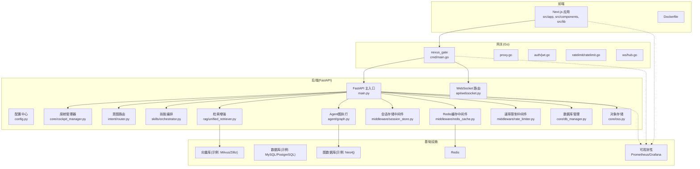
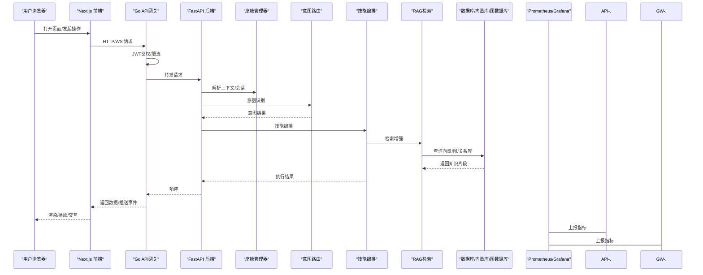
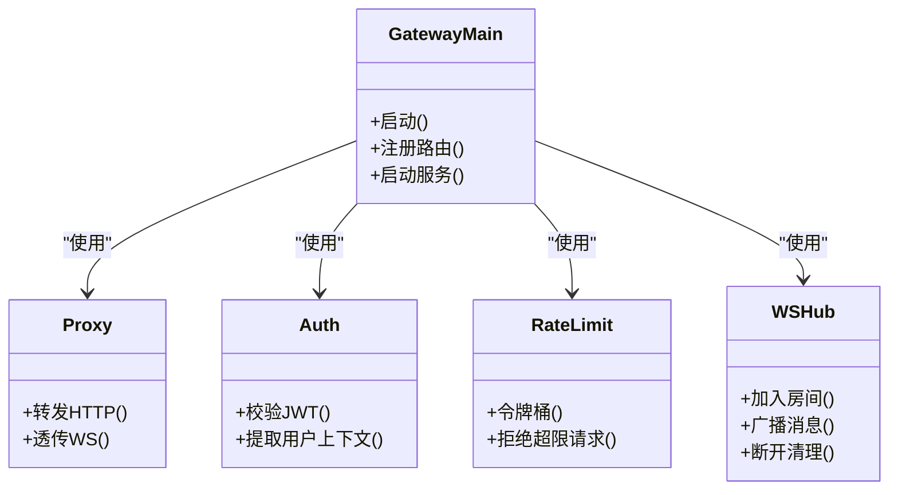
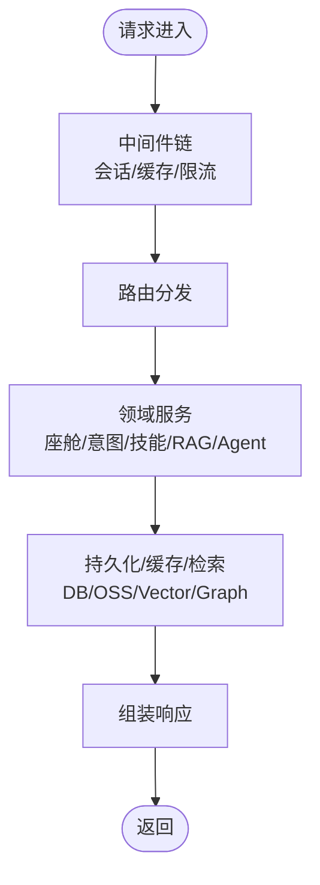
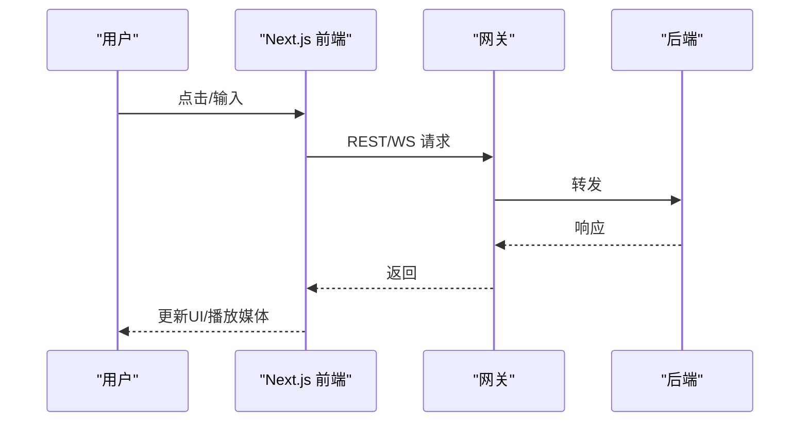
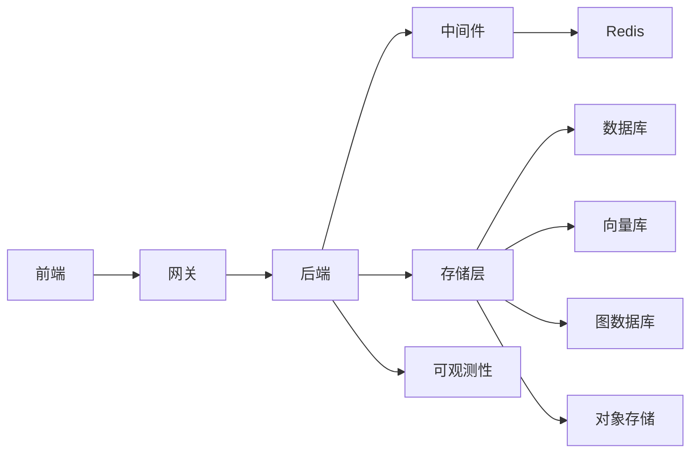
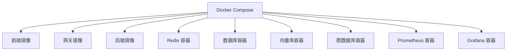

# 系统架构概览

<cite>
**本文引用的文件**   
- [docker-compose.yml](file://docker-compose.yml)
- [backend_design/nexus/main.py](file://backend_design/nexus/main.py)
- [backend_design/nexus/config.py](file://backend_design/nexus/config.py)
- [backend_design/nexus/api/websocket.py](file://backend_design/nexus/api/websocket.py)
- [backend_design/nexus/core/cockpit_manager.py](file://backend_design/nexus/core/cockpit_manager.py)
- [backend_design/nexus/middleware/session_store.py](file://backend_design/nexus/middleware/session_store.py)
- [backend_design/nexus/middleware/redis_cache.py](file://backend_design/nexus/middleware/redis_cache.py)
- [backend_design/nexus/middleware/rate_limiter.py](file://backend_design/nexus/middleware/rate_limiter.py)
- [backend_design/nexus/core/db_manager.py](file://backend_design/nexus/core/db_manager.py)
- [backend_design/nexus/core/oss.py](file://backend_design/nexus/core/oss.py)
- [backend_design/nexus/intent/router.py](file://backend_design/nexus/intent/router.py)
- [backend_design/nexus/skills/orchestrator.py](file://backend_design/nexus/skills/orchestrator.py)
- [backend_design/nexus/rag/unified_retriever.py](file://backend_design/nexus/rag/unified_retriever.py)
- [backend_design/nexus/agent/graph.py](file://backend_design/nexus/agent/graph.py)
- [backend_design/nexus_gate/cmd/main.go](file://backend_design/nexus_gate/cmd/main.go)
- [backend_design/nexus_gate/internal/proxy/proxy.go](file://backend_design/nexus_gate/internal/proxy/proxy.go)
- [backend_design/nexus_gate/internal/auth/jwt.go](file://backend_design/nexus_gate/internal/auth/jwt.go)
- [backend_design/nexus_gate/internal/ratelimit/ratelimit.go](file://backend_design/nexus_gate/internal/ratelimit/ratelimit.go)
- [backend_design/nexus_gate/internal/ws/hub.go](file://backend_design/nexus_gate/internal/ws/hub.go)
- [frontend_design/src/app/layout.tsx](file://frontend_design/src/app/layout.tsx)
- [frontend_design/src/lib/api.ts](file://frontend_design/src/lib/api.ts)
- [frontend_design/Dockerfile](file://frontend_design/Dockerfile)
- [config/prometheus/prometheus.yml](file://config/prometheus/prometheus.yml)
- [config/grafana/provisioning/dashboards/nexuscockpit-overview.json](file://config/grafana/provisioning/dashboards/nexuscockpit-overview.json)
</cite>

## 目录
1. [简介](#简介)
2. [项目结构](#项目结构)
3. [核心组件](#核心组件)
4. [架构总览](#架构总览)
5. [详细组件分析](#详细组件分析)
6. [依赖关系分析](#依赖关系分析)
7. [性能与可扩展性](#性能与可扩展性)
8. [部署与容器化](#部署与容器化)
9. [故障排查指南](#故障排查指南)
10. [结论](#结论)
11. [附录](#附录)

## 简介
本文件面向不同层次的读者，提供NexusCockpit系统的全面架构概览。系统采用前后端分离的微服务架构：前端基于Next.js，后端基于Python FastAPI，并通过Go实现的API网关进行统一接入、鉴权、限流与反向代理；同时集成WebSocket用于实时通信。系统通过Docker Compose编排，结合Prometheus与Grafana实现可观测性。文档涵盖整体架构图、数据流向、组件通信机制、依赖关系、容器化部署与服务发现策略、可扩展性与性能优化建议，以及系统边界与外部系统集成点。

## 项目结构
仓库按“前端设计”、“后端设计”、“网关”、“配置与监控”、“模型与资源”等维度组织，便于分层治理与独立演进。

图表来源
- [docker-compose.yml](file://docker-compose.yml)
- [backend_design/nexus/main.py](file://backend_design/nexus/main.py)
- [backend_design/nexus_gate/cmd/main.go](file://backend_design/nexus_gate/cmd/main.go)
- [frontend_design/src/app/layout.tsx](file://frontend_design/src/app/layout.tsx)

章节来源
- [docker-compose.yml](file://docker-compose.yml)
- [backend_design/nexus/main.py](file://backend_design/nexus/main.py)
- [backend_design/nexus_gate/cmd/main.go](file://backend_design/nexus_gate/cmd/main.go)
- [frontend_design/src/app/layout.tsx](file://frontend_design/src/app/layout.tsx)

## 核心组件
- 前端（Next.js）
  - 负责页面渲染、交互与状态管理，通过REST与WebSocket与后端通信。
  - 关键路径：布局与全局样式、API客户端封装、语音与媒体能力调用。
- API网关（Go）
  - 统一入口，承担鉴权、限流、请求转发、WebSocket代理与连接汇聚。
  - 关键路径：主程序启动、反向代理、JWT校验、令牌桶限流、Hub广播。
- 后端（FastAPI）
  - 业务逻辑与领域能力：座舱管理、意图识别、技能编排、RAG检索、Agent图执行、ASR/TTS、车辆控制等。
  - 关键路径：应用初始化、路由注册、中间件链、领域服务调用、持久化与缓存。
- 中间件与支撑
  - 会话存储、Redis缓存、速率限制、数据库与对象存储访问。
- 可观测性
  - Prometheus指标采集与Grafana仪表盘展示。

章节来源
- [frontend_design/src/app/layout.tsx](file://frontend_design/src/app/layout.tsx)
- [frontend_design/src/lib/api.ts](file://frontend_design/src/lib/api.ts)
- [backend_design/nexus_gate/cmd/main.go](file://backend_design/nexus_gate/cmd/main.go)
- [backend_design/nexus_gate/internal/proxy/proxy.go](file://backend_design/nexus_gate/internal/proxy/proxy.go)
- [backend_design/nexus_gate/internal/auth/jwt.go](file://backend_design/nexus_gate/internal/auth/jwt.go)
- [backend_design/nexus_gate/internal/ratelimit/ratelimit.go](file://backend_design/nexus_gate/internal/ratelimit/ratelimit.go)
- [backend_design/nexus_gate/internal/ws/hub.go](file://backend_design/nexus_gate/internal/ws/hub.go)
- [backend_design/nexus/main.py](file://backend_design/nexus/main.py)
- [backend_design/nexus/config.py](file://backend_design/nexus/config.py)
- [backend_design/nexus/api/websocket.py](file://backend_design/nexus/api/websocket.py)
- [backend_design/nexus/core/cockpit_manager.py](file://backend_design/nexus/core/cockpit_manager.py)
- [backend_design/nexus/intent/router.py](file://backend_design/nexus/intent/router.py)
- [backend_design/nexus/skills/orchestrator.py](file://backend_design/nexus/skills/orchestrator.py)
- [backend_design/nexus/rag/unified_retriever.py](file://backend_design/nexus/rag/unified_retriever.py)
- [backend_design/nexus/agent/graph.py](file://backend_design/nexus/agent/graph.py)
- [backend_design/nexus/middleware/session_store.py](file://backend_design/nexus/middleware/session_store.py)
- [backend_design/nexus/middleware/redis_cache.py](file://backend_design/nexus/middleware/redis_cache.py)
- [backend_design/nexus/middleware/rate_limiter.py](file://backend_design/nexus/middleware/rate_limiter.py)
- [backend_design/nexus/core/db_manager.py](file://backend_design/nexus/core/db_manager.py)
- [backend_design/nexus/core/oss.py](file://backend_design/nexus/core/oss.py)
- [config/prometheus/prometheus.yml](file://config/prometheus/prometheus.yml)
- [config/grafana/provisioning/dashboards/nexuscockpit-overview.json](file://config/grafana/provisioning/dashboards/nexuscockpit-overview.json)

## 架构总览
系统采用分层微服务架构：前端通过网关访问后端；网关集中处理安全与流量治理；后端以领域服务为核心，借助中间件与外部存储完成数据与能力扩展；可观测性贯穿全链路。

图表来源
- [backend_design/nexus_gate/cmd/main.go](file://backend_design/nexus_gate/cmd/main.go)
- [backend_design/nexus_gate/internal/proxy/proxy.go](file://backend_design/nexus_gate/internal/proxy/proxy.go)
- [backend_design/nexus_gate/internal/auth/jwt.go](file://backend_design/nexus_gate/internal/auth/jwt.go)
- [backend_design/nexus_gate/internal/ratelimit/ratelimit.go](file://backend_design/nexus_gate/internal/ratelimit/ratelimit.go)
- [backend_design/nexus/main.py](file://backend_design/nexus/main.py)
- [backend_design/nexus/core/cockpit_manager.py](file://backend_design/nexus/core/cockpit_manager.py)
- [backend_design/nexus/intent/router.py](file://backend_design/nexus/intent/router.py)
- [backend_design/nexus/skills/orchestrator.py](file://backend_design/nexus/skills/orchestrator.py)
- [backend_design/nexus/rag/unified_retriever.py](file://backend_design/nexus/rag/unified_retriever.py)
- [config/prometheus/prometheus.yml](file://config/prometheus/prometheus.yml)

## 详细组件分析

### API网关（Go）
- 职责
  - 统一入口、反向代理、JWT鉴权、令牌桶限流、WebSocket Hub聚合与广播。
- 关键流程
  - 启动加载配置与路由，注册鉴权与限流中间件，将HTTP/WS请求转发至后端。
  - WebSocket场景下维护连接集合，支持服务端主动推送。
- 依赖
  - 外部：后端服务、Redis（可选）、认证密钥。
- 扩展点
  - 新增鉴权策略、限流规则、协议适配、灰度发布。

图表来源
- [backend_design/nexus_gate/cmd/main.go](file://backend_design/nexus_gate/cmd/main.go)
- [backend_design/nexus_gate/internal/proxy/proxy.go](file://backend_design/nexus_gate/internal/proxy/proxy.go)
- [backend_design/nexus_gate/internal/auth/jwt.go](file://backend_design/nexus_gate/internal/auth/jwt.go)
- [backend_design/nexus_gate/internal/ratelimit/ratelimit.go](file://backend_design/nexus_gate/internal/ratelimit/ratelimit.go)
- [backend_design/nexus_gate/internal/ws/hub.go](file://backend_design/nexus_gate/internal/ws/hub.go)

章节来源
- [backend_design/nexus_gate/cmd/main.go](file://backend_design/nexus_gate/cmd/main.go)
- [backend_design/nexus_gate/internal/proxy/proxy.go](file://backend_design/nexus_gate/internal/proxy/proxy.go)
- [backend_design/nexus_gate/internal/auth/jwt.go](file://backend_design/nexus_gate/internal/auth/jwt.go)
- [backend_design/nexus_gate/internal/ratelimit/ratelimit.go](file://backend_design/nexus_gate/internal/ratelimit/ratelimit.go)
- [backend_design/nexus_gate/internal/ws/hub.go](file://backend_design/nexus_gate/internal/ws/hub.go)

### 后端（FastAPI）
- 职责
  - 暴露REST/WS接口，承载座舱管理、意图识别、技能编排、RAG检索、Agent图执行、ASR/TTS、车辆控制等能力。
- 关键流程
  - 应用初始化加载配置，注册路由与中间件；请求进入后由中间件链完成会话、缓存、限流；业务层调用领域服务与外部存储。
- 依赖
  - 中间件：会话存储、Redis缓存、速率限制。
  - 存储：数据库、对象存储、向量库、图数据库。
  - 可观测性：指标上报。

图表来源
- [backend_design/nexus/main.py](file://backend_design/nexus/main.py)
- [backend_design/nexus/config.py](file://backend_design/nexus/config.py)
- [backend_design/nexus/api/websocket.py](file://backend_design/nexus/api/websocket.py)
- [backend_design/nexus/core/cockpit_manager.py](file://backend_design/nexus/core/cockpit_manager.py)
- [backend_design/nexus/intent/router.py](file://backend_design/nexus/intent/router.py)
- [backend_design/nexus/skills/orchestrator.py](file://backend_design/nexus/skills/orchestrator.py)
- [backend_design/nexus/rag/unified_retriever.py](file://backend_design/nexus/rag/unified_retriever.py)
- [backend_design/nexus/agent/graph.py](file://backend_design/nexus/agent/graph.py)
- [backend_design/nexus/middleware/session_store.py](file://backend_design/nexus/middleware/session_store.py)
- [backend_design/nexus/middleware/redis_cache.py](file://backend_design/nexus/middleware/redis_cache.py)
- [backend_design/nexus/middleware/rate_limiter.py](file://backend_design/nexus/middleware/rate_limiter.py)
- [backend_design/nexus/core/db_manager.py](file://backend_design/nexus/core/db_manager.py)
- [backend_design/nexus/core/oss.py](file://backend_design/nexus/core/oss.py)

章节来源
- [backend_design/nexus/main.py](file://backend_design/nexus/main.py)
- [backend_design/nexus/config.py](file://backend_design/nexus/config.py)
- [backend_design/nexus/api/websocket.py](file://backend_design/nexus/api/websocket.py)
- [backend_design/nexus/core/cockpit_manager.py](file://backend_design/nexus/core/cockpit_manager.py)
- [backend_design/nexus/intent/router.py](file://backend_design/nexus/intent/router.py)
- [backend_design/nexus/skills/orchestrator.py](file://backend_design/nexus/skills/orchestrator.py)
- [backend_design/nexus/rag/unified_retriever.py](file://backend_design/nexus/rag/unified_retriever.py)
- [backend_design/nexus/agent/graph.py](file://backend_design/nexus/agent/graph.py)
- [backend_design/nexus/middleware/session_store.py](file://backend_design/nexus/middleware/session_store.py)
- [backend_design/nexus/middleware/redis_cache.py](file://backend_design/nexus/middleware/redis_cache.py)
- [backend_design/nexus/middleware/rate_limiter.py](file://backend_design/nexus/middleware/rate_limiter.py)
- [backend_design/nexus/core/db_manager.py](file://backend_design/nexus/core/db_manager.py)
- [backend_design/nexus/core/oss.py](file://backend_design/nexus/core/oss.py)

### 前端（Next.js）
- 职责
  - 页面与组件渲染、状态管理、音频/媒体能力、与后端REST/WS通信。
- 关键路径
  - 全局布局与样式、API客户端封装、语音录制与播放、WebSocket连接与消息处理。
- 依赖
  - 后端API、网关（鉴权与会话）、媒体设备。

图表来源
- [frontend_design/src/app/layout.tsx](file://frontend_design/src/app/layout.tsx)
- [frontend_design/src/lib/api.ts](file://frontend_design/src/lib/api.ts)

章节来源
- [frontend_design/src/app/layout.tsx](file://frontend_design/src/app/layout.tsx)
- [frontend_design/src/lib/api.ts](file://frontend_design/src/lib/api.ts)

## 依赖关系分析
- 组件耦合
  - 网关对后端为单向依赖；后端对中间件与存储为弱耦合，通过接口与配置解耦。
  - 前端仅依赖网关提供的稳定接口。
- 外部依赖
  - Redis、数据库、向量库、图数据库、对象存储、可观测性平台。
- 潜在风险
  - 单点：网关与后端需多副本+负载均衡；存储需高可用集群；Redis需哨兵或集群模式。
  - 循环依赖：确保中间件不反向依赖业务模块。

图表来源
- [docker-compose.yml](file://docker-compose.yml)
- [backend_design/nexus/main.py](file://backend_design/nexus/main.py)
- [backend_design/nexus_gate/cmd/main.go](file://backend_design/nexus_gate/cmd/main.go)
- [frontend_design/src/app/layout.tsx](file://frontend_design/src/app/layout.tsx)

章节来源
- [docker-compose.yml](file://docker-compose.yml)
- [backend_design/nexus/main.py](file://backend_design/nexus/main.py)
- [backend_design/nexus_gate/cmd/main.go](file://backend_design/nexus_gate/cmd/main.go)
- [frontend_design/src/app/layout.tsx](file://frontend_design/src/app/layout.tsx)

## 性能与可扩展性
- 水平扩展
  - 网关与后端无状态化，配合负载均衡横向扩容；WebSocket Hub支持多实例广播。
- 缓存与异步
  - 热点数据走Redis缓存；长耗时任务入队异步处理，提升吞吐。
- 限流与熔断
  - 网关层令牌桶限流；后端关键调用增加熔断与重试退避。
- 检索优化
  - RAG检索引入重排序与分页截断，减少大模型上下文长度。
- 可观测性
  - 指标采集覆盖网关、后端与关键子系统，结合Grafana告警与看板。

[本节为通用指导，无需特定文件引用]

## 部署与容器化
- 容器编排
  - 使用Docker Compose定义服务拓扑，包括前端、网关、后端、Redis、数据库、向量库、图数据库、可观测性组件等。
- 服务发现
  - 开发环境通过Compose网络名解析；生产环境建议使用Kubernetes Service或外部服务发现。
- 镜像构建
  - 前端与网关均提供Dockerfile，后端镜像包含运行时与依赖。
- 配置与环境
  - 通过环境变量注入各服务配置，敏感信息使用Secrets管理。

图表来源
- [docker-compose.yml](file://docker-compose.yml)
- [frontend_design/Dockerfile](file://frontend_design/Dockerfile)

章节来源
- [docker-compose.yml](file://docker-compose.yml)
- [frontend_design/Dockerfile](file://frontend_design/Dockerfile)

## 故障排查指南
- 常见问题定位
  - 鉴权失败：检查网关JWT配置与签名算法一致性。
  - 限流触发：查看网关限流日志与阈值设置。
  - WebSocket断连：确认Hub连接数与心跳策略。
  - 缓存未命中：核对Redis连通性与键空间。
  - 检索延迟：评估向量库索引与查询参数。
- 可观测性
  - 通过Prometheus抓取指标，Grafana查看面板与告警。
- 日志与追踪
  - 统一日志格式，关联请求ID，跨网关与后端链路追踪。

章节来源
- [backend_design/nexus_gate/internal/auth/jwt.go](file://backend_design/nexus_gate/internal/auth/jwt.go)
- [backend_design/nexus_gate/internal/ratelimit/ratelimit.go](file://backend_design/nexus_gate/internal/ratelimit/ratelimit.go)
- [backend_design/nexus_gate/internal/ws/hub.go](file://backend_design/nexus_gate/internal/ws/hub.go)
- [backend_design/nexus/middleware/redis_cache.py](file://backend_design/nexus/middleware/redis_cache.py)
- [backend_design/nexus/rag/unified_retriever.py](file://backend_design/nexus/rag/unified_retriever.py)
- [config/prometheus/prometheus.yml](file://config/prometheus/prometheus.yml)
- [config/grafana/provisioning/dashboards/nexuscockpit-overview.json](file://config/grafana/provisioning/dashboards/nexuscockpit-overview.json)

## 结论
NexusCockpit采用清晰的分层与微服务架构，通过Go网关统一接入与安全治理，FastAPI后端承载核心业务能力，Next.js前端提供良好交互体验。借助容器化编排与可观测性体系，系统在可扩展性、稳定性与可运维性方面具备良好基础。后续可在服务网格、分布式追踪、弹性伸缩等方面持续演进。

[本节为总结性内容，无需特定文件引用]

## 附录
- 系统边界与外部集成点
  - 外部存储：数据库、向量库、图数据库、对象存储。
  - 外部服务：语音识别/合成、地图导航、车辆控制接口（通过MCP或HTTP）。
  - 可观测性：Prometheus、Grafana、日志系统。
- 术语
  - RAG：检索增强生成；ASR：自动语音识别；TTS：文本转语音；MCP：模型协作协议。

[本节为概念性说明，无需特定文件引用]