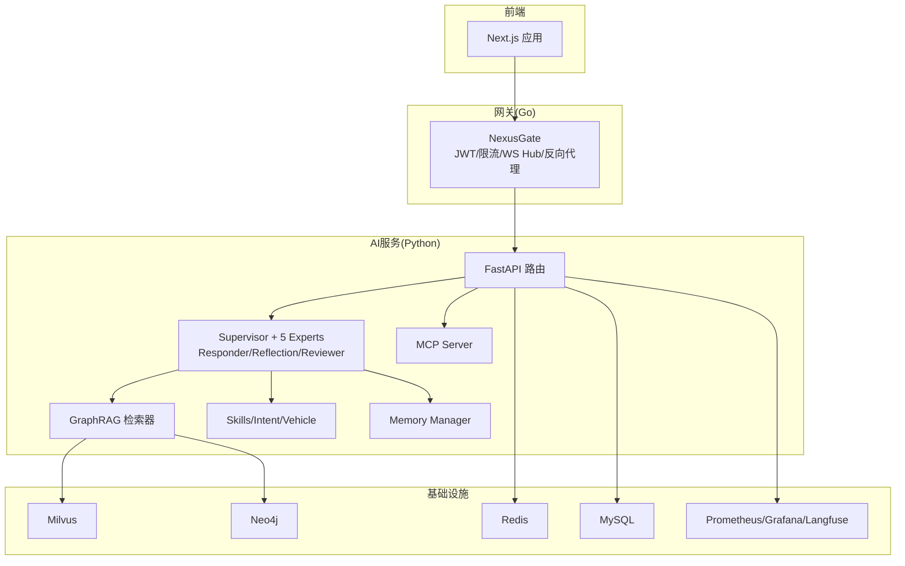
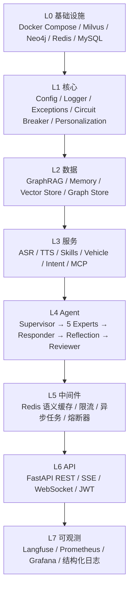
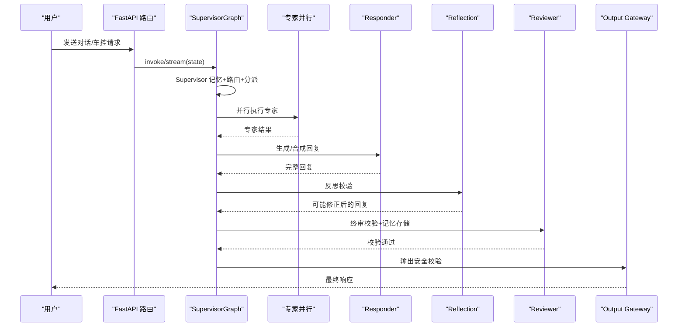
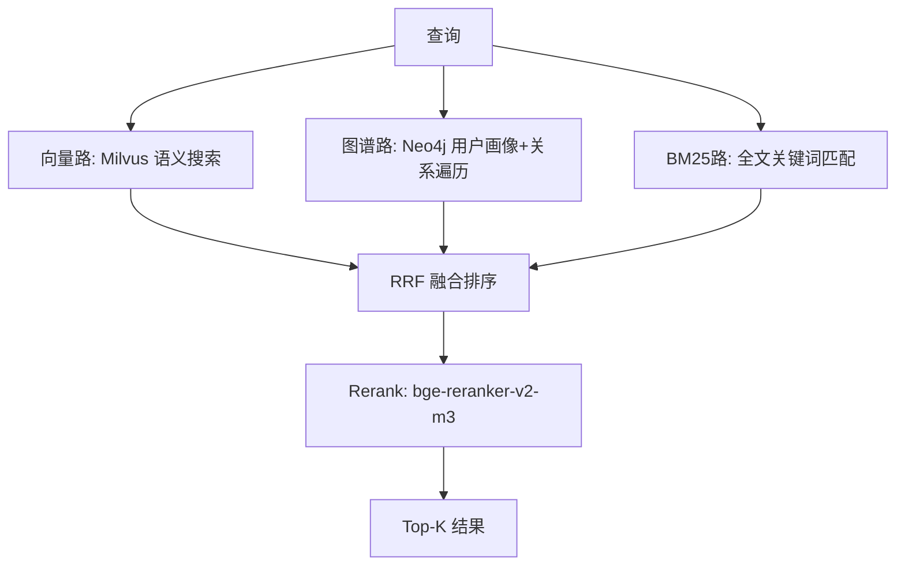
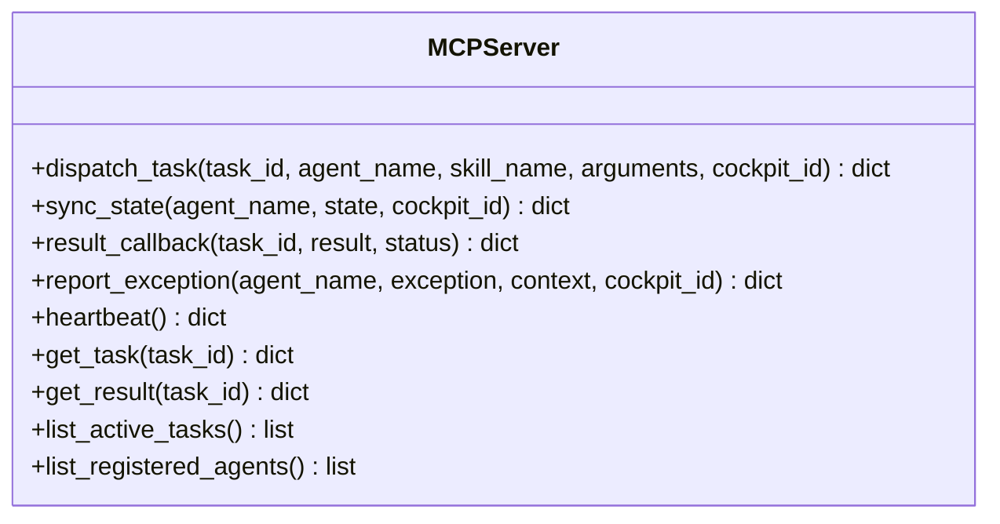
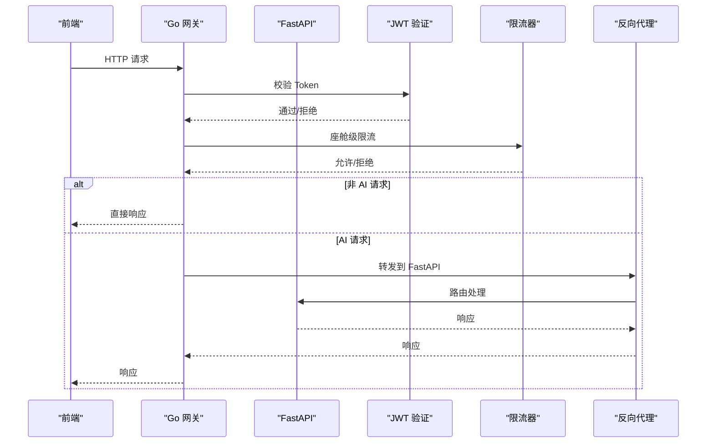
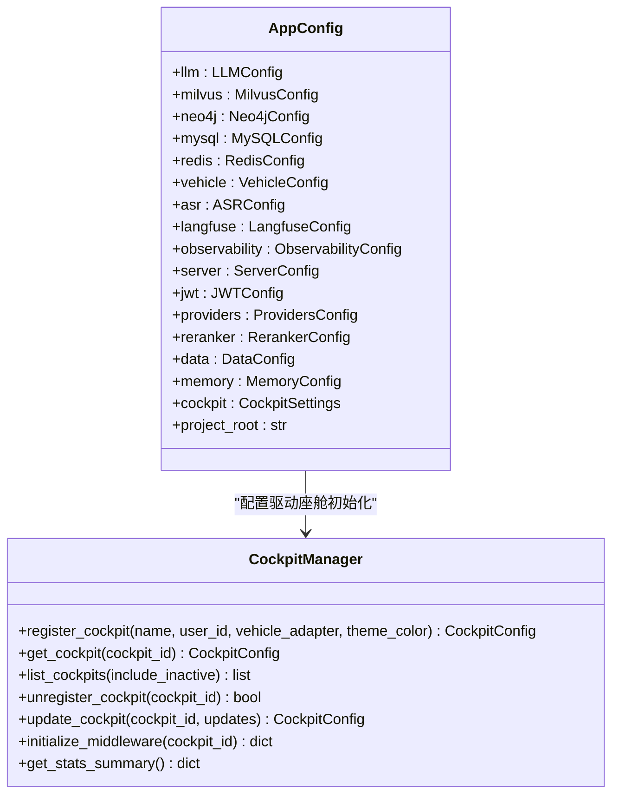
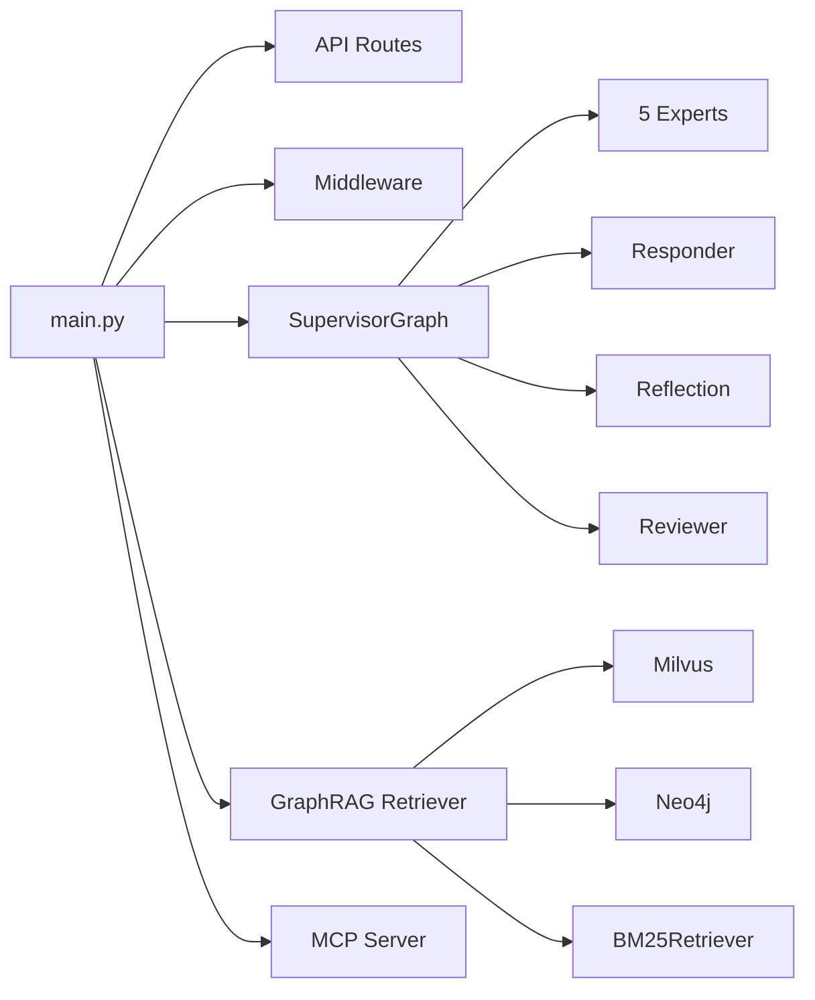

# 项目介绍

<cite>
**本文引用的文件**   
- [README.md](file://README.md)
- [Agent.md](file://Agent.md)
- [backend_design/nexus/main.py](file://backend_design/nexus/main.py)
- [backend_design/nexus_gate/cmd/main.go](file://backend_design/nexus_gate/cmd/main.go)
- [backend_design/nexus/agent/supervisor_graph.py](file://backend_design/nexus/agent/supervisor_graph.py)
- [backend_design/nexus/rag/retriever.py](file://backend_design/nexus/rag/retriever.py)
- [backend_design/nexus/mcp/server.py](file://backend_design/nexus/mcp/server.py)
- [backend_design/nexus/config/__init__.py](file://backend_design/nexus/config/__init__.py)
- [backend_design/nexus/core/cockpit_manager.py](file://backend_design/nexus/core/cockpit_manager.py)
- [backend_design/pyproject.toml](file://backend_design/pyproject.toml)
</cite>

## 目录
1. [引言](#引言)
2. [项目结构](#项目结构)
3. [核心组件](#核心组件)
4. [架构总览](#架构总览)
5. [详细组件分析](#详细组件分析)
6. [依赖关系分析](#依赖关系分析)
7. [性能与可扩展性](#性能与可扩展性)
8. [故障排查指南](#故障排查指南)
9. [结论](#结论)
10. [附录：使用场景示例](#附录使用场景示例)

## 引言
NexusCockpit 是一个企业级车载语音 Agent 系统，采用 7 层分层架构，融合 Multi-Agent 协同、GraphRAG 检索增强、语义缓存与 MCP 协议等前沿技术。系统以“座舱控制 + 运营总览”为核心形态，面向真实车载交互场景提供高可用、可观测、可演进的 AI 能力底座。其差异化在于：
- 多智能体并行编排与反思校验闭环，保障输出质量与安全；
- 向量+图谱+BM25 三路 RRF 融合检索，提升召回与排序精度；
- Go 并发网关承载鉴权、限流与 WebSocket Hub，Python FastAPI 专注 AI 推理与业务编排；
- 本地化全栈中间件（Milvus/Neo4j/Redis/MySQL）与云端 LLM 降级策略并存；
- 面向座舱的多租户隔离与个性化服务（声纹识别、偏好注入）。

这些特性使 NexusCockpit 在车载语音交互领域具备更强的稳定性、可控性与扩展性。

**章节来源**
- [README.md:13-33](file://README.md#L13-L33)
- [Agent.md:5-24](file://Agent.md#L5-L24)

## 项目结构
项目采用前后端分离与模块化分层组织：
- 后端 Python（FastAPI）：AI 服务、Agent 编排、RAG、记忆、技能、车控适配、MCP、可观测性等；
- 后端 Go（Gin）：并发网关，负责 JWT 鉴权、限流、反向代理与 WebSocket Hub；
- 前端 Next.js：座舱控制台、聊天页、数据中台、监控看板、设置与管理后台；
- 基础设施：Docker Compose 编排 Milvus、Neo4j、Redis、MySQL、Prometheus、Grafana、Loki；
- 模型与数据：ASR/TTS/Embedding/Reranker 模型文件与知识库、用户偏好等。

```mermaid
graph TB
subgraph "前端"
FE["Next.js 应用"]
end
subgraph "网关(Go)"
GW["NexusGate<br/>JWT/限流/WS Hub/反向代理"]
end
subgraph "AI服务(Python)"
API["FastAPI 路由"]
AG["Supervisor + 5 Experts<br/>Responder/Reflection/Reviewer"]
RAG["GraphRAG 检索器"]
MCP["MCP Server"]
SK["Skills/Intent/Vehicle"]
MEM["Memory Manager"]
end
subgraph "基础设施"
VEC["Milvus"]
GRAPH["Neo4j"]
CACHE["Redis"]
DB["MySQL"]
OBS["Prometheus/Grafana/Langfuse"]
end
FE --> GW
GW --> API
API --> AG
AG --> RAG
AG --> SK
AG --> MEM
RAG --> VEC
RAG --> GRAPH
API --> MCP
API --> CACHE
API --> DB
API --> OBS
```

**图表来源**
- [backend_design/nexus/main.py:436-484](file://backend_design/nexus/main.py#L436-L484)
- [backend_design/nexus_gate/cmd/main.go:123-138](file://backend_design/nexus_gate/cmd/main.go#L123-L138)
- [backend_design/nexus/agent/supervisor_graph.py:93-179](file://backend_design/nexus/agent/supervisor_graph.py#L93-L179)
- [backend_design/nexus/rag/retriever.py:48-87](file://backend_design/nexus/rag/retriever.py#L48-L87)
- [backend_design/nexus/mcp/server.py:36-66](file://backend_design/nexus/mcp/server.py#L36-L66)

**章节来源**
- [README.md:93-138](file://README.md#L93-L138)
- [Agent.md:66-170](file://Agent.md#L66-L170)

## 核心组件
- 7 层分层架构：从基础设施到可观测层的清晰解耦，便于独立演进与替换；
- Multi-Agent 工作流：Supervisor 调度 5 个专家（车辆、导航、生活方式、健康、闲聊），经 Responder 汇总、Reflection 反思、Reviewer 终审，形成强约束闭环；
- GraphRAG 检索：向量（Milvus）、图谱（Neo4j）、BM25 全文三路召回，RRF 融合后由 bge-reranker-v2-m3 重排；
- 语义缓存与限流：Redis 8 RediSearch KNN 语义缓存，滑动窗口限流，副作用隔离；
- 车控总线：Mock/HTTP/MCP stdio 三模式适配，统一 Skill 调用；
- 可观测性：Langfuse Tracing、Prometheus Metrics、Grafana 面板、结构化日志；
- 混合架构：Go 网关高并发处理请求入口，Python FastAPI 专注 AI 推理与业务编排。

**章节来源**
- [README.md:15-33](file://README.md#L15-L33)
- [backend_design/nexus/main.py:75-170](file://backend_design/nexus/main.py#L75-L170)
- [backend_design/nexus/agent/supervisor_graph.py:93-179](file://backend_design/nexus/agent/supervisor_graph.py#L93-L179)
- [backend_design/nexus/rag/retriever.py:48-87](file://backend_design/nexus/rag/retriever.py#L48-L87)

## 架构总览
NexusCockpit 的 7 层架构设计将职责边界清晰划分，确保各层可独立升级与测试：
- L0 基础设施：Docker Compose 编排中间件与监控；
- L1 核心：配置中心、日志、异常、熔断器、个性化服务；
- L2 数据：GraphRAG、记忆管理、向量/图存储；
- L3 服务：ASR/TTS、Skills、Vehicle、Intent、MCP；
- L4 Agent：Supervisor + 5 Experts + Responder + Reflection + Reviewer；
- L5 中间件：语义缓存、限流、异步任务、熔断器；
- L6 API：REST/SSE/WebSocket、JWT 认证；
- L7 可观测：Langfuse、Prometheus、Grafana、结构化日志。

```mermaid
flowchart TD
L0["L0 基础设施<br/>Docker Compose / Milvus / Neo4j / Redis / MySQL"] --> L1["L1 核心<br/>Config / Logger / Exceptions / Circuit Breaker / Personalization"]
L1 --> L2["L2 数据<br/>GraphRAG / Memory / Vector Store / Graph Store"]
L2 --> L3["L3 服务<br/>ASR / TTS / Skills / Vehicle / Intent / MCP"]
L3 --> L4["L4 Agent<br/>Supervisor → 5 Experts → Responder → Reflection → Reviewer"]
L4 --> L5["L5 中间件<br/>Redis 语义缓存 / 限流 / 异步任务 / 熔断器"]
L5 --> L6["L6 API<br/>FastAPI REST / SSE / WebSocket / JWT"]
L6 --> L7["L7 可观测<br/>Langfuse / Prometheus / Grafana / 结构化日志"]
```

**图表来源**
- [Agent.md:36-64](file://Agent.md#L36-L64)
- [README.md:371-382](file://README.md#L371-L382)

**章节来源**
- [Agent.md:36-64](file://Agent.md#L36-L64)
- [README.md:371-382](file://README.md#L371-L382)

## 详细组件分析

### Multi-Agent 协同架构（Supervisor + 5 Experts）
- Supervisor 节点负责记忆召回、意图路由与专家分派决策；
- 5 个专家并行执行（车辆、导航、生活方式、健康、闲聊），结果汇聚至 Responder；
- Responder 生成自然语言回复或合成工具返回的结构化数据；
- Reflection 进行事实性/一致性/无幻觉检查，必要时自我修正；
- Reviewer 作为全局终审关卡，记录指标并持久化记忆；
- Output Gateway 对最终输出做安全校验，确保不泄露内部状态。

```mermaid
sequenceDiagram
participant U as "用户"
participant API as "FastAPI 路由"
participant SG as "SupervisorGraph"
participant EXP as "专家并行"
participant RESP as "Responder"
participant REF as "Reflection"
participant REV as "Reviewer"
participant GW as "Output Gateway"
U->>API : 发送对话/车控请求
API->>SG : invoke/stream(state)
SG->>SG : Supervisor 记忆+路由+分派
SG->>EXP : 并行执行专家
EXP-->>SG : 专家结果
SG->>RESP : 生成/合成回复
RESP-->>SG : 完整回复
SG->>REF : 反思校验
REF-->>SG : 可能修正后的回复
SG->>REV : 终审校验+记忆存储
REV-->>SG : 校验通过
SG->>GW : 输出安全校验
GW-->>U : 最终响应
```

**图表来源**
- [backend_design/nexus/agent/supervisor_graph.py:183-207](file://backend_design/nexus/agent/supervisor_graph.py#L183-L207)
- [backend_design/nexus/agent/supervisor_graph.py:209-384](file://backend_design/nexus/agent/supervisor_graph.py#L209-L384)
- [backend_design/nexus/agent/supervisor_graph.py:386-617](file://backend_design/nexus/agent/supervisor_graph.py#L386-L617)

**章节来源**
- [backend_design/nexus/agent/supervisor_graph.py:93-179](file://backend_design/nexus/agent/supervisor_graph.py#L93-L179)
- [backend_design/nexus/agent/supervisor_graph.py:183-384](file://backend_design/nexus/agent/supervisor_graph.py#L183-L384)

### GraphRAG 融合检索
- 三路召回：向量（Milvus 语义相似度）、图谱（Neo4j 用户画像与关系遍历）、BM25（全文关键词匹配）；
- RRF 融合排序：按倒数排名加权合并，平衡不同路径的贡献；
- Rerank 重排：bge-reranker-v2-m3 对 Top-K 候选进行精细排序；
- 支持用户记忆检索与食材库检索等特定场景。

```mermaid
flowchart TD
Q["查询"] --> V["向量路: Milvus 语义搜索"]
Q --> G["图谱路: Neo4j 用户画像+关系遍历"]
Q --> B["BM25路: 全文关键词匹配"]
V --> F["RRF 融合排序"]
G --> F
B --> F
F --> R["Rerank: bge-reranker-v2-m3"]
R --> O["Top-K 结果"]
```

**图表来源**
- [backend_design/nexus/rag/retriever.py:48-87](file://backend_design/nexus/rag/retriever.py#L48-L87)
- [backend_design/nexus/rag/retriever.py:128-149](file://backend_design/nexus/rag/retriever.py#L128-L149)
- [backend_design/nexus/rag/retriever.py:150-182](file://backend_design/nexus/rag/retriever.py#L150-L182)

**章节来源**
- [backend_design/nexus/rag/retriever.py:48-87](file://backend_design/nexus/rag/retriever.py#L48-L87)
- [backend_design/nexus/rag/retriever.py:128-182](file://backend_design/nexus/rag/retriever.py#L128-L182)

### MCP 协议集成
- MCP Server 提供标准化接口：任务分发、状态同步、结果回调、异常上报、心跳保活；
- 支持跨进程、跨服务的任务协调与状态共享；
- 在启动流程中自动初始化并注册为子模块，供其他服务调用。

```mermaid
classDiagram
class MCPServer {
+dispatch_task(task_id, agent_name, skill_name, arguments, cockpit_id) dict
+sync_state(agent_name, state, cockpit_id) dict
+result_callback(task_id, result, status) dict
+report_exception(agent_name, exception, context, cockpit_id) dict
+heartbeat() dict
+get_task(task_id) dict
+get_result(task_id) dict
+list_active_tasks() list
+list_registered_agents() list
}
```

**图表来源**
- [backend_design/nexus/mcp/server.py:36-255](file://backend_design/nexus/mcp/server.py#L36-L255)

**章节来源**
- [backend_design/nexus/mcp/server.py:36-255](file://backend_design/nexus/mcp/server.py#L36-L255)

### 混合架构：Python FastAPI + Go 并发网关
- Go 网关（NexusGate）：JWT 鉴权、座舱级令牌桶限流、WebSocket Hub、非 AI 请求直接处理、AI 请求反向代理到 Python；
- Python FastAPI：统一路由注册、中间件、异常处理、Prometheus 指标采集、静态资源挂载；
- 双端共享 JWT 密钥，保证鉴权一致性。

```mermaid
sequenceDiagram
participant FE as "前端"
participant GW as "Go 网关"
participant API as "FastAPI"
participant AUTH as "JWT 验证"
participant RL as "限流器"
participant PROXY as "反向代理"
FE->>GW : HTTP 请求
GW->>AUTH : 校验 Token
AUTH-->>GW : 通过/拒绝
GW->>RL : 座舱级限流
RL-->>GW : 允许/拒绝
alt 非 AI 请求
GW-->>FE : 直接响应
else AI 请求
GW->>PROXY : 转发到 FastAPI
PROXY->>API : 路由处理
API-->>PROXY : 响应
PROXY-->>GW : 响应
GW-->>FE : 响应
end
```

**图表来源**
- [backend_design/nexus_gate/cmd/main.go:123-138](file://backend_design/nexus_gate/cmd/main.go#L123-L138)
- [backend_design/nexus/main.py:436-484](file://backend_design/nexus/main.py#L436-L484)

**章节来源**
- [backend_design/nexus_gate/cmd/main.go:123-138](file://backend_design/nexus_gate/cmd/main.go#L123-L138)
- [backend_design/nexus/main.py:436-484](file://backend_design/nexus/main.py#L436-L484)

### 配置中心与多座舱管理
- 配置中心按子系统拆分，统一聚合导出，支持环境变量与 .env 文件加载；
- 座舱管理器维护多座舱生命周期，支持注册、查询、注销与中间件资源初始化；
- 每个座舱拥有独立的 Redis DB、Milvus collection 前缀与主题色等个性化配置。

```mermaid
classDiagram
class AppConfig {
+llm : LLMConfig
+milvus : MilvusConfig
+neo4j : Neo4jConfig
+mysql : MySQLConfig
+redis : RedisConfig
+vehicle : VehicleConfig
+asr : ASRConfig
+langfuse : LangfuseConfig
+observability : ObservabilityConfig
+server : ServerConfig
+jwt : JWTConfig
+providers : ProvidersConfig
+reranker : RerankerConfig
+data : DataConfig
+memory : MemoryConfig
+cockpit : CockpitSettings
+project_root : str
}
class CockpitManager {
+register_cockpit(name, user_id, vehicle_adapter, theme_color) CockpitConfig
+get_cockpit(cockpit_id) CockpitConfig
+list_cockpits(include_inactive) list
+unregister_cockpit(cockpit_id) bool
+update_cockpit(cockpit_id, updates) CockpitConfig
+initialize_middleware(cockpit_id) dict
+get_stats_summary() dict
}
AppConfig --> CockpitManager : "配置驱动座舱初始化"
```

**图表来源**
- [backend_design/nexus/config/__init__.py:84-167](file://backend_design/nexus/config/__init__.py#L84-L167)
- [backend_design/nexus/core/cockpit_manager.py:75-397](file://backend_design/nexus/core/cockpit_manager.py#L75-L397)

**章节来源**
- [backend_design/nexus/config/__init__.py:84-167](file://backend_design/nexus/config/__init__.py#L84-L167)
- [backend_design/nexus/core/cockpit_manager.py:75-397](file://backend_design/nexus/core/cockpit_manager.py#L75-L397)

## 依赖关系分析
- 外部依赖：FastAPI、LangChain/LangGraph、Milvus、Neo4j、Redis、MySQL、Prometheus、Grafana、FunASR、CosyVoice、sentence-transformers、Pydantic、PyJWT 等；
- 内部依赖：main.py 聚合路由与中间件，supervisor_graph.py 编排 Agent 工作流，retriever.py 实现 GraphRAG，server.py 提供 MCP 接口；
- 启动顺序：先初始化配置与日志，再连接中间件，随后构建 Agent 图与检索器，最后启动 MCP 与后台任务。

```mermaid
graph LR
MAIN["main.py"] --> ROUTES["API Routes"]
MAIN --> MIDDLEWARE["Middleware"]
MAIN --> AGENT["SupervisorGraph"]
MAIN --> RAG["GraphRAG Retriever"]
MAIN --> MCP["MCP Server"]
AGENT --> EXPERTS["5 Experts"]
AGENT --> RESPONDER["Responder"]
AGENT --> REFLECTION["Reflection"]
AGENT --> REVIEWER["Reviewer"]
RAG --> VECTOR["Milvus"]
RAG --> GRAPH["Neo4j"]
RAG --> BM25["BM25Retriever"]
```

**图表来源**
- [backend_design/nexus/main.py:436-484](file://backend_design/nexus/main.py#L436-L484)
- [backend_design/nexus/agent/supervisor_graph.py:93-179](file://backend_design/nexus/agent/supervisor_graph.py#L93-L179)
- [backend_design/nexus/rag/retriever.py:48-87](file://backend_design/nexus/rag/retriever.py#L48-L87)

**章节来源**
- [backend_design/pyproject.toml:10-100](file://backend_design/pyproject.toml#L10-L100)
- [backend_design/nexus/main.py:436-484](file://backend_design/nexus/main.py#L436-L484)

## 性能与可扩展性
- 并发与吞吐：Go 网关基于 Goroutine 与 Gin 框架，支撑千级 WebSocket 连接与高 QPS；
- 检索性能：Milvus HNSW 索引与 Neo4j Cypher 查询优化，结合 RRF 与 Rerank 提升准确率；
- 缓存命中：Redis 语义缓存减少重复计算，滑动窗口限流保护后端；
- 降级策略：云端 LLM 不可用时自动降级至本地 llama.cpp，保障可用性；
- 可观测性：Prometheus 指标与 Langfuse 追踪覆盖端到端延迟与错误率。

[本节为通用性能讨论，不直接分析具体文件]

## 故障排查指南
- 启动失败：检查 .env.local 与 JWT 密钥一致性，确认中间件容器状态；
- 鉴权失败：核对网关与后端 JWT_SECRET_KEY 一致；
- 检索异常：验证 Milvus/Neo4j 连接与索引状态；
- Agent 无响应：查看 SupervisorGraph 日志与 checkpoint 持久化；
- 限流触发：调整网关 RateLimitQPS 或后端限流阈值；
- 模型加载慢：ASR/TTS 模型后台预加载，首次请求可能较慢。

**章节来源**
- [backend_design/nexus_gate/cmd/main.go:155-167](file://backend_design/nexus_gate/cmd/main.go#L155-L167)
- [backend_design/nexus/main.py:505-596](file://backend_design/nexus/main.py#L505-L596)
- [backend_design/nexus/main.py:361-382](file://backend_design/nexus/main.py#L361-L382)

## 结论
NexusCockpit 以 7 层分层架构为基础，融合 Multi-Agent、GraphRAG、MCP 与混合网关架构，构建了稳定、高效、可观测的车载语音 Agent 平台。其在多智能体协作、检索增强、会话隔离与个性化服务方面具备显著优势，适合企业级车载交互场景的快速落地与持续演进。

[本节为总结性内容，不直接分析具体文件]

## 附录：使用场景示例
- 文本对话（非流式）：POST /cockpit/{id}/chat，返回完整响应；
- SSE 流式对话：POST /cockpit/{id}/chat/stream，逐块输出；
- 车控命令：POST /cockpit/{id}/vehicle/command，执行空调/导航等操作；
- WebSocket 连接：ws://localhost:8080/cockpit/{id}/ws/chat，实时双向通信；
- 获取 JWT Token：POST /auth/token，登录后访问受保护接口。

**章节来源**
- [README.md:322-366](file://README.md#L322-L366)