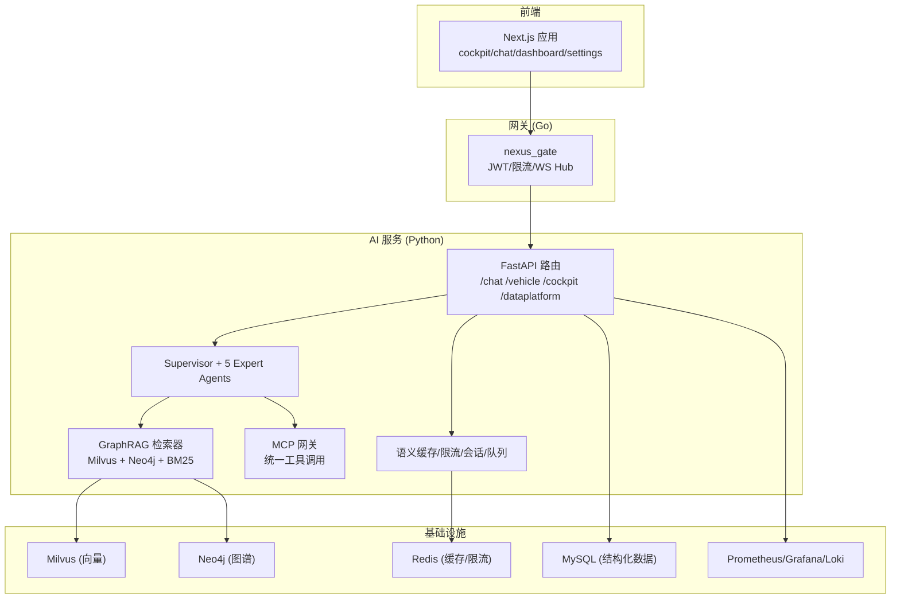
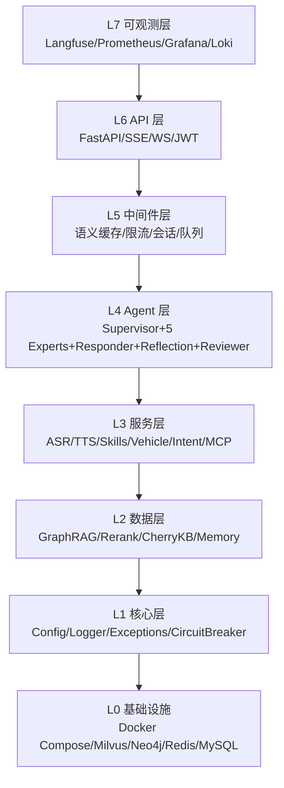
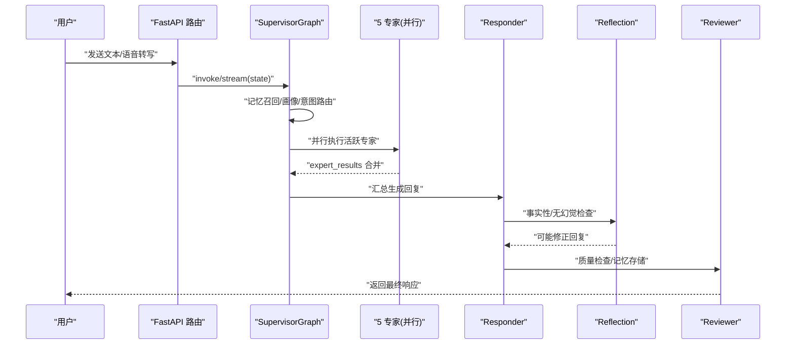
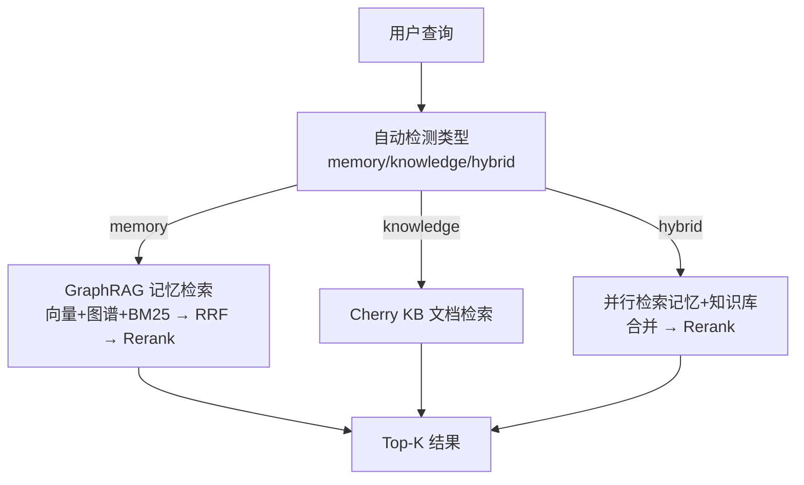
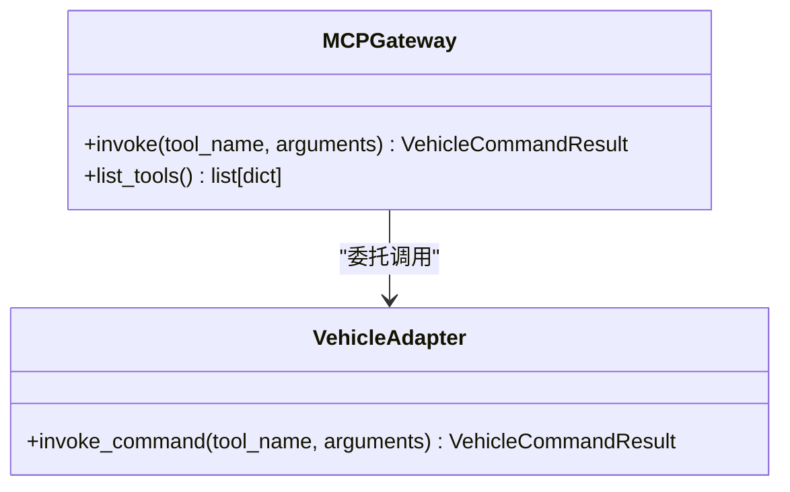
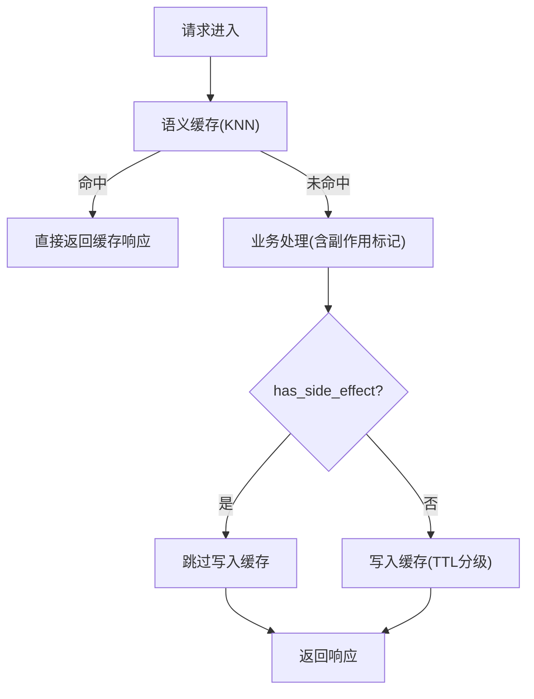
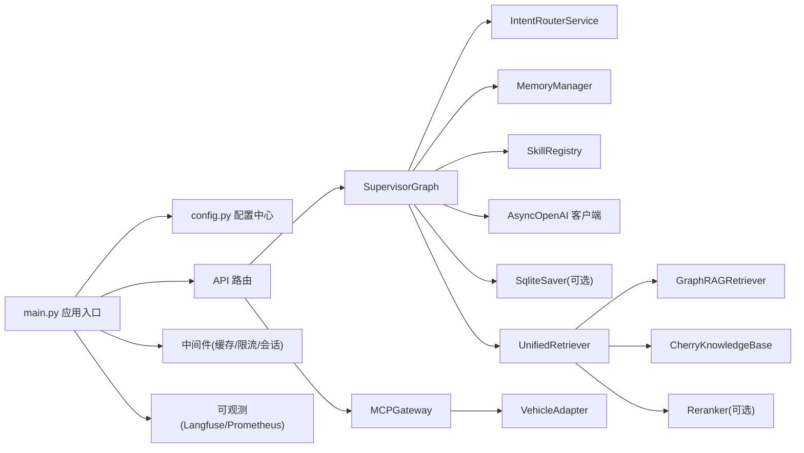

# 项目介绍与核心价值

<cite>
**本文引用的文件列表**
- [README.md](file://README.md)
- [backend_design/nexus/main.py](file://backend_design/nexus/main.py)
- [backend_design/nexus/config.py](file://backend_design/nexus/config.py)
- [docs/architecture/README.md](file://docs/architecture/README.md)
- [docs/architecture/L4-agent.md](file://docs/architecture/L4-agent.md)
- [docs/architecture/L2-data.md](file://docs/architecture/L2-data.md)
- [docs/architecture/L5-middleware.md](file://docs/architecture/L5-middleware.md)
- [backend_design/nexus/agent/supervisor_graph.py](file://backend_design/nexus/agent/supervisor_graph.py)
- [backend_design/nexus/rag/unified_retriever.py](file://backend_design/nexus/rag/unified_retriever.py)
- [backend_design/nexus/mcp/gateway.py](file://backend_design/nexus/mcp/gateway.py)
- [frontend_design/src/app/cockpit/page.tsx](file://frontend_design/src/app/cockpit/page.tsx)
</cite>

## 目录
1. [引言](#引言)
2. [项目结构](#项目结构)
3. [核心组件](#核心组件)
4. [架构总览](#架构总览)
5. [详细组件分析](#详细组件分析)
6. [依赖关系分析](#依赖关系分析)
7. [性能考量](#性能考量)
8. [故障排查指南](#故障排查指南)
9. [结论](#结论)
10. [附录](#附录)

## 引言
NexusCockpit 是企业级车载语音 Agent 平台，围绕“多智能体协同 + GraphRAG 融合检索 + MCP 协议”构建，提供从语音交互到车控管理的端到端能力。其核心价值主张包括：
- Multi-Agent + GraphRAG + MCP 的技术创新：以 Supervisor 调度五类专家并行执行，结合向量、图谱与全文三路 RRF 融合检索，并通过 MCP 统一暴露车控工具，形成高可靠、可解释、可扩展的对话与执行闭环。
- 7 层分层架构：L0-L7 清晰解耦，便于独立演进与替换（如本地 Milvus/Neo4j 与云端 Zilliz/AuraDB 一键切换）。
- 双模式部署灵活性：通过配置开关在本地 Docker 与云端托管之间无缝切换，降低运维复杂度并提升弹性。
- 车载场景落地价值：覆盖语音对话、个性化服务、车控管理等高频业务，解决“意图识别不准、知识召回不精准、指令执行不安全、体验不一致”等实际痛点。
- 独立性与可移植性：所有路径基于相对路径解析，不依赖外部项目文件，支持整体迁移与快速交付。

本章节为初学者建立认知路径，同时为有经验的开发者展示技术深度与创新点。

## 项目结构
仓库采用前后端分离与多语言协作的组织方式：
- 后端 Python AI 服务：FastAPI 应用，承载 Agent 编排、GraphRAG、中间件、API 路由等。
- Go 并发网关：JWT 鉴权、限流、WebSocket Hub，面向前端与客户端的高并发入口。
- 前端 Next.js：座舱控制台、聊天页、数据中台、设置中心等页面。
- 文档与配置：7 层架构文档、部署指南、监控配置等。

图表来源
- [backend_design/nexus/main.py:294-433](file://backend_design/nexus/main.py#L294-L433)
- [docs/architecture/README.md:23-36](file://docs/architecture/README.md#L23-L36)

章节来源
- [README.md:95-140](file://README.md#L95-L140)
- [docs/architecture/README.md:1-22](file://docs/architecture/README.md#L1-L22)

## 核心组件
- FastAPI 应用入口与生命周期管理：集中初始化 Embedding、向量/图谱存储、车控适配器、语义缓存、限流、会话、Langfuse 追踪、Agent 工作流、Cherry 知识库、数据保留策略等，并在关闭时有序清理资源。
- 配置中心：基于 Pydantic Settings 的类型安全配置，自动加载 .env.local/.env.prod，提供 LLM、Milvus、Neo4j、Redis、MySQL、车控、ASR/TTS、可观测性等子配置，以及 Providers 双模式开关。
- Multi-Agent 编排：Supervisor 负责记忆召回、用户画像加载、意图路由与专家分派；5 个专家并行执行；Responder 汇总生成回复；Reflection 做事实性与无幻觉检查；Reviewer 质量检查与记忆持久化。
- GraphRAG 检索：向量（Milvus）、图谱（Neo4j）、BM25 三路召回，RRF 融合后由 Reranker 重排；UnifiedRetriever 根据 query_type 分发至记忆或知识库或混合检索。
- MCP 网关：统一封装车控适配器，对外暴露标准化工具清单与 invoke 接口，屏蔽底层 HTTP/Mock/MCP stdio 差异。
- 中间件层：Redis 语义缓存（KNN 向量检索 + 副作用隔离）、滑动窗口限流、会话持久化、进程内异步任务。
- 前端座舱控制：面向用户的简洁界面，集成语音助手栏与车控面板，屏蔽技术细节。

章节来源
- [backend_design/nexus/main.py:61-291](file://backend_design/nexus/main.py#L61-L291)
- [backend_design/nexus/config.py:97-693](file://backend_design/nexus/config.py#L97-L693)
- [docs/architecture/L4-agent.md:1-77](file://docs/architecture/L4-agent.md#L1-L77)
- [docs/architecture/L2-data.md:90-166](file://docs/architecture/L2-data.md#L90-L166)
- [backend_design/nexus/mcp/gateway.py:20-67](file://backend_design/nexus/mcp/gateway.py#L20-L67)
- [docs/architecture/L5-middleware.md:13-57](file://docs/architecture/L5-middleware.md#L13-L57)
- [frontend_design/src/app/cockpit/page.tsx:22-40](file://frontend_design/src/app/cockpit/page.tsx#L22-L40)

## 架构总览
系统遵循 7 层分层架构，职责清晰、边界明确：
- L0 基础设施：Docker Compose 编排 Milvus、Neo4j、Redis、MySQL、Prometheus、Grafana、Loki。
- L1 核心层：配置、日志、异常、熔断、个性化服务。
- L2 数据层：GraphRAG（向量+图谱+BM25 三路 RRF 融合）+ Rerank + CherryKB + 记忆系统。
- L3 服务层：ASR/TTS、技能系统、车控总线、意图路由、MCP。
- L4 Agent 层：Supervisor + 5 Expert Agents + Responder + Reflection + Reviewer。
- L5 中间件层：Redis 语义缓存（KNN）、限流、会话、异步任务。
- L6 API 层：FastAPI REST/SSE/WebSocket + CockpitContextMiddleware。
- L7 可观测层：Langfuse Tracing + Prometheus Metrics + Grafana + Loki。

图表来源
- [docs/architecture/README.md:23-36](file://docs/architecture/README.md#L23-L36)

章节来源
- [docs/architecture/README.md:23-36](file://docs/architecture/README.md#L23-L36)

## 详细组件分析

### Multi-Agent 编排（Supervisor + 5 Experts + Responder + Reflection + Reviewer）
- Supervisor 节点：并行执行记忆召回、用户画像加载、意图路由，决定是否需要澄清与分派哪些专家。
- 专家并行：Vehicle/Navigation/Lifestyle/Health/Chat 五个专家通过 asyncio.gather 并行执行，结果通过 reducer 自动累加。
- Responder：汇总专家输出，分支处理搜索上下文、Tool→LLM 合成、简单车控直返。
- Reflection：对工具/搜索结果进行事实性、一致性、无幻觉检查，必要时修正回复。
- Reviewer：最终质量检查、记忆存储与延迟统计。

图表来源
- [backend_design/nexus/agent/supervisor_graph.py:127-173](file://backend_design/nexus/agent/supervisor_graph.py#L127-L173)
- [backend_design/nexus/agent/supervisor_graph.py:326-399](file://backend_design/nexus/agent/supervisor_graph.py#L326-L399)
- [backend_design/nexus/agent/supervisor_graph.py:401-450](file://backend_design/nexus/agent/supervisor_graph.py#L401-L450)
- [backend_design/nexus/agent/supervisor_graph.py:534-675](file://backend_design/nexus/agent/supervisor_graph.py#L534-L675)

章节来源
- [docs/architecture/L4-agent.md:18-77](file://docs/architecture/L4-agent.md#L18-L77)
- [backend_design/nexus/agent/supervisor_graph.py:127-173](file://backend_design/nexus/agent/supervisor_graph.py#L127-L173)

### GraphRAG 统一检索（三路融合 + Rerank）
- UnifiedRetriever 根据查询类型自动或显式选择 memory/knowledge/hybrid 检索路径。
- GraphRAGRetriever 实现向量（Milvus）、图谱（Neo4j）、BM25 三路召回，使用 RRF 融合排序，再由 Reranker 重排 Top-N。
- Cherry KB 提供文档型知识库检索，按类别管理，支持分块与向量化入库。

图表来源
- [backend_design/nexus/rag/unified_retriever.py:63-155](file://backend_design/nexus/rag/unified_retriever.py#L63-L155)
- [docs/architecture/L2-data.md:90-166](file://docs/architecture/L2-data.md#L90-L166)

章节来源
- [docs/architecture/L2-data.md:90-166](file://docs/architecture/L2-data.md#L90-L166)
- [backend_design/nexus/rag/unified_retriever.py:63-155](file://backend_design/nexus/rag/unified_retriever.py#L63-L155)

### MCP 网关（统一工具调用）
- MCPGateway 封装 vehicle adapter，提供统一的 invoke 接口与工具清单，屏蔽 Mock/HTTP/MCP stdio 差异。
- 适用于车控工具的标准化管理与审计，保障安全性与可观测性。

图表来源
- [backend_design/nexus/mcp/gateway.py:20-67](file://backend_design/nexus/mcp/gateway.py#L20-L67)

章节来源
- [backend_design/nexus/mcp/gateway.py:20-67](file://backend_design/nexus/mcp/gateway.py#L20-L67)

### 中间件层（语义缓存/限流/会话/队列）
- 语义缓存：基于 Redis Stack RediSearch KNN 向量检索，O(log n) 复杂度，支持按用户分片、TTL 分级、副作用隔离与降级回退。
- 限流器：Redis Lua 原子化滑动窗口算法，避免超限污染计数。
- 会话存储：Redis 持久化会话历史，不可用时降级内存。
- 任务队列：v2.2 简化为 asyncio.create_task 进程内异步任务，无需额外中间件。

图表来源
- [docs/architecture/L5-middleware.md:13-57](file://docs/architecture/L5-middleware.md#L13-L57)

章节来源
- [docs/architecture/L5-middleware.md:13-57](file://docs/architecture/L5-middleware.md#L13-L57)

### 前端座舱控制（面向用户的简洁界面）
- 座舱控制页作为用户主界面，顶部语音助手快捷输入栏，下方车控面板（空调、座椅、音乐、导航、车窗），屏蔽技术名词，专注用户体验。

章节来源
- [frontend_design/src/app/cockpit/page.tsx:22-40](file://frontend_design/src/app/cockpit/page.tsx#L22-L40)

## 依赖关系分析
- 应用启动依赖链：main.py 创建 FastAPI 实例 → lifespan 初始化各子系统 → 注册路由与中间件 → 挂载指标与静态资源。
- 配置依赖链：config.py 聚合所有子配置，Providers 控制双模式（local/cloud），get_config() 全局单例。
- Agent 依赖链：SupervisorGraph 依赖 IntentRouterService、MemoryManager、SkillRegistry、LLM 客户端、CheckpointSaver。
- 检索依赖链：UnifiedRetriever 组合 GraphRAGRetriever 与 Cherry KB，可选 Reranker。
- MCP 依赖链：MCPGateway 委托 VehicleAdapter 执行具体车控命令。

图表来源
- [backend_design/nexus/main.py:294-433](file://backend_design/nexus/main.py#L294-L433)
- [backend_design/nexus/config.py:601-693](file://backend_design/nexus/config.py#L601-L693)
- [backend_design/nexus/agent/supervisor_graph.py:83-126](file://backend_design/nexus/agent/supervisor_graph.py#L83-L126)
- [backend_design/nexus/rag/unified_retriever.py:47-62](file://backend_design/nexus/rag/unified_retriever.py#L47-L62)
- [backend_design/nexus/mcp/gateway.py:20-37](file://backend_design/nexus/mcp/gateway.py#L20-L37)

章节来源
- [backend_design/nexus/main.py:294-433](file://backend_design/nexus/main.py#L294-L433)
- [backend_design/nexus/config.py:601-693](file://backend_design/nexus/config.py#L601-L693)

## 性能考量
- 并行优化：Supervisor 节点内记忆召回、画像加载、意图路由并行执行，显著降低端到端延迟。
- 检索优化：GraphRAG 三路召回 + RRF 融合 + Rerank 重排，兼顾召回率与相关性。
- 缓存优化：语义缓存采用 KNN 向量检索 O(log n)，按用户分片与 TTL 分级，副作用隔离避免错误命中。
- 限流保护：Redis Lua 原子化滑动窗口限流，防止过载与雪崩。
- 降级策略：云端 LLM 不可用自动降级到本地 Qwen3.5-4B（llama.cpp OpenAI 兼容接口），中间件不可用时自动回退。

章节来源
- [backend_design/nexus/agent/supervisor_graph.py:214-244](file://backend_design/nexus/agent/supervisor_graph.py#L214-L244)
- [docs/architecture/L2-data.md:90-166](file://docs/architecture/L2-data.md#L90-L166)
- [docs/architecture/L5-middleware.md:13-57](file://docs/architecture/L5-middleware.md#L13-L57)
- [backend_design/nexus/config.py:131-146](file://backend_design/nexus/config.py#L131-L146)

## 故障排查指南
- 健康检查与诊断：
  - 后端健康检查：/health
  - 网关健康检查：/health
  - 应用根路径返回版本与描述信息，便于确认服务状态。
- 常见异常与处理：
  - RateLimitError：返回 429，附带 Retry-After 头。
  - AuthError：返回 401，附带 WWW-Authenticate 头。
  - NexusError：返回 500，包含错误码与消息。
- 可观测性：
  - Langfuse：记录每次 Agent 调用的完整链路，便于定位问题。
  - Prometheus/Grafana：采集 API 延迟、Agent 耗时、缓存命中率等指标。
  - Loki：日志收集与分析。

章节来源
- [backend_design/nexus/main.py:319-395](file://backend_design/nexus/main.py#L319-L395)
- [docs/architecture/README.md:55-81](file://docs/architecture/README.md#L55-L81)

## 结论
NexusCockpit 以清晰的 7 层分层架构为基础，将 Multi-Agent 协同、GraphRAG 融合检索与 MCP 协议有机结合，提供了高可靠、可解释、可扩展的车载语音 Agent 平台。其双模式部署与独立可移植特性，使得从本地开发到云端生产的一体化交付成为可能。对于初学者，建议从 README 与架构文档入手，逐步理解各层职责与关键流程；对于资深开发者，可深入 Supervisor 编排、GraphRAG 检索管线与中间件设计，探索更多优化与扩展空间。

## 附录
- 快速开始与部署：参考 README 中的环境要求、Docker Compose 启动、模型下载、环境变量配置与服务启动步骤。
- 学习路线图：docs/learning-roadmap.md 提供新人 12-16 小时学习指南。
- 双模式部署：通过 Providers 配置在 local/cloud 间切换，无需改动代码。

章节来源
- [README.md:146-318](file://README.md#L146-L318)
- [docs/architecture/README.md:82-96](file://docs/architecture/README.md#L82-L96)