# 项目概述

<cite>
**本文引用的文件**   
- [README.md](file://README.md)
- [backend_design/nexus/main.py](file://backend_design/nexus/main.py)
- [backend_design/nexus/config.py](file://backend_design/nexus/config.py)
- [backend_design/nexus/agent/supervisor_graph.py](file://backend_design/nexus/agent/supervisor_graph.py)
- [backend_design/nexus/agent/responder.py](file://backend_design/nexus/agent/responder.py)
- [backend_design/nexus/agent/reviewer.py](file://backend_design/nexus/agent/reviewer.py)
- [backend_design/nexus/agent/experts/chat_expert.py](file://backend_design/nexus/agent/experts/chat_expert.py)
- [backend_design/nexus/agent/experts/vehicle_expert.py](file://backend_design/nexus/agent/experts/vehicle_expert.py)
- [backend_design/nexus/api/routes/chat.py](file://backend_design/nexus/api/routes/chat.py)
- [backend_design/nexus/api/routes/cockpit.py](file://backend_design/nexus/api/routes/cockpit.py)
- [backend_design/nexus/api/websocket.py](file://backend_design/nexus/api/websocket.py)
- [backend_design/nexus/intent/router.py](file://backend_design/nexus/intent/router.py)
- [backend_design/nexus/intent/llm_router.py](file://backend_design/nexus/intent/llm_router.py)
- [backend_design/nexus/memory/manager.py](file://backend_design/nexus/memory/manager.py)
- [backend_design/nexus/core/personalization.py](file://backend_design/nexus/core/personalization.py)
- [backend_design/nexus/rag/unified_retriever.py](file://backend_design/nexus/rag/unified_retriever.py)
- [backend_design/nexus/rag/vector_store.py](file://backend_design/nexus/rag/vector_store.py)
- [backend_design/nexus/rag/graph_store.py](file://backend_design/nexus/rag/graph_store.py)
- [backend_design/nexus/rag/reranker.py](file://backend_design/nexus/rag/reranker.py)
- [backend_design/nexus/skills/orchestrator.py](file://backend_design/nexus/skills/orchestrator.py)
- [backend_design/nexus/skills/registry.py](file://backend_design/nexus/skills/registry.py)
- [backend_design/nexus/vehicle/factory.py](file://backend_design/nexus/vehicle/factory.py)
- [backend_design/nexus/vehicle/http.py](file://backend_design/nexus/vehicle/http.py)
- [backend_design/nexus/vehicle/mcp.py](file://backend_design/nexus/vehicle/mcp.py)
- [backend_design/nexus/asr/engine.py](file://backend_design/nexus/asr/engine.py)
- [backend_design/nexus/tts/engine.py](file://backend_design/nexus/tts/engine.py)
- [backend_design/nexus_gate/cmd/main.go](file://backend_design/nexus_gate/cmd/main.go)
- [backend_design/nexus_gate/internal/proxy/proxy.go](file://backend_design/nexus_gate/internal/proxy/proxy.go)
- [backend_design/nexus_gate/internal/ws/hub.go](file://backend_design/nexus_gate/internal/ws/hub.go)
- [frontend_design/src/app/layout.tsx](file://frontend_design/src/app/layout.tsx)
- [frontend_design/src/app/page.tsx](file://frontend_design/src/app/page.tsx)
- [frontend_design/src/app/chat/page.tsx](file://frontend_design/src/app/chat/page.tsx)
- [frontend_design/src/app/cockpit/page.tsx](file://frontend_design/src/app/cockpit/page.tsx)
- [frontend_design/src/components/voice-recorder.tsx](file://frontend_design/src/components/voice-recorder.tsx)
- [frontend_design/src/lib/api.ts](file://frontend_design/src/lib/api.ts)
- [docker-compose.yml](file://docker-compose.yml)
</cite>

## 目录
1. [简介](#简介)
2. [项目结构](#项目结构)
3. [核心组件](#核心组件)
4. [架构总览](#架构总览)
5. [详细组件分析](#详细组件分析)
6. [依赖关系分析](#依赖关系分析)
7. [性能与可扩展性](#性能与可扩展性)
8. [故障排查指南](#故障排查指南)
9. [结论](#结论)
10. [附录：术语与参考](#附录术语与参考)

## 简介
NexusCockpit智能座舱系统是一个面向车载场景的“多专家AI + RAG检索增强生成 + 个性化记忆管理”的智能助手平台。系统采用前后端分离架构：Go语言网关负责鉴权、限流与WebSocket转发；Python后端提供意图识别、多专家路由、RAG检索、技能编排与车辆控制能力；Next.js前端提供对话、语音交互与座舱可视化界面。

核心目标
- 为驾驶员与乘客提供自然、安全、低延迟的智能交互体验
- 通过多专家协同与RAG提升回答质量与可解释性
- 以个性化记忆与习惯管理实现“越用越懂你”的服务
- 将对话转化为对车辆的真实控制，打通“说即控”的闭环

主要特性
- 多专家AI架构：聊天、导航、健康、生活方式、车辆等专家协作
- RAG检索增强：向量库与图数据库统一检索与重排
- 个性化记忆：用户偏好、历史行为与习惯的持久化与冲突消解
- 语音交互：ASR/TTS集成与实时音频流处理
- 车辆控制：HTTP/MCP协议抽象，统一技能编排执行
- 可观测性与稳定性：指标、日志、熔断与降级策略

## 项目结构
仓库采用分层与按功能域组织的方式：
- backend_design/nexus：Python后端（FastAPI应用、Agent、RAG、Skills、Vehicle、ASR/TTS、中间件、可观测性等）
- backend_design/nexus_gate：Go网关（鉴权、限流、反向代理、WebSocket Hub）
- frontend_design：Next.js前端（页面、组件、状态、API封装、语音录制等）
- config：Grafana/Prometheus/Loki配置
- models：本地模型资源（ASR/TTS/Reranker等）
- scripts：初始化与测试脚本
- docker-compose.yml：一键编排服务

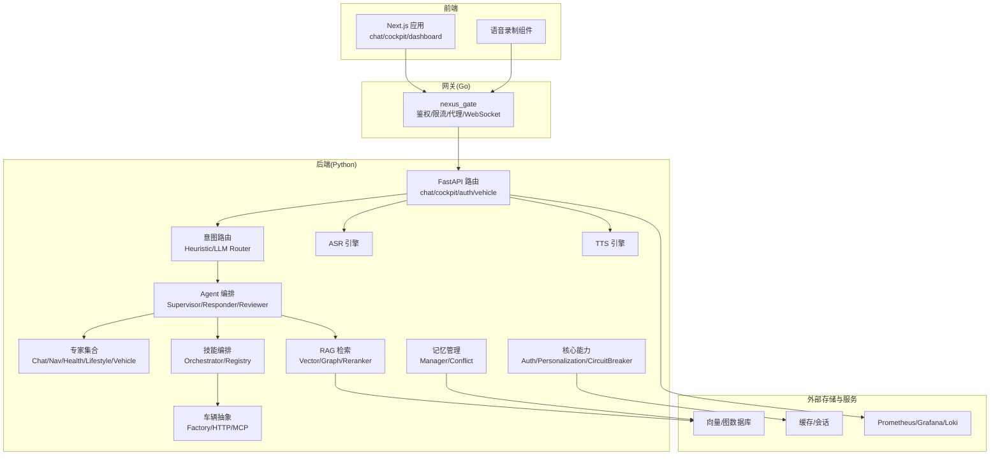

图示来源
- [backend_design/nexus/main.py](file://backend_design/nexus/main.py)
- [backend_design/nexus/api/routes/chat.py](file://backend_design/nexus/api/routes/chat.py)
- [backend_design/nexus/agent/supervisor_graph.py](file://backend_design/nexus/agent/supervisor_graph.py)
- [backend_design/nexus/rag/unified_retriever.py](file://backend_design/nexus/rag/unified_retriever.py)
- [backend_design/nexus/skills/orchestrator.py](file://backend_design/nexus/skills/orchestrator.py)
- [backend_design/nexus/vehicle/factory.py](file://backend_design/nexus/vehicle/factory.py)
- [backend_design/nexus_gate/cmd/main.go](file://backend_design/nexus_gate/cmd/main.go)
- [frontend_design/src/app/chat/page.tsx](file://frontend_design/src/app/chat/page.tsx)
- [frontend_design/src/components/voice-recorder.tsx](file://frontend_design/src/components/voice-recorder.tsx)

章节来源
- [README.md](file://README.md)
- [docker-compose.yml](file://docker-compose.yml)

## 核心组件
- 网关层（Go）
  - 职责：统一入口、JWT鉴权、请求限流、静态资源与API反向代理、WebSocket Hub转发
  - 关键路径：命令入口、代理转发、WS Hub
- 后端应用（Python）
  - 应用启动与配置：主入口、配置加载、中间件注册
  - API路由：对话、座舱、认证、车辆控制、ASR/TTS、设置与健康检查
  - Agent编排：Supervisor调度、Responder生成、Reviewer校验
  - 意图识别：启发式规则与大模型路由混合
  - RAG检索：统一检索器、向量/图存储、重排器
  - 技能编排：注册表与编排器，驱动车辆控制、提醒、健康等技能
  - 车辆抽象：工厂模式适配HTTP/MCP等多协议
  - 记忆与个性化：记忆管理器、冲突消解、个人画像
  - 语音链路：ASR转写、TTS合成
- 前端（Next.js）
  - 页面：首页、聊天页、座舱页、仪表盘、数据平台、中间件监控、设置、车辆控制
  - 组件：语音录制、车辆面板、3D车模、侧边栏布局
  - 状态与工具：认证状态、聊天状态、异步Hook、GPS定位、语音识别Hook、API封装、TTS播放

章节来源
- [backend_design/nexus/main.py](file://backend_design/nexus/main.py)
- [backend_design/nexus/config.py](file://backend_design/nexus/config.py)
- [backend_design/nexus/api/routes/chat.py](file://backend_design/nexus/api/routes/chat.py)
- [backend_design/nexus/api/routes/cockpit.py](file://backend_design/nexus/api/routes/cockpit.py)
- [backend_design/nexus/api/websocket.py](file://backend_design/nexus/api/websocket.py)
- [backend_design/nexus/agent/supervisor_graph.py](file://backend_design/nexus/agent/supervisor_graph.py)
- [backend_design/nexus/agent/responder.py](file://backend_design/nexus/agent/responder.py)
- [backend_design/nexus/agent/reviewer.py](file://backend_design/nexus/agent/reviewer.py)
- [backend_design/nexus/intent/router.py](file://backend_design/nexus/intent/router.py)
- [backend_design/nexus/intent/llm_router.py](file://backend_design/nexus/intent/llm_router.py)
- [backend_design/nexus/rag/unified_retriever.py](file://backend_design/nexus/rag/unified_retriever.py)
- [backend_design/nexus/rag/vector_store.py](file://backend_design/nexus/rag/vector_store.py)
- [backend_design/nexus/rag/graph_store.py](file://backend_design/nexus/rag/graph_store.py)
- [backend_design/nexus/rag/reranker.py](file://backend_design/nexus/rag/reranker.py)
- [backend_design/nexus/skills/orchestrator.py](file://backend_design/nexus/skills/orchestrator.py)
- [backend_design/nexus/skills/registry.py](file://backend_design/nexus/skills/registry.py)
- [backend_design/nexus/vehicle/factory.py](file://backend_design/nexus/vehicle/factory.py)
- [backend_design/nexus/vehicle/http.py](file://backend_design/nexus/vehicle/http.py)
- [backend_design/nexus/vehicle/mcp.py](file://backend_design/nexus/vehicle/mcp.py)
- [backend_design/nexus/asr/engine.py](file://backend_design/nexus/asr/engine.py)
- [backend_design/nexus/tts/engine.py](file://backend_design/nexus/tts/engine.py)
- [backend_design/nexus/memory/manager.py](file://backend_design/nexus/memory/manager.py)
- [backend_design/nexus/core/personalization.py](file://backend_design/nexus/core/personalization.py)
- [backend_design/nexus_gate/cmd/main.go](file://backend_design/nexus_gate/cmd/main.go)
- [backend_design/nexus_gate/internal/proxy/proxy.go](file://backend_design/nexus_gate/internal/proxy/proxy.go)
- [backend_design/nexus_gate/internal/ws/hub.go](file://backend_design/nexus_gate/internal/ws/hub.go)
- [frontend_design/src/app/layout.tsx](file://frontend_design/src/app/layout.tsx)
- [frontend_design/src/app/page.tsx](file://frontend_design/src/app/page.tsx)
- [frontend_design/src/app/chat/page.tsx](file://frontend_design/src/app/chat/page.tsx)
- [frontend_design/src/app/cockpit/page.tsx](file://frontend_design/src/app/cockpit/page.tsx)
- [frontend_design/src/components/voice-recorder.tsx](file://frontend_design/src/components/voice-recorder.tsx)
- [frontend_design/src/lib/api.ts](file://frontend_design/src/lib/api.ts)

## 架构总览
系统采用“网关-后端-前端”三层分离，结合“多专家+RAG+记忆+技能”的AI中台能力，形成从语音输入到车辆控制的端到端链路。

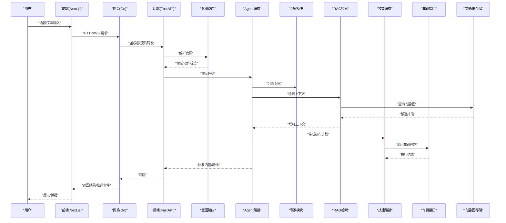

图示来源
- [backend_design/nexus/api/routes/chat.py](file://backend_design/nexus/api/routes/chat.py)
- [backend_design/nexus/intent/router.py](file://backend_design/nexus/intent/router.py)
- [backend_design/nexus/agent/supervisor_graph.py](file://backend_design/nexus/agent/supervisor_graph.py)
- [backend_design/nexus/rag/unified_retriever.py](file://backend_design/nexus/rag/unified_retriever.py)
- [backend_design/nexus/skills/orchestrator.py](file://backend_design/nexus/skills/orchestrator.py)
- [backend_design/nexus/vehicle/factory.py](file://backend_design/nexus/vehicle/factory.py)
- [backend_design/nexus_gate/cmd/main.go](file://backend_design/nexus_gate/cmd/main.go)
- [frontend_design/src/app/chat/page.tsx](file://frontend_design/src/app/chat/page.tsx)

## 详细组件分析

### 多专家AI与Agent编排
- Supervisor负责整体流程编排，协调Responder生成与Reviewer校验，确保输出质量与安全边界
- 专家模块按领域划分（聊天、导航、健康、生活方式、车辆），各自维护领域知识与动作空间
- 通过统一的输入/输出契约进行协作，便于扩展新专家

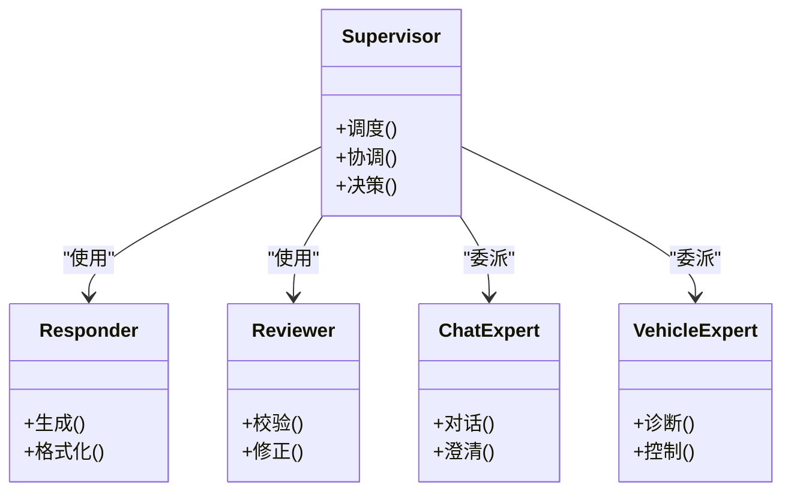

图示来源
- [backend_design/nexus/agent/supervisor_graph.py](file://backend_design/nexus/agent/supervisor_graph.py)
- [backend_design/nexus/agent/responder.py](file://backend_design/nexus/agent/responder.py)
- [backend_design/nexus/agent/reviewer.py](file://backend_design/nexus/agent/reviewer.py)
- [backend_design/nexus/agent/experts/chat_expert.py](file://backend_design/nexus/agent/experts/chat_expert.py)
- [backend_design/nexus/agent/experts/vehicle_expert.py](file://backend_design/nexus/agent/experts/vehicle_expert.py)

章节来源
- [backend_design/nexus/agent/supervisor_graph.py](file://backend_design/nexus/agent/supervisor_graph.py)
- [backend_design/nexus/agent/responder.py](file://backend_design/nexus/agent/responder.py)
- [backend_design/nexus/agent/reviewer.py](file://backend_design/nexus/agent/reviewer.py)
- [backend_design/nexus/agent/experts/chat_expert.py](file://backend_design/nexus/agent/experts/chat_expert.py)
- [backend_design/nexus/agent/experts/vehicle_expert.py](file://backend_design/nexus/agent/experts/vehicle_expert.py)

### 意图识别与路由
- 启发式规则快速匹配常见指令，降低大模型调用成本
- 大模型路由用于复杂语义与模糊表达，提高准确率
- 输出标准化标签供后续专家与技能编排消费

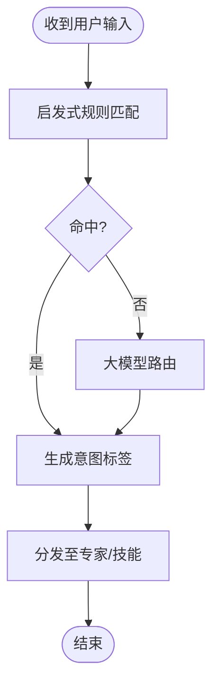

图示来源
- [backend_design/nexus/intent/router.py](file://backend_design/nexus/intent/router.py)
- [backend_design/nexus/intent/llm_router.py](file://backend_design/nexus/intent/llm_router.py)

章节来源
- [backend_design/nexus/intent/router.py](file://backend_design/nexus/intent/router.py)
- [backend_design/nexus/intent/llm_router.py](file://backend_design/nexus/intent/llm_router.py)

### RAG检索增强生成
- 统一检索器聚合向量与图两种知识源，支持跨域召回
- 向量存储用于语义相似检索，图存储用于结构化关系推理
- 重排器对候选结果进行二次排序，提升相关性

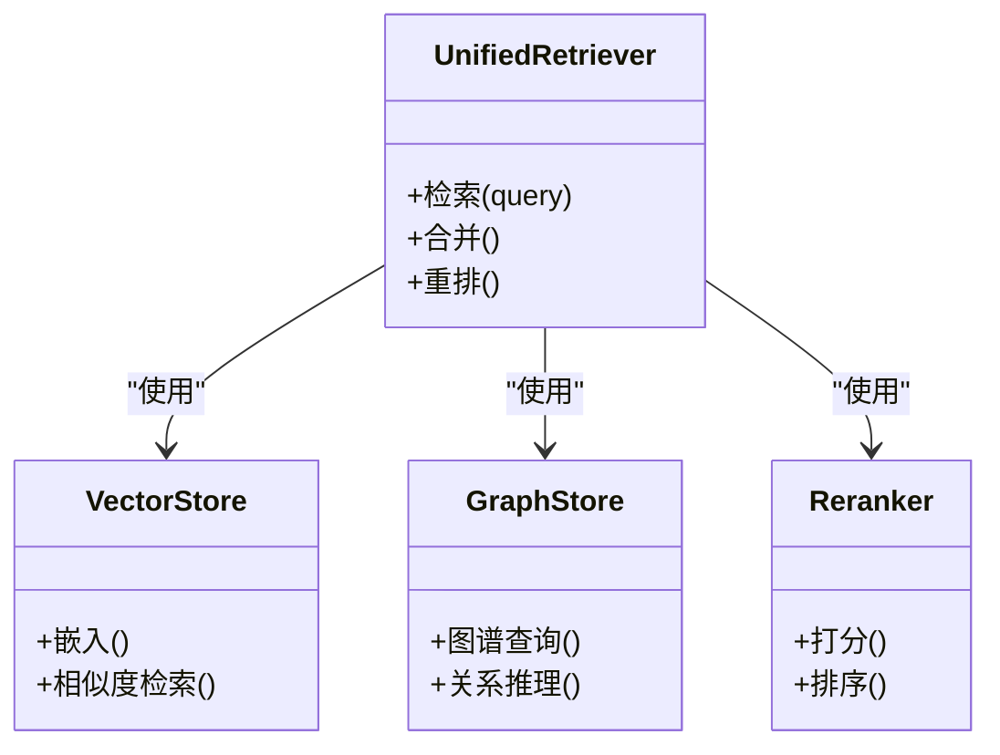

图示来源
- [backend_design/nexus/rag/unified_retriever.py](file://backend_design/nexus/rag/unified_retriever.py)
- [backend_design/nexus/rag/vector_store.py](file://backend_design/nexus/rag/vector_store.py)
- [backend_design/nexus/rag/graph_store.py](file://backend_design/nexus/rag/graph_store.py)
- [backend_design/nexus/rag/reranker.py](file://backend_design/nexus/rag/reranker.py)

章节来源
- [backend_design/nexus/rag/unified_retriever.py](file://backend_design/nexus/rag/unified_retriever.py)
- [backend_design/nexus/rag/vector_store.py](file://backend_design/nexus/rag/vector_store.py)
- [backend_design/nexus/rag/graph_store.py](file://backend_design/nexus/rag/graph_store.py)
- [backend_design/nexus/rag/reranker.py](file://backend_design/nexus/rag/reranker.py)

### 个性化记忆管理
- 记忆管理器负责抽取、存储与更新用户偏好、习惯与历史
- 冲突消解机制保证多源信息一致性
- 个性化画像在对话与推荐中动态注入

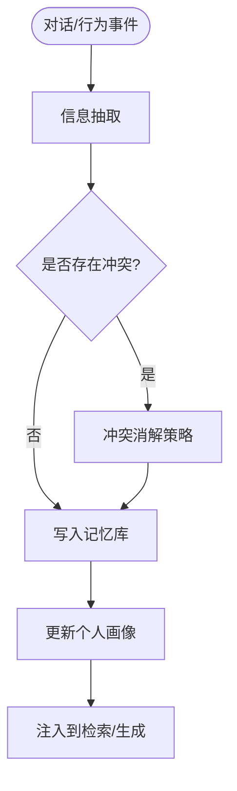

图示来源
- [backend_design/nexus/memory/manager.py](file://backend_design/nexus/memory/manager.py)
- [backend_design/nexus/core/personalization.py](file://backend_design/nexus/core/personalization.py)

章节来源
- [backend_design/nexus/memory/manager.py](file://backend_design/nexus/memory/manager.py)
- [backend_design/nexus/core/personalization.py](file://backend_design/nexus/core/personalization.py)

### 技能编排与车辆控制
- 技能注册表集中管理可用技能，编排器根据意图与上下文组合执行
- 车辆抽象层屏蔽底层差异，支持HTTP与MCP等多种协议
- 典型场景：空调调节、媒体播放、导航设定、车窗控制、座椅调整

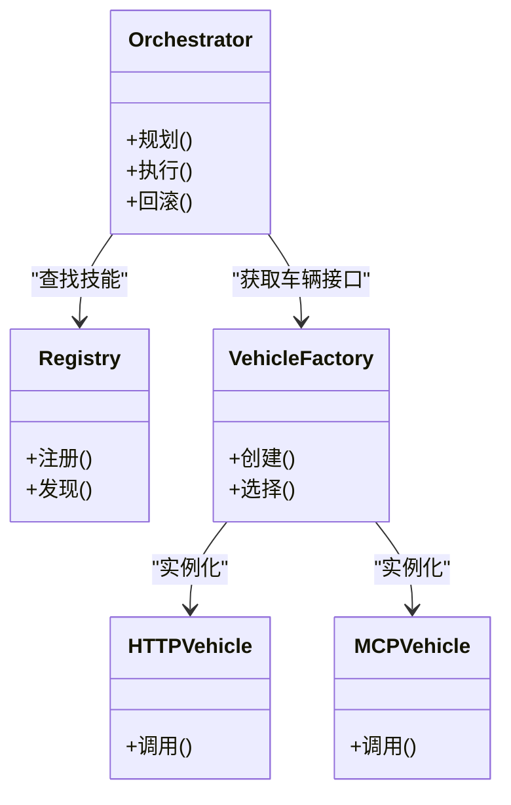

图示来源
- [backend_design/nexus/skills/orchestrator.py](file://backend_design/nexus/skills/orchestrator.py)
- [backend_design/nexus/skills/registry.py](file://backend_design/nexus/skills/registry.py)
- [backend_design/nexus/vehicle/factory.py](file://backend_design/nexus/vehicle/factory.py)
- [backend_design/nexus/vehicle/http.py](file://backend_design/nexus/vehicle/http.py)
- [backend_design/nexus/vehicle/mcp.py](file://backend_design/nexus/vehicle/mcp.py)

章节来源
- [backend_design/nexus/skills/orchestrator.py](file://backend_design/nexus/skills/orchestrator.py)
- [backend_design/nexus/skills/registry.py](file://backend_design/nexus/skills/registry.py)
- [backend_design/nexus/vehicle/factory.py](file://backend_design/nexus/vehicle/factory.py)
- [backend_design/nexus/vehicle/http.py](file://backend_design/nexus/vehicle/http.py)
- [backend_design/nexus/vehicle/mcp.py](file://backend_design/nexus/vehicle/mcp.py)

### 语音交互链路（ASR/TTS）
- 前端录音组件采集音频并上传或流式传输
- 后端ASR引擎将语音转为文本，送入对话流程
- TTS引擎将文本回复合成为语音，前端播放

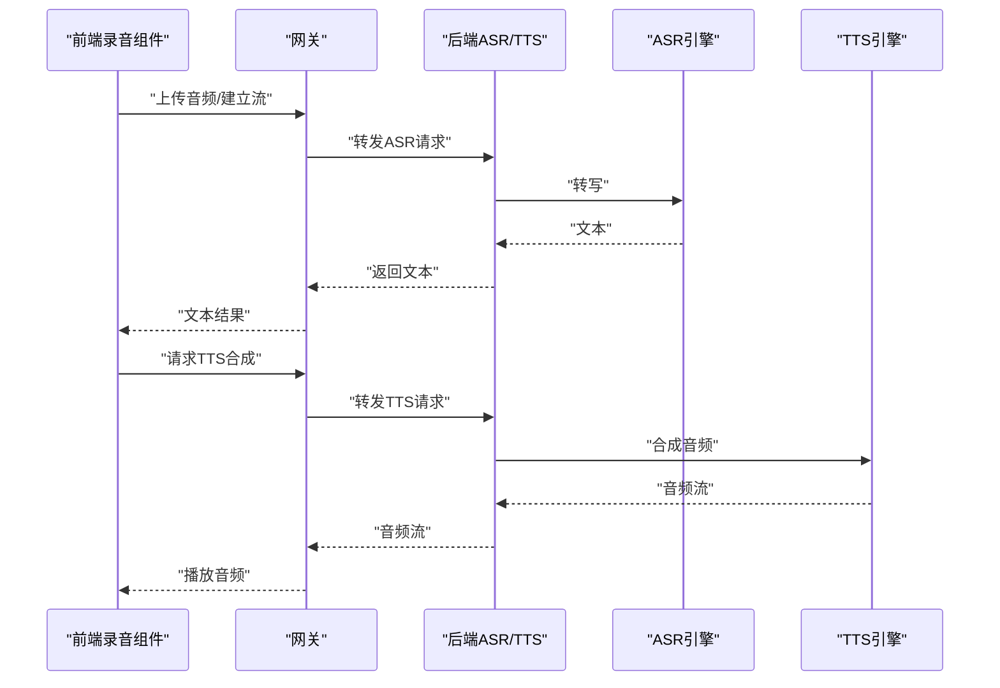

图示来源
- [frontend_design/src/components/voice-recorder.tsx](file://frontend_design/src/components/voice-recorder.tsx)
- [backend_design/nexus/asr/engine.py](file://backend_design/nexus/asr/engine.py)
- [backend_design/nexus/tts/engine.py](file://backend_design/nexus/tts/engine.py)
- [backend_design/nexus_gate/internal/proxy/proxy.go](file://backend_design/nexus_gate/internal/proxy/proxy.go)

章节来源
- [frontend_design/src/components/voice-recorder.tsx](file://frontend_design/src/components/voice-recorder.tsx)
- [backend_design/nexus/asr/engine.py](file://backend_design/nexus/asr/engine.py)
- [backend_design/nexus/tts/engine.py](file://backend_design/nexus/tts/engine.py)
- [backend_design/nexus_gate/internal/proxy/proxy.go](file://backend_design/nexus_gate/internal/proxy/proxy.go)

### 网关与WebSocket
- Go网关承担鉴权、限流、反向代理与WebSocket Hub转发
- 前端通过WebSocket接收实时事件（如语音流、车辆状态变更）

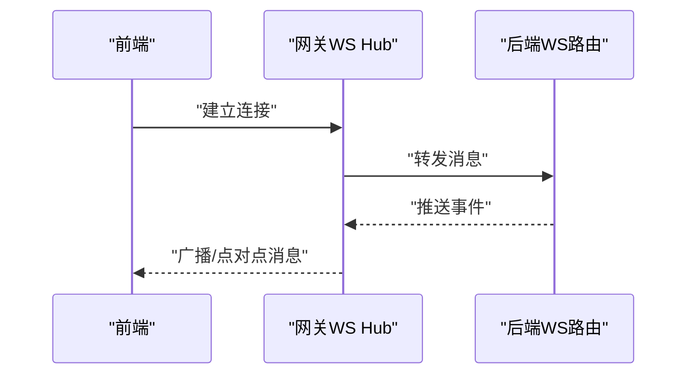

图示来源
- [backend_design/nexus_gate/internal/ws/hub.go](file://backend_design/nexus_gate/internal/ws/hub.go)
- [backend_design/nexus/api/websocket.py](file://backend_design/nexus/api/websocket.py)

章节来源
- [backend_design/nexus_gate/internal/ws/hub.go](file://backend_design/nexus_gate/internal/ws/hub.go)
- [backend_design/nexus/api/websocket.py](file://backend_design/nexus/api/websocket.py)

### 前端页面与状态
- 页面：聊天、座舱、仪表盘、数据平台、中间件监控、设置、车辆控制
- 组件：语音录制、车辆面板、3D车模、侧边栏布局
- 状态：认证、聊天会话、异步操作、GPS定位、语音识别
- API封装：统一请求头、错误处理、重试与超时

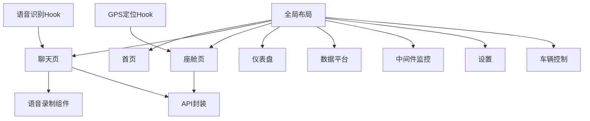

图示来源
- [frontend_design/src/app/layout.tsx](file://frontend_design/src/app/layout.tsx)
- [frontend_design/src/app/page.tsx](file://frontend_design/src/app/page.tsx)
- [frontend_design/src/app/chat/page.tsx](file://frontend_design/src/app/chat/page.tsx)
- [frontend_design/src/app/cockpit/page.tsx](file://frontend_design/src/app/cockpit/page.tsx)
- [frontend_design/src/components/voice-recorder.tsx](file://frontend_design/src/components/voice-recorder.tsx)
- [frontend_design/src/lib/api.ts](file://frontend_design/src/lib/api.ts)

章节来源
- [frontend_design/src/app/layout.tsx](file://frontend_design/src/app/layout.tsx)
- [frontend_design/src/app/page.tsx](file://frontend_design/src/app/page.tsx)
- [frontend_design/src/app/chat/page.tsx](file://frontend_design/src/app/chat/page.tsx)
- [frontend_design/src/app/cockpit/page.tsx](file://frontend_design/src/app/cockpit/page.tsx)
- [frontend_design/src/components/voice-recorder.tsx](file://frontend_design/src/components/voice-recorder.tsx)
- [frontend_design/src/lib/api.ts](file://frontend_design/src/lib/api.ts)

## 依赖关系分析
- 网关与后端：网关作为统一入口，承载鉴权与限流，将请求转发至后端各路由
- 后端内部：API路由依赖意图路由、Agent编排、RAG检索、技能编排与车辆抽象
- 存储与可观测性：RAG与记忆模块依赖向量/图数据库；可观测性模块上报指标与日志
- 前端与后端：通过REST与WebSocket通信，复用统一API封装

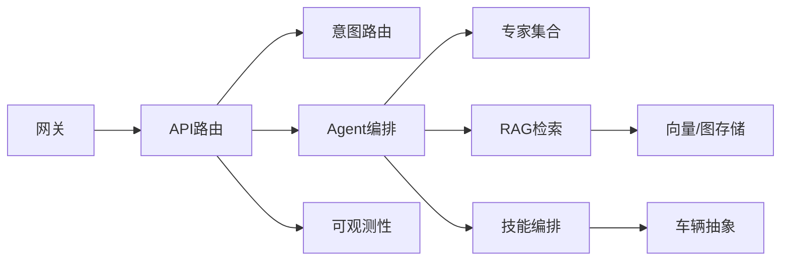

图示来源
- [backend_design/nexus_gate/cmd/main.go](file://backend_design/nexus_gate/cmd/main.go)
- [backend_design/nexus/api/routes/chat.py](file://backend_design/nexus/api/routes/chat.py)
- [backend_design/nexus/intent/router.py](file://backend_design/nexus/intent/router.py)
- [backend_design/nexus/agent/supervisor_graph.py](file://backend_design/nexus/agent/supervisor_graph.py)
- [backend_design/nexus/rag/unified_retriever.py](file://backend_design/nexus/rag/unified_retriever.py)
- [backend_design/nexus/skills/orchestrator.py](file://backend_design/nexus/skills/orchestrator.py)
- [backend_design/nexus/vehicle/factory.py](file://backend_design/nexus/vehicle/factory.py)

章节来源
- [backend_design/nexus_gate/cmd/main.go](file://backend_design/nexus_gate/cmd/main.go)
- [backend_design/nexus/api/routes/chat.py](file://backend_design/nexus/api/routes/chat.py)
- [backend_design/nexus/intent/router.py](file://backend_design/nexus/intent/router.py)
- [backend_design/nexus/agent/supervisor_graph.py](file://backend_design/nexus/agent/supervisor_graph.py)
- [backend_design/nexus/rag/unified_retriever.py](file://backend_design/nexus/rag/unified_retriever.py)
- [backend_design/nexus/skills/orchestrator.py](file://backend_design/nexus/skills/orchestrator.py)
- [backend_design/nexus/vehicle/factory.py](file://backend_design/nexus/vehicle/factory.py)

## 性能与可扩展性
- 意图路由优先启发式规则，减少大模型调用，降低延迟与成本
- RAG统一检索与重排提升答案相关性与稳定性
- 技能编排支持并行与回滚，保障复杂操作的可靠性
- 网关限流与熔断保护后端，避免雪崩
- 可观测性指标与日志帮助定位瓶颈与异常

[本节为通用指导，不直接分析具体文件]

## 故障排查指南
- 网关层
  - 鉴权失败：检查JWT配置与令牌有效性
  - 限流触发：查看限流阈值与客户端频率
  - WebSocket断连：确认Hub状态与心跳机制
- 后端层
  - 意图识别不准：优化启发式规则或调整大模型路由参数
  - RAG召回差：检查向量/图索引与重排策略
  - 技能执行失败：核对车辆接口连通性与协议适配
- 前端层
  - 语音录制异常：检查浏览器权限与编码格式
  - 网络错误：查看API封装的错误处理与重试逻辑
  - 状态不同步：检查认证与聊天状态管理

章节来源
- [backend_design/nexus_gate/cmd/main.go](file://backend_design/nexus_gate/cmd/main.go)
- [backend_design/nexus/api/routes/chat.py](file://backend_design/nexus/api/routes/chat.py)
- [backend_design/nexus/intent/router.py](file://backend_design/nexus/intent/router.py)
- [backend_design/nexus/rag/unified_retriever.py](file://backend_design/nexus/rag/unified_retriever.py)
- [backend_design/nexus/skills/orchestrator.py](file://backend_design/nexus/skills/orchestrator.py)
- [frontend_design/src/lib/api.ts](file://frontend_design/src/lib/api.ts)

## 结论
NexusCockpit以“多专家+RAG+记忆+技能”为核心，构建了从语音到车辆控制的完整智能座舱解决方案。前后端分离与网关层保障了系统的可扩展性与稳定性。通过持续优化意图路由、检索质量与技能编排，系统能够在复杂车载场景中提供高质量、可解释且安全的交互体验。

[本节为总结性内容，不直接分析具体文件]

## 附录：术语与参考
- 多专家AI：按领域划分的专用模型/模块，协同完成复杂任务
- RAG检索增强生成：通过外部知识库检索增强生成质量
- 个性化记忆：对用户偏好与行为的持久化与动态更新
- 技能编排：将原子能力组合为可复用的业务流程
- 车辆抽象：屏蔽底层协议差异的统一接口层
- 网关：统一入口，承载鉴权、限流、代理与实时通信

[本节为概念说明，不直接分析具体文件]