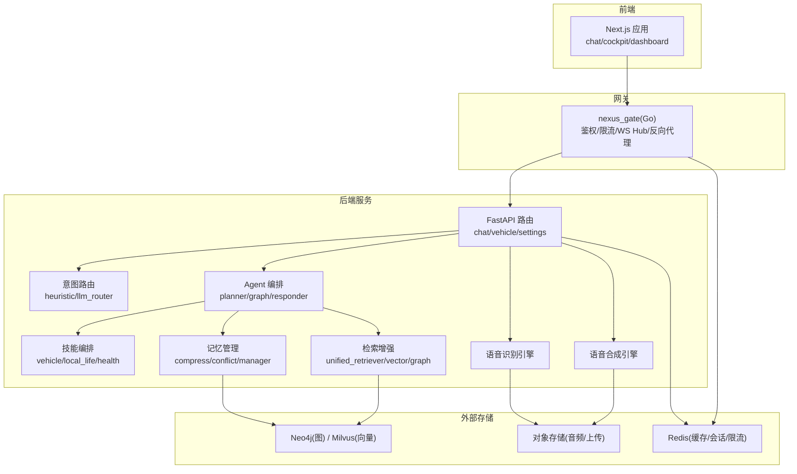
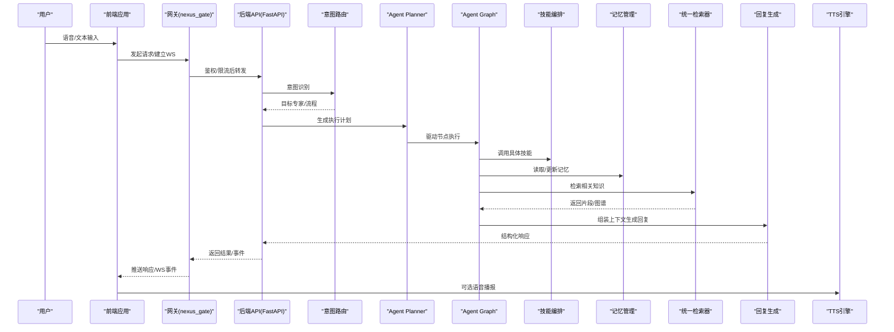
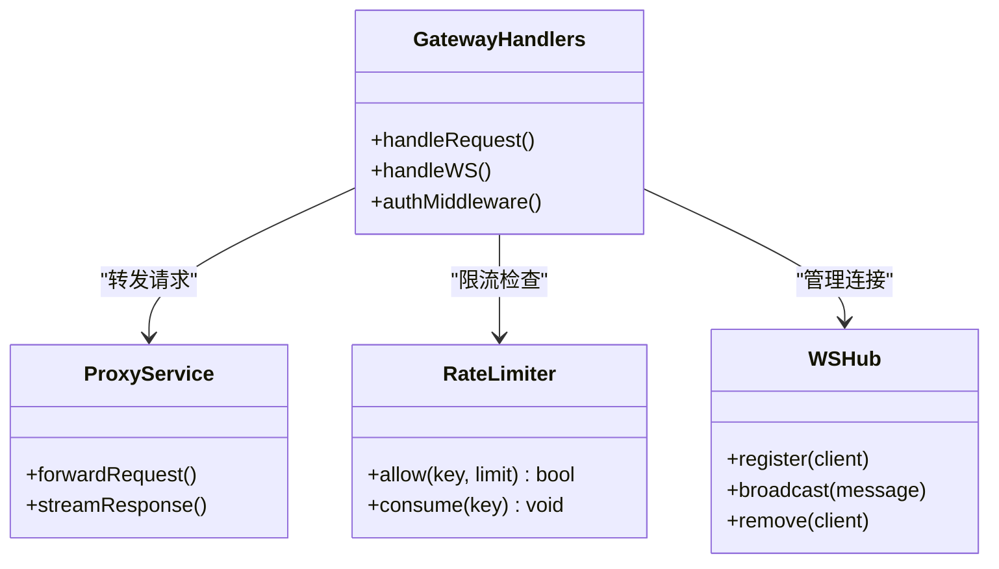
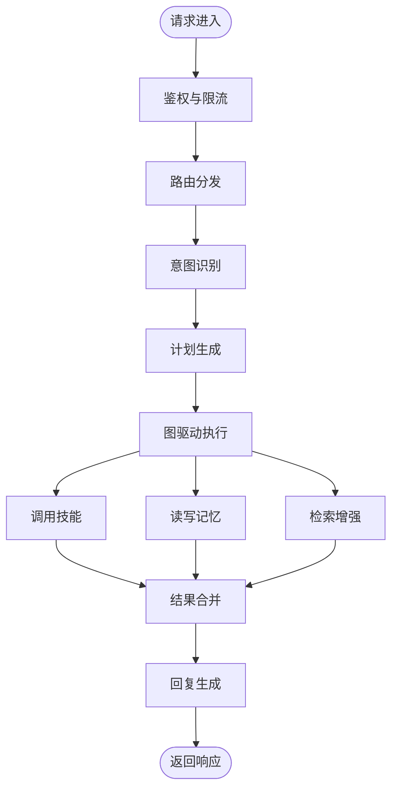
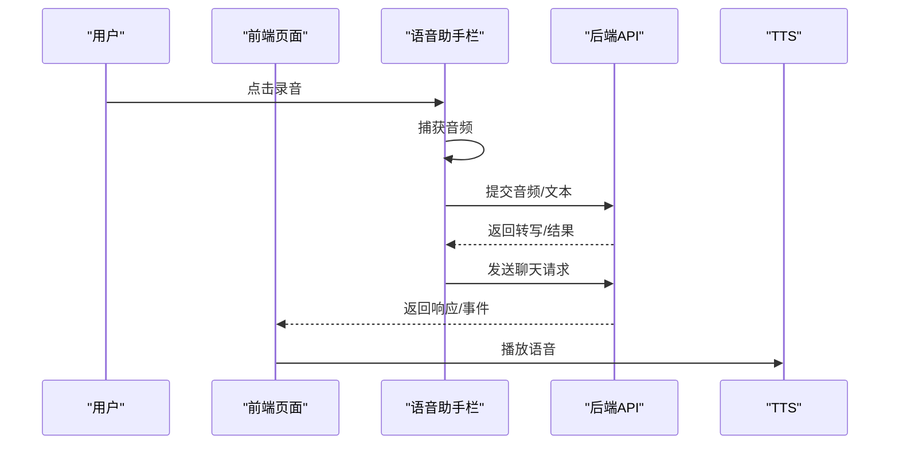
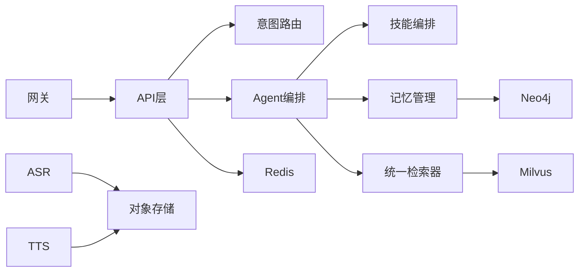

# 项目概述

<cite>
**本文引用的文件**   
- [README.md](file://README.md)
- [backend_design/nexus/main.py](file://backend_design/nexus/main.py)
- [backend_design/nexus/config.py](file://backend_design/nexus/config.py)
- [backend_design/nexus/agent/graph.py](file://backend_design/nexus/agent/graph.py)
- [backend_design/nexus/agent/planner.py](file://backend_design/nexus/agent/planner.py)
- [backend_design/nexus/agent/responder.py](file://backend_design/nexus/agent/responder.py)
- [backend_design/nexus/api/routes/chat.py](file://backend_design/nexus/api/routes/chat.py)
- [backend_design/nexus/api/routes/vehicle.py](file://backend_design/nexus/api/routes/vehicle.py)
- [backend_design/nexus/intent/router.py](file://backend_design/nexus/intent/router.py)
- [backend_design/nexus/skills/orchestrator.py](file://backend_design/nexus/skills/orchestrator.py)
- [backend_design/nexus/memory/manager.py](file://backend_design/nexus/memory/manager.py)
- [backend_design/nexus/rag/unified_retriever.py](file://backend_design/nexus/rag/unified_retriever.py)
- [backend_design/nexus/asr/engine.py](file://backend_design/nexus/asr/engine.py)
- [backend_design/nexus/tts/engine.py](file://backend_design/nexus/tts/engine.py)
- [backend_design/nexus_gate/internal/handlers/handlers.go](file://backend_design/nexus_gate/internal/handlers/handlers.go)
- [backend_design/nexus_gate/internal/proxy/proxy.go](file://backend_design/nexus_gate/internal/proxy/proxy.go)
- [frontend_design/src/app/chat/page.tsx](file://frontend_design/src/app/chat/page.tsx)
- [frontend_design/src/components/vehicle/voice-assistant-bar.tsx](file://frontend_design/src/components/vehicle/voice-assistant-bar.tsx)
- [docker-compose.yml](file://docker-compose.yml)
</cite>

## 目录
1. [简介](#简介)
2. [项目结构](#项目结构)
3. [核心组件](#核心组件)
4. [架构总览](#架构总览)
5. [详细组件分析](#详细组件分析)
6. [依赖关系分析](#依赖关系分析)
7. [性能与可扩展性](#性能与可扩展性)
8. [故障排查指南](#故障排查指南)
9. [结论](#结论)
10. [附录](#附录)

## 简介
NexusCockpit 是一个全栈智能座舱应用系统，面向车载场景提供“AI Agent 多专家协作 + 语音交互 + 车辆控制 + 知识管理”的一体化能力。系统采用前后端分离的微服务架构：前端基于 Next.js 构建座舱交互界面；后端以 Python FastAPI 为核心，集成意图路由、Agent 编排、技能执行、记忆与检索增强（RAG）、ASR/TTS 等模块；同时通过 Go 编写的网关服务进行鉴权、限流、WebSocket 转发与反向代理，统一对外暴露 API 与实时通道。

核心价值
- 多专家协作的 AI Agent：将复杂任务拆解为子专家协同完成，提升可解释性与可控性。
- 端到端语音交互：从语音输入到文本理解、决策执行再到语音播报，形成闭环。
- 车控一体化：通过技能层抽象车辆能力，支持空调、媒体、导航、座椅、车窗等控制。
- 知识管理与 RAG：结合向量与图数据库，实现个性化知识与上下文感知的回答。
- 可观测与可运维：指标、日志、链路追踪与可视化面板，便于问题定位与容量规划。

典型使用场景
- 语音对话：用户说“打开空调并播放音乐”，系统识别意图、调用对应技能并反馈结果。
- 导航与出行：用户询问路线或设置目的地，系统调用导航技能并返回路径信息。
- 健康与生活方式：根据用户偏好与健康数据，给出建议并记录到长期记忆中。
- 会话与知识沉淀：对话历史压缩与冲突合并，持续优化个性化体验。

[本节不直接分析具体代码文件]

## 项目结构
仓库采用分层与按领域组织相结合的结构：
- 前端设计 frontend_design：Next.js 应用，包含页面、组件、状态与工具库。
- 后端设计 backend_design：
  - nexus：Python 主服务，包含 API、Agent、意图、技能、记忆、RAG、ASR/TTS、中间件、可观测性等。
  - nexus_gate：Go 网关，负责鉴权、限流、WebSocket Hub、反向代理与 Redis 客户端。
- 配置与部署：docker-compose.yml、Grafana/Prometheus/Loki 配置、Dockerfile。
- 文档 docs：架构、部署、测试与变更记录。
- 模型 models：本地模型资源（ASR、TTS、Reranker 等）与示例。

图表来源
- [backend_design/nexus/main.py](file://backend_design/nexus/main.py)
- [backend_design/nexus_gate/internal/handlers/handlers.go](file://backend_design/nexus_gate/internal/handlers/handlers.go)
- [backend_design/nexus_gate/internal/proxy/proxy.go](file://backend_design/nexus_gate/internal/proxy/proxy.go)
- [backend_design/nexus/api/routes/chat.py](file://backend_design/nexus/api/routes/chat.py)
- [backend_design/nexus/api/routes/vehicle.py](file://backend_design/nexus/api/routes/vehicle.py)
- [backend_design/nexus/agent/planner.py](file://backend_design/nexus/agent/planner.py)
- [backend_design/nexus/agent/graph.py](file://backend_design/nexus/agent/graph.py)
- [backend_design/nexus/intent/router.py](file://backend_design/nexus/intent/router.py)
- [backend_design/nexus/skills/orchestrator.py](file://backend_design/nexus/skills/orchestrator.py)
- [backend_design/nexus/memory/manager.py](file://backend_design/nexus/memory/manager.py)
- [backend_design/nexus/rag/unified_retriever.py](file://backend_design/nexus/rag/unified_retriever.py)
- [backend_design/nexus/asr/engine.py](file://backend_design/nexus/asr/engine.py)
- [backend_design/nexus/tts/engine.py](file://backend_design/nexus/tts/engine.py)
- [docker-compose.yml](file://docker-compose.yml)

章节来源
- [README.md](file://README.md)
- [docker-compose.yml](file://docker-compose.yml)

## 核心组件
- 网关服务 nexus_gate
  - 职责：统一入口、JWT 鉴权、请求限流、WebSocket Hub、反向代理至后端服务。
  - 关键文件：handlers、proxy、ratelimit、ws hub。
- 后端主服务 nexus
  - API 层：REST/WebSocket 路由，承载聊天、车辆控制、设置、健康等接口。
  - 意图路由：启发式与 LLM 路由混合策略，决定进入哪个专家或流程。
  - Agent 编排：Planner 制定计划，Graph 驱动节点执行，Responder 生成回复。
  - 技能层：车辆、本地生活、健康、习惯、提醒、特殊能力等。
  - 记忆管理：压缩、冲突合并、持久化与检索。
  - RAG：统一检索器，对接向量与图存储，支持重排序。
  - 语音：ASR 与 TTS 引擎封装，支持音频上传与流式处理。
  - 中间件：速率限制、Redis 缓存、会话存储、任务队列。
  - 可观测性：指标采集、Langfuse 链路追踪、数据保留策略。
- 前端应用
  - 页面：聊天、座舱、仪表盘、数据平台、中间件、设置、车辆等。
  - 组件：语音助手栏、车辆面板、3D 车辆展示等。
  - 状态与工具：认证、聊天状态、异步、录音、GPS、语音识别、TTS。

章节来源
- [backend_design/nexus/main.py](file://backend_design/nexus/main.py)
- [backend_design/nexus/config.py](file://backend_design/nexus/config.py)
- [backend_design/nexus/api/routes/chat.py](file://backend_design/nexus/api/routes/chat.py)
- [backend_design/nexus/api/routes/vehicle.py](file://backend_design/nexus/api/routes/vehicle.py)
- [backend_design/nexus/intent/router.py](file://backend_design/nexus/intent/router.py)
- [backend_design/nexus/agent/planner.py](file://backend_design/nexus/agent/planner.py)
- [backend_design/nexus/agent/graph.py](file://backend_design/nexus/agent/graph.py)
- [backend_design/nexus/agent/responder.py](file://backend_design/nexus/agent/responder.py)
- [backend_design/nexus/skills/orchestrator.py](file://backend_design/nexus/skills/orchestrator.py)
- [backend_design/nexus/memory/manager.py](file://backend_design/nexus/memory/manager.py)
- [backend_design/nexus/rag/unified_retriever.py](file://backend_design/nexus/rag/unified_retriever.py)
- [backend_design/nexus/asr/engine.py](file://backend_design/nexus/asr/engine.py)
- [backend_design/nexus/tts/engine.py](file://backend_design/nexus/tts/engine.py)
- [frontend_design/src/app/chat/page.tsx](file://frontend_design/src/app/chat/page.tsx)
- [frontend_design/src/components/vehicle/voice-assistant-bar.tsx](file://frontend_design/src/components/vehicle/voice-assistant-bar.tsx)

## 架构总览
整体采用“前端 + 网关 + 微服务”的分层架构。网关作为统一入口，承担鉴权、限流与 WebSocket 转发；后端服务按领域拆分，Agent 编排贯穿意图识别、计划生成、技能执行与回复生成；记忆与 RAG 提供上下文与知识支撑；ASR/TTS 完成语音闭环。

图表来源
- [backend_design/nexus_gate/internal/handlers/handlers.go](file://backend_design/nexus_gate/internal/handlers/handlers.go)
- [backend_design/nexus/api/routes/chat.py](file://backend_design/nexus/api/routes/chat.py)
- [backend_design/nexus/intent/router.py](file://backend_design/nexus/intent/router.py)
- [backend_design/nexus/agent/planner.py](file://backend_design/nexus/agent/planner.py)
- [backend_design/nexus/agent/graph.py](file://backend_design/nexus/agent/graph.py)
- [backend_design/nexus/skills/orchestrator.py](file://backend_design/nexus/skills/orchestrator.py)
- [backend_design/nexus/memory/manager.py](file://backend_design/nexus/memory/manager.py)
- [backend_design/nexus/rag/unified_retriever.py](file://backend_design/nexus/rag/unified_retriever.py)
- [backend_design/nexus/agent/responder.py](file://backend_design/nexus/agent/responder.py)
- [backend_design/nexus/tts/engine.py](file://backend_design/nexus/tts/engine.py)

## 详细组件分析

### 网关服务（nexus_gate）
- 功能要点
  - 鉴权：JWT 校验与上下文注入。
  - 限流：基于 Redis 的令牌桶/滑动窗口策略。
  - WebSocket Hub：连接管理、消息广播与房间机制。
  - 反向代理：将请求转发至后端 FastAPI 服务。
- 关键文件
  - handlers、proxy、ratelimit、ws hub、config。

图表来源
- [backend_design/nexus_gate/internal/handlers/handlers.go](file://backend_design/nexus_gate/internal/handlers/handlers.go)
- [backend_design/nexus_gate/internal/proxy/proxy.go](file://backend_design/nexus_gate/internal/proxy/proxy.go)

章节来源
- [backend_design/nexus_gate/internal/handlers/handlers.go](file://backend_design/nexus_gate/internal/handlers/handlers.go)
- [backend_design/nexus_gate/internal/proxy/proxy.go](file://backend_design/nexus_gate/internal/proxy/proxy.go)

### 后端主服务（nexus）
- 启动与配置
  - 服务初始化、中间件注册、路由挂载、生命周期钩子。
  - 配置加载与环境变量覆盖。
- API 路由
  - 聊天与会话：创建、查询、删除、历史分页。
  - 车辆控制：状态查询、设备控制、事件订阅。
  - 设置与健康：系统参数、健康检查、中间件状态。
- Agent 编排
  - Planner：将用户意图转化为可执行的步骤序列。
  - Graph：节点有向图驱动，支持条件分支与并行执行。
  - Responder：基于上下文与模板生成自然语言回复。
- 意图路由
  - 启发式规则与 LLM 路由组合，提高准确率与鲁棒性。
- 技能编排
  - 统一注册与调度，支持车辆、本地生活、健康、习惯、提醒、特殊能力。
- 记忆管理
  - 压缩策略、冲突检测与合并、持久化与检索。
- RAG
  - 统一检索器聚合多种后端（向量/图），支持重排序与召回优化。
- 语音
  - ASR：音频上传、转写、时间戳对齐。
  - TTS：文本转语音、流式输出、音色选择。

图表来源
- [backend_design/nexus/main.py](file://backend_design/nexus/main.py)
- [backend_design/nexus/config.py](file://backend_design/nexus/config.py)
- [backend_design/nexus/api/routes/chat.py](file://backend_design/nexus/api/routes/chat.py)
- [backend_design/nexus/api/routes/vehicle.py](file://backend_design/nexus/api/routes/vehicle.py)
- [backend_design/nexus/intent/router.py](file://backend_design/nexus/intent/router.py)
- [backend_design/nexus/agent/planner.py](file://backend_design/nexus/agent/planner.py)
- [backend_design/nexus/agent/graph.py](file://backend_design/nexus/agent/graph.py)
- [backend_design/nexus/agent/responder.py](file://backend_design/nexus/agent/responder.py)
- [backend_design/nexus/skills/orchestrator.py](file://backend_design/nexus/skills/orchestrator.py)
- [backend_design/nexus/memory/manager.py](file://backend_design/nexus/memory/manager.py)
- [backend_design/nexus/rag/unified_retriever.py](file://backend_design/nexus/rag/unified_retriever.py)

章节来源
- [backend_design/nexus/main.py](file://backend_design/nexus/main.py)
- [backend_design/nexus/config.py](file://backend_design/nexus/config.py)
- [backend_design/nexus/api/routes/chat.py](file://backend_design/nexus/api/routes/chat.py)
- [backend_design/nexus/api/routes/vehicle.py](file://backend_design/nexus/api/routes/vehicle.py)
- [backend_design/nexus/intent/router.py](file://backend_design/nexus/intent/router.py)
- [backend_design/nexus/agent/planner.py](file://backend_design/nexus/agent/planner.py)
- [backend_design/nexus/agent/graph.py](file://backend_design/nexus/agent/graph.py)
- [backend_design/nexus/agent/responder.py](file://backend_design/nexus/agent/responder.py)
- [backend_design/nexus/skills/orchestrator.py](file://backend_design/nexus/skills/orchestrator.py)
- [backend_design/nexus/memory/manager.py](file://backend_design/nexus/memory/manager.py)
- [backend_design/nexus/rag/unified_retriever.py](file://backend_design/nexus/rag/unified_retriever.py)

### 前端应用（Next.js）
- 页面与路由
  - 聊天页、座舱页、仪表盘、数据平台、中间件、设置、车辆管理等。
- 组件与交互
  - 语音助手栏：录音、转写、发送、播放。
  - 车辆面板：状态展示与控制按钮。
  - 3D 车辆：可视化展示与交互。
- 状态与工具
  - 认证状态、聊天状态、异步 Hook、录音 Hook、GPS Hook、语音识别 Hook、TTS 工具。

图表来源
- [frontend_design/src/app/chat/page.tsx](file://frontend_design/src/app/chat/page.tsx)
- [frontend_design/src/components/vehicle/voice-assistant-bar.tsx](file://frontend_design/src/components/vehicle/voice-assistant-bar.tsx)
- [backend_design/nexus/api/routes/chat.py](file://backend_design/nexus/api/routes/chat.py)
- [backend_design/nexus/tts/engine.py](file://backend_design/nexus/tts/engine.py)

章节来源
- [frontend_design/src/app/chat/page.tsx](file://frontend_design/src/app/chat/page.tsx)
- [frontend_design/src/components/vehicle/voice-assistant-bar.tsx](file://frontend_design/src/components/vehicle/voice-assistant-bar.tsx)

## 依赖关系分析
- 组件耦合
  - 网关与后端解耦，通过 HTTP/WS 通信，降低耦合度。
  - API 层对 Agent、意图、技能、记忆、RAG 的依赖清晰，遵循单一职责。
  - 记忆与 RAG 共享外部存储（Neo4j/Milvus/Redis/OSS），避免重复实现。
- 外部依赖
  - 存储：Neo4j（图）、Milvus（向量）、Redis（缓存/会话/限流）、对象存储（音频/上传）。
  - 模型：ASR/TTS/Reranker 等本地或远程模型。
- 潜在循环依赖
  - 通过模块化与接口隔离避免循环引用；Agent 与技能之间通过统一编排器交互。

图表来源
- [docker-compose.yml](file://docker-compose.yml)
- [backend_design/nexus/main.py](file://backend_design/nexus/main.py)
- [backend_design/nexus/memory/manager.py](file://backend_design/nexus/memory/manager.py)
- [backend_design/nexus/rag/unified_retriever.py](file://backend_design/nexus/rag/unified_retriever.py)
- [backend_design/nexus/asr/engine.py](file://backend_design/nexus/asr/engine.py)
- [backend_design/nexus/tts/engine.py](file://backend_design/nexus/tts/engine.py)

章节来源
- [docker-compose.yml](file://docker-compose.yml)
- [backend_design/nexus/main.py](file://backend_design/nexus/main.py)

## 性能与可扩展性
- 并发与吞吐
  - 网关侧限流保护后端，防止雪崩。
  - 异步 I/O 与流式传输（WS/流式 TTS）提升用户体验。
- 缓存与命中
  - Redis 缓存热点数据与会话，减少存储压力。
  - RAG 重排序与索引优化提升召回质量与速度。
- 水平扩展
  - 无状态网关与 API 服务可横向扩容。
  - 存储层独立扩展（Neo4j/Milvus/Redis 集群）。
- 监控与告警
  - Prometheus 指标、Grafana 看板、Loki 日志、Langfuse 链路追踪。

[本节提供通用指导，不直接分析具体代码文件]

## 故障排查指南
- 常见问题
  - 鉴权失败：检查 JWT 配置与过期时间。
  - 限流触发：查看 Redis 计数与阈值配置。
  - WebSocket 断连：确认 Hub 心跳与房间状态。
  - 意图误判：调整启发式规则或 LLM 路由提示词。
  - 技能执行异常：检查技能注册与参数校验。
  - 记忆冲突：查看冲突合并策略与压缩阈值。
  - RAG 召回差：优化向量维度、索引与重排序权重。
  - ASR/TTS 延迟：检查音频格式、采样率与模型加载。
- 定位方法
  - 查看网关日志与指标，确认请求是否到达后端。
  - 在 API 层增加结构化日志与耗时埋点。
  - 使用 Langfuse 追踪 Agent 节点执行路径。
  - 针对存储层检查连接池与慢查询。

章节来源
- [backend_design/nexus_gate/internal/handlers/handlers.go](file://backend_design/nexus_gate/internal/handlers/handlers.go)
- [backend_design/nexus/api/routes/chat.py](file://backend_design/nexus/api/routes/chat.py)
- [backend_design/nexus/agent/graph.py](file://backend_design/nexus/agent/graph.py)
- [backend_design/nexus/memory/manager.py](file://backend_design/nexus/memory/manager.py)
- [backend_design/nexus/rag/unified_retriever.py](file://backend_design/nexus/rag/unified_retriever.py)
- [backend_design/nexus/asr/engine.py](file://backend_design/nexus/asr/engine.py)
- [backend_design/nexus/tts/engine.py](file://backend_design/nexus/tts/engine.py)

## 结论
NexusCockpit 以“多专家协作的 AI Agent”为核心，结合语音交互、车辆控制与知识管理，构建了面向智能座舱的全栈解决方案。其前后端分离的微服务架构具备良好的可扩展性与可维护性，配合完善的可观测体系，能够在真实车载场景中稳定运行并持续演进。对于初学者，可从网关与 API 入手逐步理解数据流向；对于有经验的开发者，可深入 Agent 编排、记忆与 RAG 的优化空间，以及网关的高可用与限流策略。

[本节总结性内容，不直接分析具体代码文件]

## 附录
- 快速开始
  - 使用 docker-compose 拉起服务，访问前端页面进行聊天与车辆控制演示。
- 术语表
  - Agent：具备规划与执行能力的智能体。
  - 技能：封装具体业务能力的可复用模块。
  - RAG：检索增强生成，结合外部知识提升回答质量。
  - 记忆：对话与偏好的持久化与检索。
  - 意图：对用户目标的抽象表示。

[本节为补充信息，不直接分析具体代码文件]