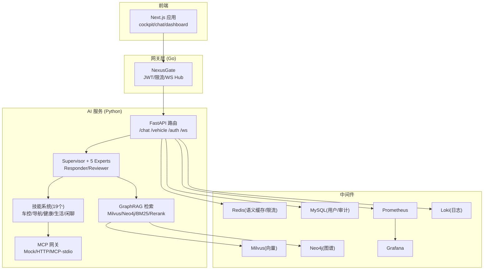
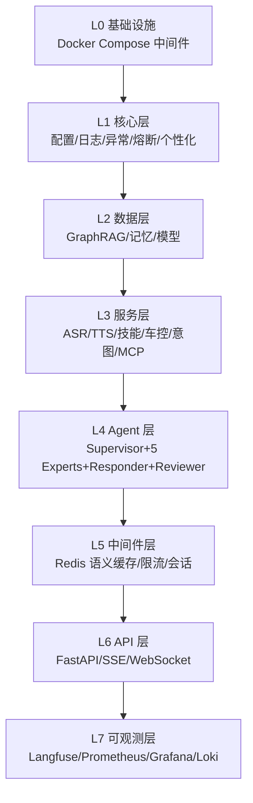
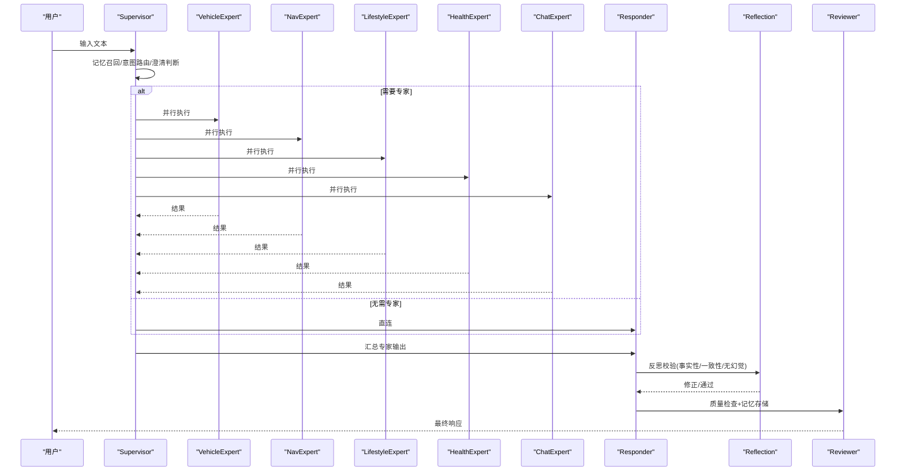
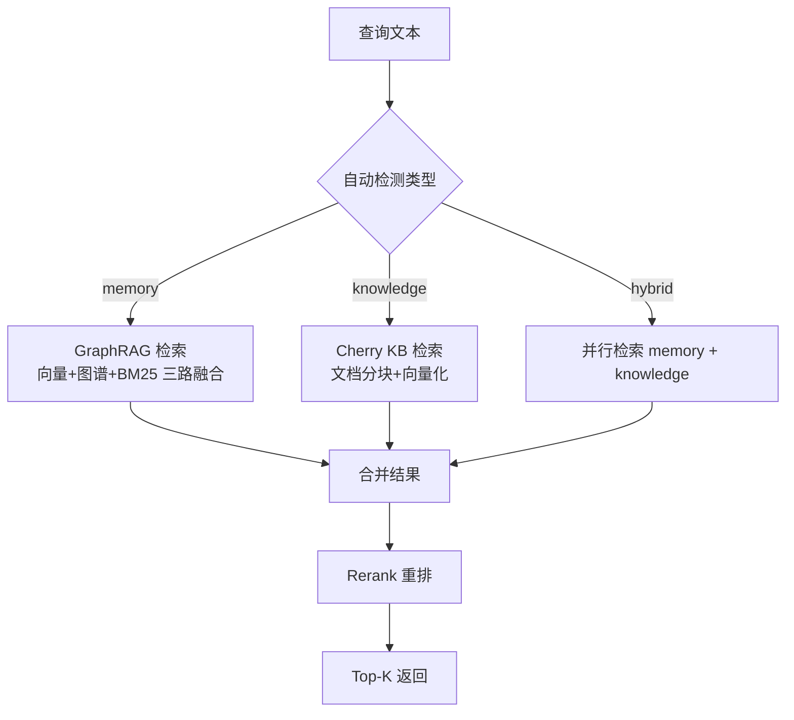
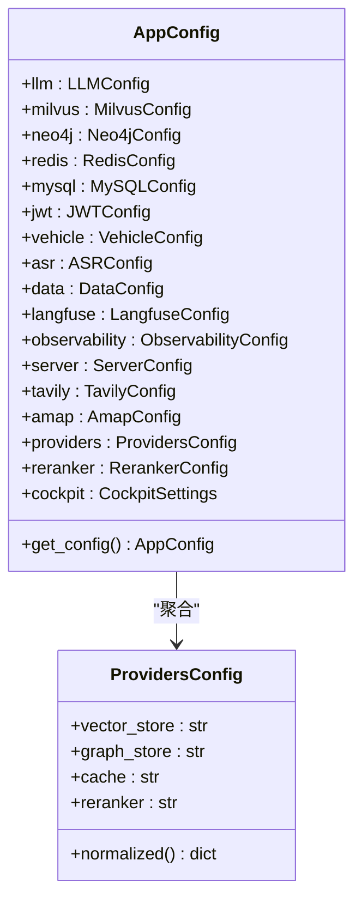
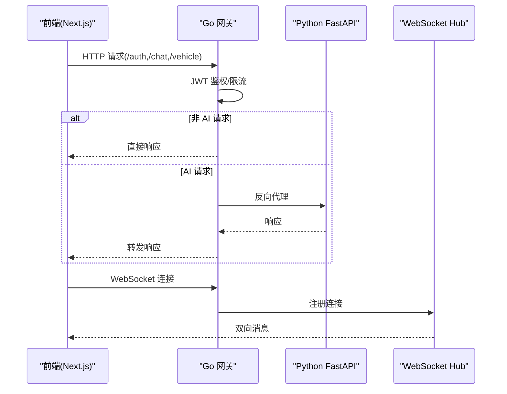
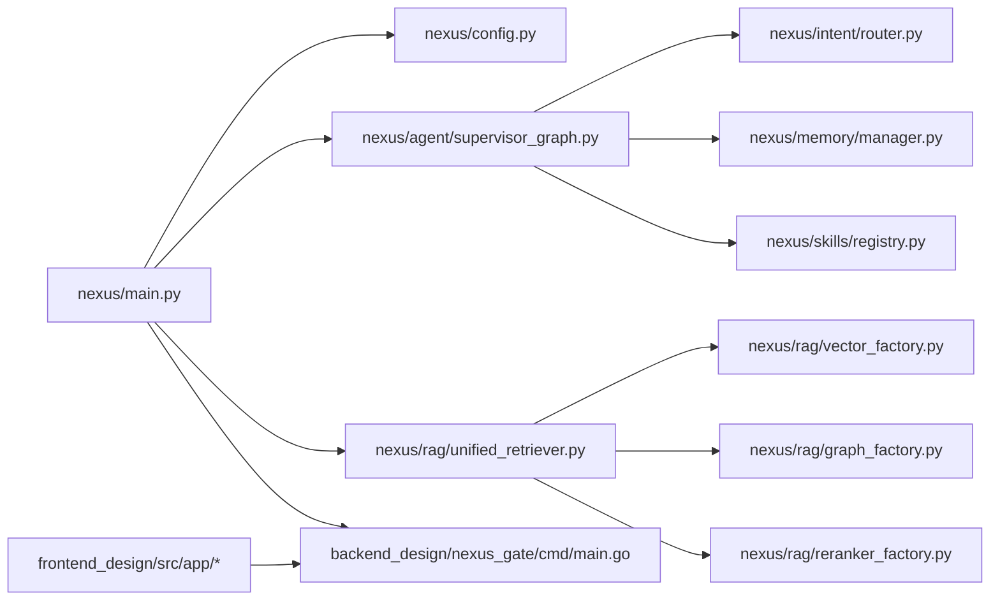

# 项目概述

<cite>
**本文引用的文件**   
- [README.md](file://README.md)
- [docker-compose.yml](file://docker-compose.yml)
- [backend_design/nexus/main.py](file://backend_design/nexus/main.py)
- [backend_design/nexus/config.py](file://backend_design/nexus/config.py)
- [backend_design/nexus/agent/supervisor_graph.py](file://backend_design/nexus/agent/supervisor_graph.py)
- [backend_design/nexus/rag/unified_retriever.py](file://backend_design/nexus/rag/unified_retriever.py)
- [backend_design/nexus_gate/cmd/main.go](file://backend_design/nexus_gate/cmd/main.go)
- [frontend_design/src/app/page.tsx](file://frontend_design/src/app/page.tsx)
- [frontend_design/src/app/cockpit/page.tsx](file://frontend_design/src/app/cockpit/page.tsx)
- [docs/architecture/README.md](file://docs/architecture/README.md)
- [docs/architecture/L0-infrastructure.md](file://docs/architecture/L0-infrastructure.md)
- [docs/architecture/L1-core.md](file://docs/architecture/L1-core.md)
- [docs/architecture/L2-data.md](file://docs/architecture/L2-data.md)
- [docs/architecture/L3-service.md](file://docs/architecture/L3-service.md)
- [docs/architecture/L4-agent.md](file://docs/architecture/L4-agent.md)
</cite>

## 目录
1. [引言](#引言)
2. [项目结构](#项目结构)
3. [核心组件](#核心组件)
4. [架构总览](#架构总览)
5. [详细组件分析](#详细组件分析)
6. [依赖关系分析](#依赖关系分析)
7. [性能与可靠性](#性能与可靠性)
8. [故障排查指南](#故障排查指南)
9. [结论](#结论)
10. [附录：快速开始与环境要求](#附录快速开始与环境要求)

## 引言
NexusCockpit 是企业级车载语音 Agent 平台，面向真实车机场景提供“语音交互 + 个性化服务 + 车控管理”的一体化能力。项目采用 Multi-Agent（Supervisor + 5 Expert Agents）+ GraphRAG（向量/图谱/全文三路融合 + Rerank）+ MCP（Model Context Protocol）技术栈，结合 Go 高并发网关、Python FastAPI AI 后端与 Next.js 前端，形成可观测、可扩展、可降级的完整解决方案。

核心价值
- 多智能体协同：Supervisor 统一调度，专家并行执行，提升复杂意图处理效率与质量。
- GraphRAG 检索增强：Milvus 语义搜索 + Neo4j 图谱关系 + BM25 关键词召回，RRF 融合后重排，显著提升回答准确性与个性化。
- MCP 协议适配：通过 Mock/HTTP/MCP stdio 三模式接入车控总线，兼容不同厂商实现。
- 双模式部署：本地 Docker 与云端托管一键切换，降低运维复杂度与成本。
- 企业级特性：JWT 鉴权、限流、熔断、语义缓存、会话持久化、Langfuse 追踪、Prometheus/Grafana 监控。

## 项目结构
仓库采用前后端分离与分层架构组织：
- 后端：Python FastAPI（AI 服务）+ Go 网关（鉴权/限流/WebSocket Hub）
- 前端：Next.js 14（App Router），提供座舱控制、聊天、数据中台等页面
- 基础设施：Docker Compose 编排 Milvus、Neo4j、Redis、MySQL、Prometheus、Grafana、Loki
- 文档：按 L0-L7 分层说明，便于新人快速上手

图表来源
- [docker-compose.yml:1-246](file://docker-compose.yml#L1-L246)
- [backend_design/nexus/main.py:294-437](file://backend_design/nexus/main.py#L294-L437)
- [backend_design/nexus/agent/supervisor_graph.py:127-173](file://backend_design/nexus/agent/supervisor_graph.py#L127-L173)
- [backend_design/nexus/rag/unified_retriever.py:63-155](file://backend_design/nexus/rag/unified_retriever.py#L63-L155)
- [backend_design/nexus_gate/cmd/main.go:38-87](file://backend_design/nexus_gate/cmd/main.go#L38-L87)
- [frontend_design/src/app/cockpit/page.tsx:22-40](file://frontend_design/src/app/cockpit/page.tsx#L22-L40)

章节来源
- [README.md:95-142](file://README.md#L95-L142)
- [docs/architecture/README.md:23-37](file://docs/architecture/README.md#L23-L37)

## 核心组件
- 配置中心：集中管理 LLM、向量库、图谱、缓存、数据库、车控、ASR/TTS、可观测性等配置，支持 .env.local/.env.prod 自动切换与路径解析。
- 多智能体工作流：Supervisor 负责记忆召回、意图路由、澄清判断与专家分派；5 位专家并行执行；Responder 汇总生成回复；Reflection 做事实性/一致性检查；Reviewer 完成质量检查与记忆存储。
- GraphRAG 检索：统一检索器根据 query_type 分发至 GraphRAG（记忆/习惯）或 Cherry KB（手册/FAQ），混合检索时合并并 Rerank。
- 车控总线：Mock/HTTP/MCP stdio 三模式适配器，统一接口下发指令。
- 网关与前端：Go 网关承担 JWT 鉴权、限流、WebSocket Hub；Next.js 提供座舱控制主界面与聊天页。

章节来源
- [backend_design/nexus/config.py:601-673](file://backend_design/nexus/config.py#L601-L673)
- [backend_design/nexus/agent/supervisor_graph.py:69-173](file://backend_design/nexus/agent/supervisor_graph.py#L69-L173)
- [backend_design/nexus/rag/unified_retriever.py:33-155](file://backend_design/nexus/rag/unified_retriever.py#L33-L155)
- [docs/architecture/L3-service.md:143-196](file://docs/architecture/L3-service.md#L143-L196)
- [backend_design/nexus_gate/cmd/main.go:38-87](file://backend_design/nexus_gate/cmd/main.go#L38-L87)
- [frontend_design/src/app/cockpit/page.tsx:22-40](file://frontend_design/src/app/cockpit/page.tsx#L22-L40)

## 架构总览
7 层分层架构
- L0 基础设施：Docker Compose 编排 Milvus/Neo4j/Redis/MySQL/Prometheus/Grafana/Loki
- L1 核心层：配置中心、结构化日志、异常体系、熔断器、JWT、个性化服务
- L2 数据层：GraphRAG（向量/图谱/BM25 三路融合 + Rerank）、记忆系统、数据模型
- L3 服务层：ASR/TTS、技能系统（19 个）、车控总线、意图路由、MCP 网关
- L4 Agent 层：Supervisor + 5 Expert Agents + Responder + Reflection + Reviewer
- L5 中间件层：Redis 语义缓存（KNN）、限流、会话、异步任务
- L6 API 层：FastAPI REST/SSE/WebSocket，CockpitContextMiddleware 注入上下文
- L7 可观测层：Langfuse 追踪、Prometheus 指标、Grafana 面板、Loki 日志

图表来源
- [docs/architecture/README.md:23-37](file://docs/architecture/README.md#L23-L37)
- [docs/architecture/L0-infrastructure.md:1-75](file://docs/architecture/L0-infrastructure.md#L1-L75)
- [docs/architecture/L1-core.md:1-131](file://docs/architecture/L1-core.md#L1-L131)
- [docs/architecture/L2-data.md:1-241](file://docs/architecture/L2-data.md#L1-L241)
- [docs/architecture/L3-service.md:1-196](file://docs/architecture/L3-service.md#L1-L196)
- [docs/architecture/L4-agent.md:1-250](file://docs/architecture/L4-agent.md#L1-L250)

## 详细组件分析

### Supervisor 多智能体工作流
Supervisor 负责记忆召回、意图路由、澄清判断与专家分派；专家并行执行；Responder 汇总生成回复；Reflection 进行事实性与无幻觉检查；Reviewer 完成质量检查与记忆存储。

图表来源
- [backend_design/nexus/agent/supervisor_graph.py:127-173](file://backend_design/nexus/agent/supervisor_graph.py#L127-L173)
- [backend_design/nexus/agent/supervisor_graph.py:326-400](file://backend_design/nexus/agent/supervisor_graph.py#L326-L400)
- [backend_design/nexus/agent/supervisor_graph.py:401-450](file://backend_design/nexus/agent/supervisor_graph.py#L401-L450)
- [backend_design/nexus/agent/supervisor_graph.py:534-675](file://backend_design/nexus/agent/supervisor_graph.py#L534-L675)

章节来源
- [backend_design/nexus/agent/supervisor_graph.py:69-173](file://backend_design/nexus/agent/supervisor_graph.py#L69-L173)
- [docs/architecture/L4-agent.md:1-250](file://docs/architecture/L4-agent.md#L1-L250)

### GraphRAG 统一检索
统一检索器根据查询类型分发到 GraphRAG（记忆/习惯）或 Cherry KB（手册/故障/FAQ），支持混合检索与 Rerank 重排。

图表来源
- [backend_design/nexus/rag/unified_retriever.py:63-155](file://backend_design/nexus/rag/unified_retriever.py#L63-L155)
- [docs/architecture/L2-data.md:90-166](file://docs/architecture/L2-data.md#L90-L166)

章节来源
- [backend_design/nexus/rag/unified_retriever.py:33-155](file://backend_design/nexus/rag/unified_retriever.py#L33-L155)
- [docs/architecture/L2-data.md:1-241](file://docs/architecture/L2-data.md#L1-L241)

### 配置中心与双模式部署
配置中心统一管理所有子系统参数，支持 .env.local/.env.prod 自动加载与路径解析；ProvidersConfig 控制向量库、图谱、缓存、Reranker 的本地/云端切换。

图表来源
- [backend_design/nexus/config.py:601-673](file://backend_design/nexus/config.py#L601-L673)
- [backend_design/nexus/config.py:458-489](file://backend_design/nexus/config.py#L458-L489)

章节来源
- [backend_design/nexus/config.py:601-673](file://backend_design/nexus/config.py#L601-L673)
- [docs/architecture/L1-core.md:19-55](file://docs/architecture/L1-core.md#L19-L55)

### 网关与前端协作
Go 网关负责 JWT 鉴权、限流、WebSocket Hub，并将 AI 请求反向代理到 Python FastAPI；前端 Next.js 提供座舱控制与聊天页面，默认跳转到 cockpit 主界面。

图表来源
- [backend_design/nexus_gate/cmd/main.go:38-87](file://backend_design/nexus_gate/cmd/main.go#L38-L87)
- [frontend_design/src/app/page.tsx:15-17](file://frontend_design/src/app/page.tsx#L15-L17)
- [frontend_design/src/app/cockpit/page.tsx:22-40](file://frontend_design/src/app/cockpit/page.tsx#L22-L40)

章节来源
- [backend_design/nexus_gate/cmd/main.go:38-87](file://backend_design/nexus_gate/cmd/main.go#L38-L87)
- [frontend_design/src/app/page.tsx:15-17](file://frontend_design/src/app/page.tsx#L15-L17)
- [frontend_design/src/app/cockpit/page.tsx:22-40](file://frontend_design/src/app/cockpit/page.tsx#L22-L40)

## 依赖关系分析
- 组件耦合与内聚
  - main.py 作为应用入口，集中初始化 Embedding、向量/图谱存储、车控适配器、语义缓存、限流、会话、Langfuse、Agent 图、Cherry KB、MySQL、CockpitManager、数据保留策略等，并通过 app.state 共享。
  - SupervisorGraph 依赖 IntentRouterService、MemoryManager、SkillRegistry，内部维护 5 位专家与 Responder/Reviewer。
  - UnifiedRetriever 组合 GraphRAG 与 Cherry KB，并在混合检索时调用 Reranker。
- 外部依赖与集成点
  - Milvus/Neo4j/Redis/MySQL 通过工厂函数按 ProvidersConfig 选择本地或云端实现。
  - Prometheus/Grafana/Loki 用于指标采集与可视化。
- 潜在循环依赖
  - 当前模块以分层方式解耦，未见明显循环导入；main.py 在启动阶段按需 import 子模块，避免循环。

图表来源
- [backend_design/nexus/main.py:294-437](file://backend_design/nexus/main.py#L294-L437)
- [backend_design/nexus/agent/supervisor_graph.py:69-173](file://backend_design/nexus/agent/supervisor_graph.py#L69-L173)
- [backend_design/nexus/rag/unified_retriever.py:33-155](file://backend_design/nexus/rag/unified_retriever.py#L33-L155)
- [backend_design/nexus_gate/cmd/main.go:38-87](file://backend_design/nexus_gate/cmd/main.go#L38-L87)
- [frontend_design/src/app/cockpit/page.tsx:22-40](file://frontend_design/src/app/cockpit/page.tsx#L22-L40)

章节来源
- [backend_design/nexus/main.py:294-437](file://backend_design/nexus/main.py#L294-L437)
- [docs/architecture/README.md:23-37](file://docs/architecture/README.md#L23-L37)

## 性能与可靠性
- 并发与延迟
  - Supervisor 节点将记忆召回、画像加载、意图路由并行执行，显著降低端到端延迟。
  - 专家并行执行通过 asyncio.gather 同时触发，expert_results 使用 reducer 自动累加。
- 检索优化
  - GraphRAG 三路融合（向量/图谱/BM25）+ RRF 排序 + Rerank 重排，提高召回质量与相关性。
- 降级与容错
  - LLM 降级：云端 DeepSeek-V3 → 本地 Qwen3.5-4B（llama.cpp OpenAI 兼容接口）。
  - 中间件降级：云 Redis 无 RediSearch 时扫描降级；Reranker 可选 none 跳过重排省成本。
- 可观测性
  - Langfuse 追踪每次 Agent 调用链路；Prometheus 采集 API 延迟、Agent 耗时、缓存命中率；Grafana 可视化看板。

章节来源
- [backend_design/nexus/agent/supervisor_graph.py:214-283](file://backend_design/nexus/agent/supervisor_graph.py#L214-L283)
- [backend_design/nexus/agent/supervisor_graph.py:326-400](file://backend_design/nexus/agent/supervisor_graph.py#L326-L400)
- [docs/architecture/L2-data.md:90-166](file://docs/architecture/L2-data.md#L90-L166)
- [README.md:26-31](file://README.md#L26-L31)

## 故障排查指南
- 启动与健康检查
  - 后端健康：http://localhost:8000/health
  - 网关健康：http://localhost:8080/health
  - 中间件健康：Milvus http://localhost:9091/healthz；Redis redis-cli ping；Neo4j http://localhost:7474；MySQL mysqladmin ping
- 常见问题定位
  - LLM API Key 为空或未加载：查看启动日志中的 Key 长度与末四位提示
  - 向量/图谱连接失败：main.py 启动阶段会记录错误但不阻塞服务，后续重试
  - 语义缓存不可用：检查 Redis 连通性与配置项 SEMANTIC_CACHE_ENABLED
  - 限流触发：关注 429 响应与 Retry-After 头
  - 认证失败：检查 Authorization Bearer Token 与 JWT_SECRET_KEY 配置
- 日志与追踪
  - 结构化日志：setup_logging() 初始化后使用 get_logger(__name__)
  - Langfuse 追踪：启用 public_key 与 secret_key 后自动记录
  - Prometheus 指标：访问 /metrics 端点

章节来源
- [backend_design/nexus/main.py:61-117](file://backend_design/nexus/main.py#L61-L117)
- [backend_design/nexus/main.py:354-395](file://backend_design/nexus/main.py#L354-L395)
- [docs/architecture/L0-infrastructure.md:67-75](file://docs/architecture/L0-infrastructure.md#L67-L75)
- [docs/architecture/L1-core.md:57-106](file://docs/architecture/L1-core.md#L57-L106)

## 结论
NexusCockpit 以清晰的 7 层分层架构与 Multi-Agent + GraphRAG + MCP 的技术组合，为企业级车载语音场景提供了高可用、高性能、可观测、可降级的完整方案。通过双模式部署与统一的配置中心，开发者可在本地与云端之间无缝切换，快速验证与上线。前端 Next.js 与 Go 网关的协作进一步提升了用户体验与系统吞吐。

## 附录：快速开始与环境要求
- 环境要求
  - Python 3.10+、Go 1.21+、Node.js 18+、Docker 24+、Docker Compose 2.20+、Git 2.30+
- 快速开始
  - 克隆项目并启动基础设施：docker compose up -d
  - 安装后端依赖：pip install -r backend_design/requirements.txt 或使用 make install
  - 下载 AI 模型（SenseVoice/CAM++/CosyVoice）
  - 配置环境变量：复制 .env.example 并填写 ARK_API_KEY、LLM_MODEL、EMBEDDING_MODEL 等
  - 启动后端：uvicorn nexus.main:app --host 0.0.0.0 --port 8000 --reload
  - 启动网关：go run backend_design/nexus_gate/cmd/main.go
  - 启动前端：cd frontend_design && npm run dev
  - 访问地址：前端 http://localhost:3000/cockpit；API 文档 http://localhost:8000/docs；Grafana http://localhost:3001
- 双模式部署
  - 在 .env 中将 *_PROVIDER 设置为 cloud，即可切换到 Zilliz/AuraDB/云 Redis/硅基流动 Rerank

章节来源
- [README.md:146-318](file://README.md#L146-L318)
- [README.md:321-350](file://README.md#L321-L350)
- [docs/architecture/L0-infrastructure.md:30-47](file://docs/architecture/L0-infrastructure.md#L30-L47)