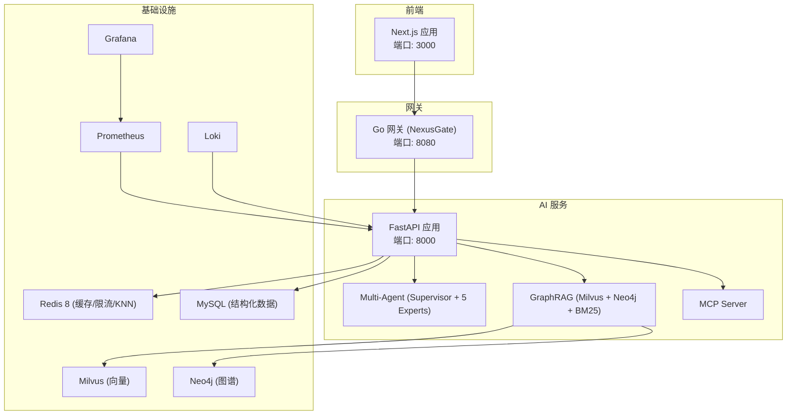
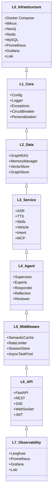
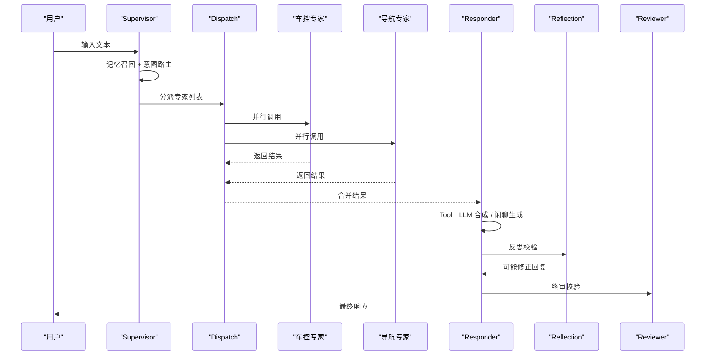
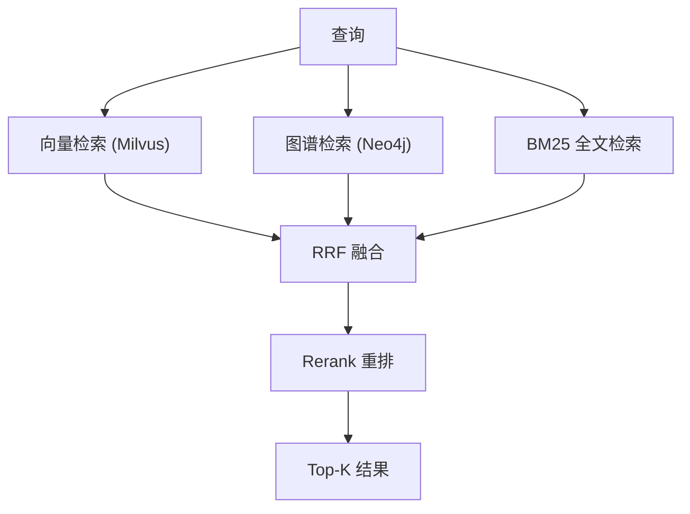
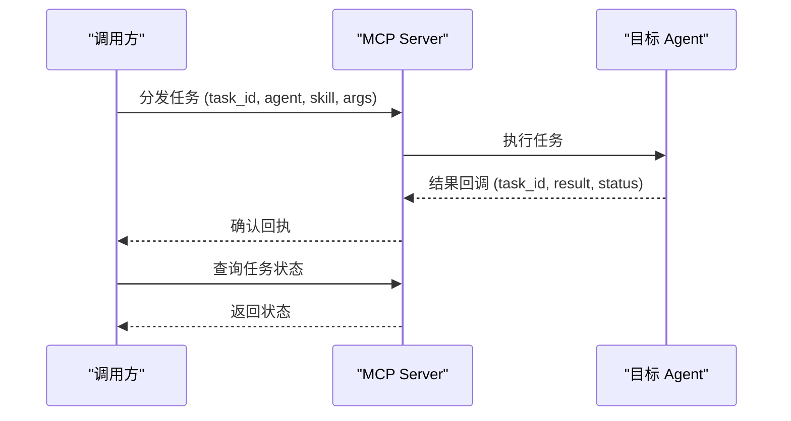
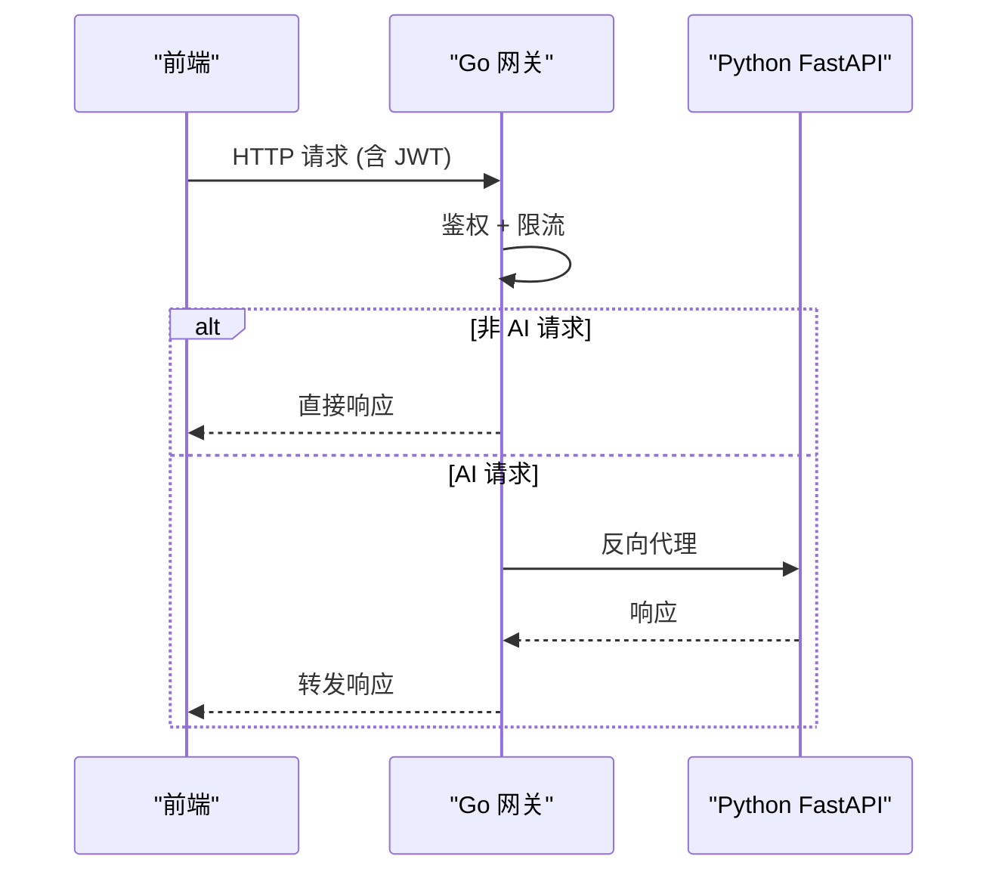
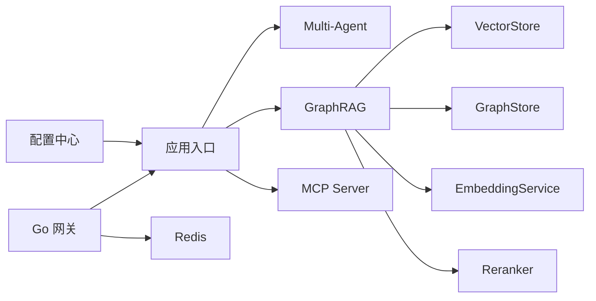

# 项目概述

<cite>
**本文引用的文件**   
- [README.md](file://README.md)
- [Agent.md](file://Agent.md)
- [backend_design/nexus/main.py](file://backend_design/nexus/main.py)
- [backend_design/nexus/config/__init__.py](file://backend_design/nexus/config/__init__.py)
- [backend_design/nexus/agent/graph_builder.py](file://backend_design/nexus/agent/graph_builder.py)
- [backend_design/nexus/agent/supervisor_graph.py](file://backend_design/nexus/agent/supervisor_graph.py)
- [backend_design/nexus/rag/retriever.py](file://backend_design/nexus/rag/retriever.py)
- [backend_design/nexus/mcp/server.py](file://backend_design/nexus/mcp/server.py)
- [backend_design/nexus_gate/cmd/main.go](file://backend_design/nexus_gate/cmd/main.go)
- [docker-compose.yml](file://docker-compose.yml)
- [docs/内部开发存档文档/架构详细设计/README.md](file://docs/内部开发存档文档/架构详细设计/README.md)
</cite>

## 目录
1. [引言](#引言)
2. [项目结构](#项目结构)
3. [核心组件](#核心组件)
4. [架构总览](#架构总览)
5. [关键组件详解](#关键组件详解)
6. [依赖关系分析](#依赖关系分析)
7. [性能与可观测性](#性能与可观测性)
8. [快速开始指南](#快速开始指南)
9. [故障排查](#故障排查)
10. [结论](#结论)

## 引言
NexusCockpit 是一个企业级车载语音 Agent 系统，采用 7 层分层架构，融合 Multi-Agent 协同、GraphRAG 检索增强、语义缓存与 MCP 协议等前沿技术，提供“座舱控制 + 运营总览”的一体化体验。系统以 Go 高并发网关为入口，Python FastAPI 承载 AI 能力，Next.js 构建前端界面，并通过 Docker Compose 一键编排 Milvus、Neo4j、Redis、MySQL、Prometheus、Grafana、Loki 等基础设施，支持本地离线部署与云端 LLM 降级。

核心价值：
- 多智能体协同：Supervisor 调度 5 个专家（车控、导航、生活、健康、闲聊），并行执行后统一汇总、反思与审查，保障输出质量与安全。
- GraphRAG 三路融合：向量（Milvus）+ 图谱（Neo4j）+ BM25（全文）经 RRF 融合与 Rerank 重排，提升召回与排序精度。
- MCP 标准化协同：跨进程/服务任务分发、状态同步、结果回调、异常上报与心跳保活，便于扩展与集成。
- 企业级中间件：Redis 语义缓存（KNN）、限流、会话持久化、熔断器、异步任务池，保障高可用与高性能。
- 可观测性：Langfuse 追踪、Prometheus 指标、Grafana 面板、Loki 日志，覆盖全链路监控。

技术特色：
- 7 层分层架构清晰解耦，职责单一，易于演进与替换。
- 本地化优先：固定本地 Docker 中间件，LLM 可选云端 API 或本地 llama.cpp 自动降级。
- 语音交互闭环：ASR（SenseVoice）+ TTS（CosyVoice）+ 声纹识别（CAM++），实现个性化语音服务。
- 前后端分离：Go 网关承担鉴权、限流、WebSocket Hub；FastAPI 暴露 REST/SSE/WebSocket；Next.js 提供现代化 UI。

企业级应用场景：
- 车载语音助手：自然语言对话、车控指令、导航、天气、日程提醒、健康建议等。
- 多座舱隔离：每座舱独立数据与状态，支持跨座舱统计与运营看板。
- 知识问答与搜索：结合用户画像与历史记忆，提供精准回答与个性化推荐。
- 运维监控：中间件健康、API 延迟、Agent 耗时、缓存命中率等可视化监控。

[本节不直接分析具体文件]

## 项目结构
整体采用前后端分离与模块化分层组织：
- 后端：Python（AI 服务）+ Go（并发网关）
- 前端：Next.js 应用
- 基础设施：Docker Compose 编排中间件与监控栈

```mermaid
graph TB
subgraph "前端"
FE["Next.js 应用<br/>端口: 3000"]
end
subgraph "网关"
GW["Go 网关 (NexusGate)<br/>端口: 8080"]
end
subgraph "AI 服务"
API["FastAPI 应用<br/>端口: 8000"]
AG["Multi-Agent (Supervisor + 5 Experts)"]
RAG["GraphRAG (Milvus + Neo4j + BM25)"]
MCP["MCP Server"]
end
subgraph "基础设施"
MILVUS["Milvus (向量)"]
NEO4J["Neo4j (图谱)"]
REDIS["Redis 8 (缓存/限流/KNN)"]
MYSQL["MySQL (结构化数据)"]
PROM["Prometheus"]
GRAF["Grafana"]
LOKI["Loki"]
end
FE --> GW
GW --> API
API --> AG
API --> RAG
API --> MCP
RAG --> MILVUS
RAG --> NEO4J
API --> REDIS
API --> MYSQL
PROM --> API
GRAF --> PROM
LOKI --> API
```

**图表来源** 
- [docker-compose.yml:10-90](file://docker-compose.yml#L10-L90)
- [backend_design/nexus/main.py:436-490](file://backend_design/nexus/main.py#L436-L490)
- [backend_design/nexus_gate/cmd/main.go:130-150](file://backend_design/nexus_gate/cmd/main.go#L130-L150)

**章节来源**
- [README.md:93-138](file://README.md#L93-L138)
- [Agent.md:66-170](file://Agent.md#L66-L170)
- [docs/内部开发存档文档/架构详细设计/README.md:25-36](file://docs/内部开发存档文档/架构详细设计/README.md#L25-L36)

## 核心组件
- 配置中心：集中管理 LLM、数据库、缓存、服务器、第三方服务等配置，支持 .env.local 覆盖与环境变量注入。
- 应用入口：FastAPI 生命周期管理，初始化 Embedding、向量/图谱存储、车控适配器、语义缓存、限流、会话、Langfuse、Agent 工作流、MCP Server、提醒扫描器等。
- Multi-Agent：Supervisor 调度 5 个专家并行执行，Responder 汇总生成回复，Reflection 反思校验，Reviewer 终审并存储记忆。
- GraphRAG：三路召回（向量、图谱、BM25），RRF 融合与 Rerank 重排，支持用户记忆与食材库检索。
- MCP Server：标准化任务分发、状态同步、结果回调、异常上报、心跳保活。
- Go 网关：JWT 鉴权、座舱级限流、非 AI 请求直处理、AI 请求反向代理到 Python、WebSocket Hub 管理连接。

**章节来源**
- [backend_design/nexus/config/__init__.py:84-132](file://backend_design/nexus/config/__init__.py#L84-L132)
- [backend_design/nexus/main.py:75-170](file://backend_design/nexus/main.py#L75-L170)
- [backend_design/nexus/agent/supervisor_graph.py:93-179](file://backend_design/nexus/agent/supervisor_graph.py#L93-L179)
- [backend_design/nexus/rag/retriever.py:48-88](file://backend_design/nexus/rag/retriever.py#L48-L88)
- [backend_design/nexus/mcp/server.py:36-70](file://backend_design/nexus/mcp/server.py#L36-L70)
- [backend_design/nexus_gate/cmd/main.go:43-93](file://backend_design/nexus_gate/cmd/main.go#L43-L93)

## 架构总览
7 层分层架构将系统职责清晰划分，从基础设施到可观测性逐层解耦，便于扩展与维护。

```mermaid
classDiagram
class L0_Infrastructure {
+Docker Compose
+Milvus
+Neo4j
+Redis
+MySQL
+Prometheus
+Grafana
+Loki
}
class L1_Core {
+Config
+Logger
+Exceptions
+CircuitBreaker
+Personalization
}
class L2_Data {
+GraphRAG
+MemoryManager
+VectorStore
+GraphStore
}
class L3_Service {
+ASR
+TTS
+Skills
+Vehicle
+Intent
+MCP
}
class L4_Agent {
+Supervisor
+Experts
+Responder
+Reflection
+Reviewer
}
class L5_Middleware {
+SemanticCache
+RateLimiter
+SessionStore
+AsyncTaskPool
}
class L6_API {
+FastAPI
+REST
+SSE
+WebSocket
+JWT
}
class L7_Observability {
+Langfuse
+Prometheus
+Grafana
+Loki
}
L0_Infrastructure <|-- L1_Core
L1_Core <|-- L2_Data
L2_Data <|-- L3_Service
L3_Service <|-- L4_Agent
L4_Agent <|-- L5_Middleware
L5_Middleware <|-- L6_API
L6_API <|-- L7_Observability
```

**图表来源** 
- [docs/内部开发存档文档/架构详细设计/README.md:25-36](file://docs/内部开发存档文档/架构详细设计/README.md#L25-L36)

**章节来源**
- [docs/内部开发存档文档/架构详细设计/README.md:25-36](file://docs/内部开发存档文档/架构详细设计/README.md#L25-L36)

## 关键组件详解

### Multi-Agent 工作流（Supervisor + 5 Experts）
- Supervisor 节点负责记忆召回、意图路由与专家分派决策。
- Dispatch 节点通过 asyncio.gather 并行调用专家，合并结果。
- Responder 节点汇总专家输出，进行 Tool→LLM 合成或闲聊生成。
- Reflection 节点进行事实性、一致性、无幻觉检查，必要时修正回复。
- Reviewer 节点进行终审校验，记录指标并存储记忆。

```mermaid
sequenceDiagram
participant U as "用户"
participant S as "Supervisor"
participant D as "Dispatch"
participant E1 as "车控专家"
participant E2 as "导航专家"
participant R as "Responder"
participant F as "Reflection"
participant V as "Reviewer"
U->>S : 输入文本
S->>S : 记忆召回 + 意图路由
S->>D : 分派专家列表
D->>E1 : 并行调用
D->>E2 : 并行调用
E1-->>D : 返回结果
E2-->>D : 返回结果
D-->>R : 合并结果
R->>R : Tool→LLM 合成 / 闲聊生成
R->>F : 反思校验
F-->>R : 可能修正回复
R->>V : 终审校验
V-->>U : 最终响应
```

**图表来源** 
- [backend_design/nexus/agent/supervisor_graph.py:183-208](file://backend_design/nexus/agent/supervisor_graph.py#L183-L208)
- [backend_design/nexus/agent/graph_builder.py:70-119](file://backend_design/nexus/agent/graph_builder.py#L70-L119)

**章节来源**
- [backend_design/nexus/agent/supervisor_graph.py:93-179](file://backend_design/nexus/agent/supervisor_graph.py#L93-L179)
- [backend_design/nexus/agent/graph_builder.py:40-119](file://backend_design/nexus/agent/graph_builder.py#L40-L119)

### GraphRAG 融合检索
- 三路召回：向量（Milvus）、图谱（Neo4j）、BM25（全文）。
- RRF 融合：按排名倒数加权求和，得到融合分数。
- Rerank 重排：使用 bge-reranker-v2-m3 对 Top-K 结果进一步排序。

```mermaid
flowchart TD
Q["查询"] --> V["向量检索 (Milvus)"]
Q --> G["图谱检索 (Neo4j)"]
Q --> B["BM25 全文检索"]
V --> F["RRF 融合"]
G --> F
B --> F
F --> R["Rerank 重排"]
R --> K["Top-K 结果"]
```

**图表来源** 
- [backend_design/nexus/rag/retriever.py:128-140](file://backend_design/nexus/rag/retriever.py#L128-L140)
- [backend_design/nexus/rag/retriever.py:150-182](file://backend_design/nexus/rag/retriever.py#L150-L182)

**章节来源**
- [backend_design/nexus/rag/retriever.py:48-88](file://backend_design/nexus/rag/retriever.py#L48-L88)

### MCP 协议集成
- 任务分发：标准化接口将任务分发到指定 Agent/Skill。
- 状态同步：多 Agent 间共享状态，支持座舱隔离。
- 结果回调：异步任务完成后回调通知。
- 异常上报：异常信息上报至监控中心。
- 心跳保活：定期检测服务存活与活跃任务数。

```mermaid
sequenceDiagram
participant C as "调用方"
participant M as "MCP Server"
participant A as "目标 Agent"
C->>M : 分发任务 (task_id, agent, skill, args)
M->>A : 执行任务
A-->>M : 结果回调 (task_id, result, status)
M-->>C : 确认回执
C->>M : 查询任务状态
M-->>C : 返回状态
```

**图表来源** 
- [backend_design/nexus/mcp/server.py:76-109](file://backend_design/nexus/mcp/server.py#L76-L109)
- [backend_design/nexus/mcp/server.py:145-171](file://backend_design/nexus/mcp/server.py#L145-L171)

**章节来源**
- [backend_design/nexus/mcp/server.py:36-70](file://backend_design/nexus/mcp/server.py#L36-L70)

### Go 并发网关
- JWT 鉴权与 cockpit_id 校验。
- 座舱级令牌桶限流。
- 非 AI 请求（如 health/auth）直接处理。
- AI 请求反向代理到 Python FastAPI。
- WebSocket Hub 管理千级连接。

```mermaid
sequenceDiagram
participant FE as "前端"
participant GW as "Go 网关"
participant PY as "Python FastAPI"
FE->>GW : HTTP 请求 (含 JWT)
GW->>GW : 鉴权 + 限流
alt 非 AI 请求
GW-->>FE : 直接响应
else AI 请求
GW->>PY : 反向代理
PY-->>GW : 响应
GW-->>FE : 转发响应
end
```

**图表来源** 
- [backend_design/nexus_gate/cmd/main.go:130-150](file://backend_design/nexus_gate/cmd/main.go#L130-L150)

**章节来源**
- [backend_design/nexus_gate/cmd/main.go:43-93](file://backend_design/nexus_gate/cmd/main.go#L43-L93)

## 依赖关系分析
- 配置中心聚合所有子系统配置，提供全局单例访问。
- 应用入口在启动时初始化各组件，注册路由与中间件。
- Multi-Agent 依赖 IntentRouter、MemoryManager、SkillRegistry。
- GraphRAG 依赖 VectorStore、GraphStore、EmbeddingService、Reranker。
- MCP Server 独立运行，提供标准接口供外部调用。
- Go 网关依赖 Redis 限流、JWT 鉴权，反向代理到 Python。

```mermaid
graph LR
CFG["配置中心"] --> APP["应用入口"]
APP --> AG["Multi-Agent"]
APP --> RAG["GraphRAG"]
APP --> MCP["MCP Server"]
RAG --> VS["VectorStore"]
RAG --> GS["GraphStore"]
RAG --> ES["EmbeddingService"]
RAG --> RR["Reranker"]
GW["Go 网关"] --> APP
GW --> REDIS["Redis"]
```

**图表来源** 
- [backend_design/nexus/config/__init__.py:84-132](file://backend_design/nexus/config/__init__.py#L84-L132)
- [backend_design/nexus/main.py:112-170](file://backend_design/nexus/main.py#L112-L170)
- [backend_design/nexus/rag/retriever.py:59-82](file://backend_design/nexus/rag/retriever.py#L59-L82)

**章节来源**
- [backend_design/nexus/config/__init__.py:84-132](file://backend_design/nexus/config/__init__.py#L84-L132)
- [backend_design/nexus/main.py:112-170](file://backend_design/nexus/main.py#L112-L170)
- [backend_design/nexus/rag/retriever.py:59-82](file://backend_design/nexus/rag/retriever.py#L59-L82)

## 性能与可观测性
- 语义缓存：Redis 8 RediSearch KNN 向量缓存，副作用隔离，避免重复计算。
- 限流：Redis 滑动窗口限流，保护后端资源。
- 异步任务池：GenerationTaskPool 脱离 SSE 连接生命周期，保证长任务稳定执行。
- 可观测性：Langfuse 追踪 LLM 调用，Prometheus 采集指标，Grafana 可视化，Loki 聚合日志。

优化建议：
- 合理设置缓存 TTL 与淘汰策略，平衡命中率与内存占用。
- 根据负载动态调整限流阈值，避免雪崩效应。
- 监控 LLM 调用延迟与错误率，及时切换降级模型。

[本节不直接分析具体文件]

## 快速开始指南
环境要求：
- Python 3.10+、Go 1.21+、Node.js 18+、Docker 24+、Docker Compose 2.20+、Git 2.30+

步骤：
1. 克隆项目并进入目录。
2. 启动基础设施：docker compose up -d
3. 安装后端依赖：pip install -r backend_design/requirements.txt 或使用 make install
4. 下载 AI 模型：SenseVoice、CAM++、CosyVoice（约 3.5GB）
5. 配置环境变量：复制 .env.example 为 .env，填入 ARK_API_KEY 等必要参数
6. 启动后端服务：uvicorn nexus.main:app --host 0.0.0.0 --port 8000 --reload
7. 启动 Go 网关：go run backend_design/nexus_gate/cmd/main.go
8. 启动前端：cd frontend_design && npm install && npm run dev
9. 访问应用：前端 http://localhost:3000/cockpit，API 文档 http://localhost:8000/docs

验证方法：
- 后端健康检查：curl http://localhost:8000/health
- 网关健康检查：curl http://localhost:8080/health
- 登录获取 Token：POST /auth/token
- 发送聊天请求：POST /cockpit/{id}/chat

**章节来源**
- [README.md:144-320](file://README.md#L144-L320)

## 故障排查
常见问题：
- LLM API Key 为空：检查 .env.local 中 ARK_API_KEY 是否配置正确
- Milvus/Neo4j 连接失败：检查 docker compose 服务是否正常运行，网络是否互通
- JWT 密钥不一致：确保 Go 网关与 Python 后端使用相同 JWT_SECRET_KEY
- ASR/TTS 模型加载慢：首次请求会阻塞，后续请求直接使用已加载模型
- 缓存未命中：检查 Redis 连接与密码配置，清理旧缓存条目

调试技巧：
- 查看日志文件：logs/go_logs/gateway_*.log
- 使用 Grafana 面板监控中间件状态
- 启用 Langfuse 追踪 LLM 调用链

**章节来源**
- [backend_design/nexus/main.py:103-111](file://backend_design/nexus/main.py#L103-L111)
- [backend_design/nexus_gate/cmd/main.go:95-122](file://backend_design/nexus_gate/cmd/main.go#L95-L122)

## 结论
NexusCockpit 通过 7 层分层架构与 Multi-Agent 协同，实现了企业级车载语音 Agent 的完整解决方案。GraphRAG 融合检索提升了知识问答的准确性，MCP 协议简化了系统集成，Go 网关保障了高并发与安全性。系统支持本地化部署与云端降级，具备完善的可观测性与运维能力，适用于车载语音助手、多座舱管理与运营监控等场景。

[本节不直接分析具体文件]