# NexusCockpit

> 企业级车载语音 Agent — Multi-Agent + GraphRAG + MCP | 语音交互 + 个性化服务

[](https://opensource.org/licenses/MIT)
[](https://www.python.org/)
[](https://go.dev/)
[](https://nextjs.org/)
[](https://fastapi.tiangolo.com/)

---

## 概述

NexusCockpit 是一个独立的车载语音 Agent 项目，采用 **7 层分层架构**，集成了 Multi-Agent 协同、GraphRAG 融合检索、语义缓存、MCP 协议等前沿技术。

> **项目完全独立** — 不依赖任何外部项目文件，所有路径使用相对路径，可整体迁移。

| 能力 | 技术栈 |
|------|--------|
| **Multi-Agent** | LangGraph: Supervisor + 5 Expert Agents + Responder + Reflection + Reviewer |
| **语音交互** | ASR (SenseVoice) + TTS (CosyVoice) + 声纹识别 (CAM++) + 个性化服务 |
| **Go 并发网关** | Gin + JWT 鉴权 + 优先级限流 + WebSocket Hub |
| **GraphRAG** | Milvus (向量) + Neo4j (图谱) + BM25 (全文) 三路 RRF 融合 + Rerank 重排 |
| **语义缓存** | Redis Stack RediSearch KNN 向量缓存 + 副作用隔离 |
| **双模式部署** | 本地 Docker ⇄ 云端 API/AK·SK 一键切换 (Zilliz/AuraDB/云Redis/硅基流动) |
| **LLM 降级** | 云端 DeepSeek-V3 → 本地 Qwen3.5-4B (llama.cpp) 自动降级 |
| **限流** | Redis 滑动窗口限流 |
| **车控总线** | Mock / HTTP / MCP stdio 三模式适配 |
| **可观测性** | Langfuse Tracing + Prometheus Metrics + grafana |
| **API** | FastAPI REST + SSE + WebSocket |
| **ASR/TTS** | FunASR (SenseVoice) + CosyVoice |

---

## 界面预览

> 以下截图展示了 NexusCockpit 的核心前端界面，点击图片可放大查看。

### 座舱控制台

座舱控制台是系统的核心交互页面，集成了语音对话、车控操作和 3D 可视化。

| 座舱控制台主界面 | 语音对话与车控联动 |
|:---:|:---:|
| 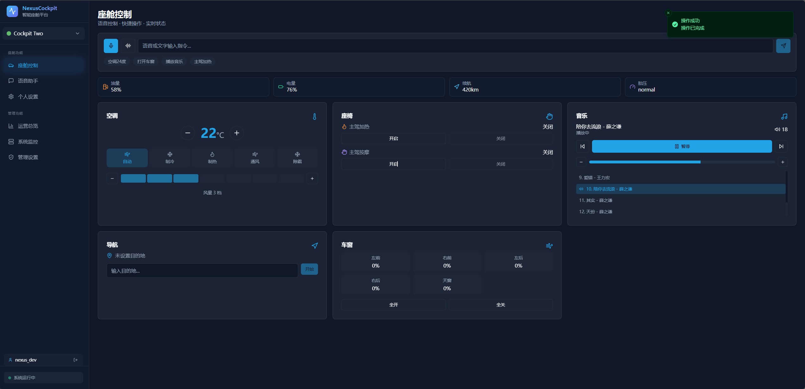 | 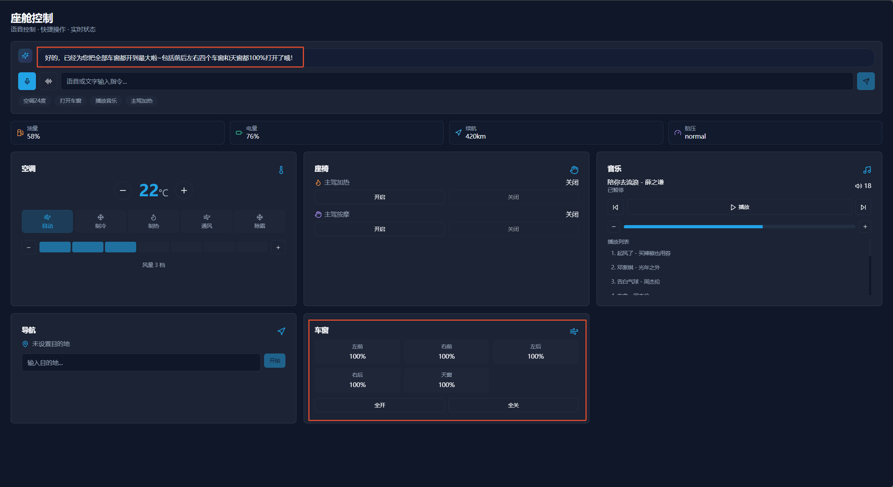 |

### 座舱控制

座舱控制台提供车控面板与语音助手，支持座舱间切换，每个座舱拥有独立的数据隔离和状态追踪。

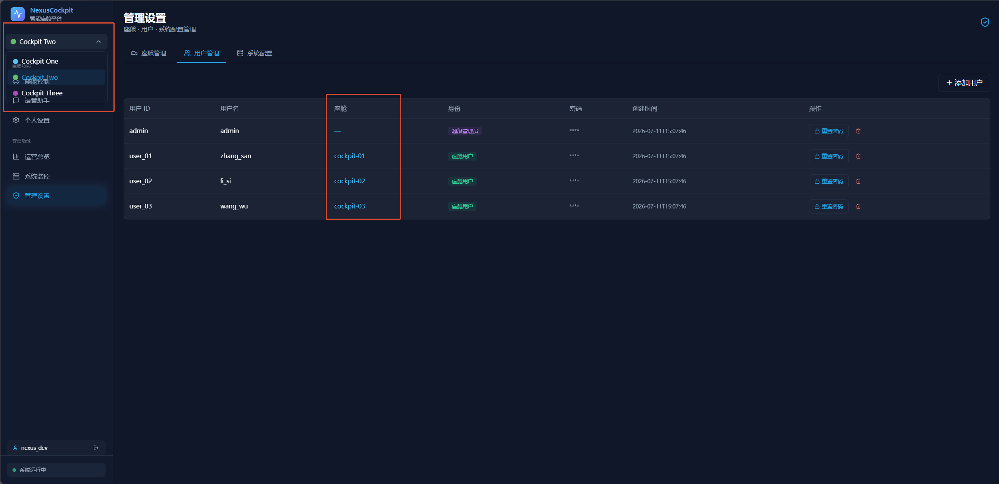

### 聊天对话界面

独立的聊天页面，支持 SSE 流式输出、Markdown 渲染和上下文记忆。

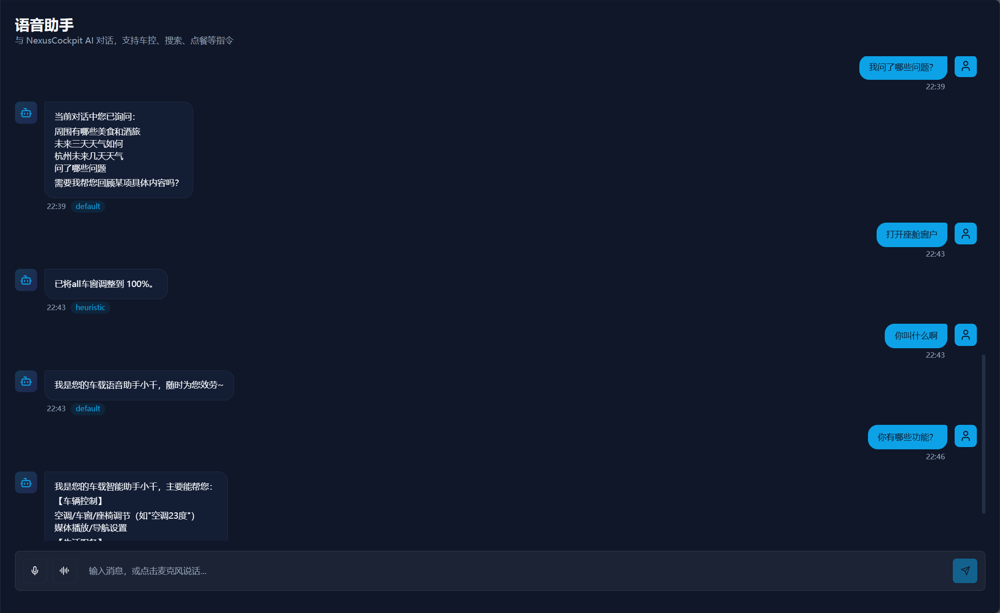

### 数据中台看板

跨座舱数据统计与分析平台，实时展示各座舱运行指标。

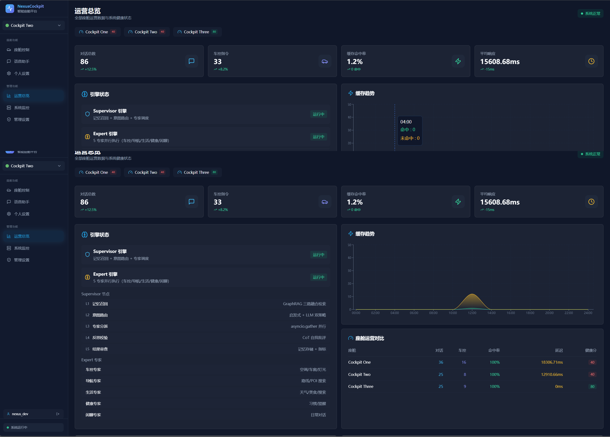

### 中间件监控看板

实时监控 ASR、TTS、Milvus、Neo4j、MySQL、Redis、LLM 等中间件的运行状态，采用每行2个组件的网格布局。

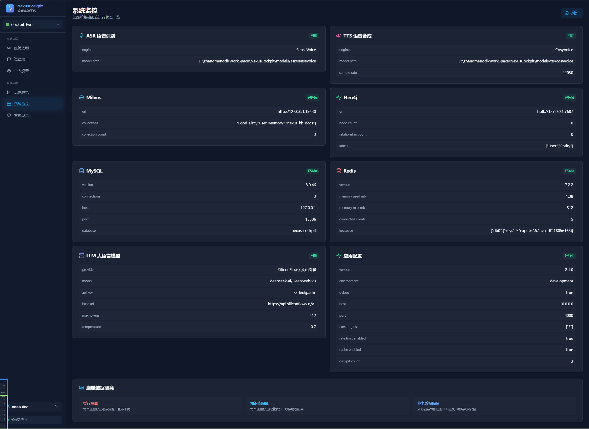

### grafana 监控面板

Prometheus 指标采集 + grafana 可视化看板，覆盖 API 延迟、Agent 执行耗时、缓存命中率等核心指标。

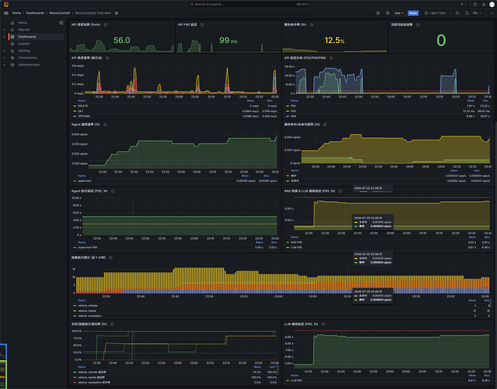

### 设置中心

座舱管理、用户管理、中间件配置统一管理入口。

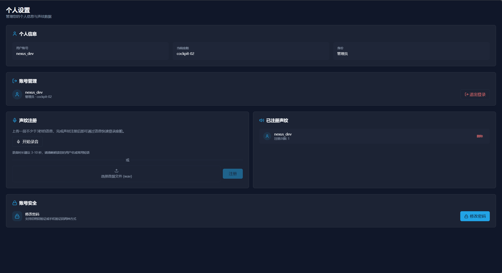

### 管理后台

系统管理员专用页面，用于用户权限管理、座舱注册和系统配置。

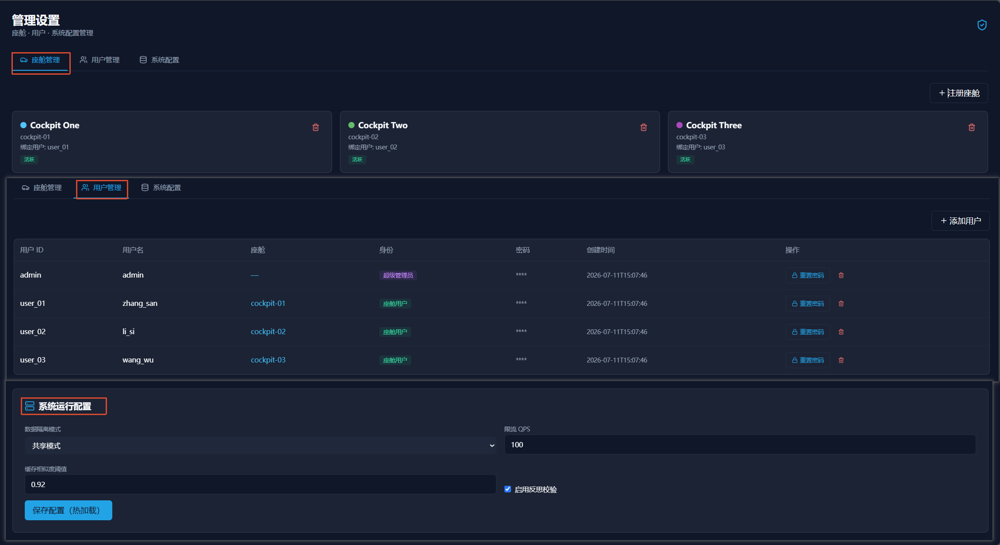


> 📸 **图片说明**：以上截图文件存放在 `images/` 目录下，按用途分为 `frontend/`、`dashboard/`、`architecture/`、`misc/` 子目录。详细命名规范见 [images/README.md](images/README.md)。

---

## 项目结构

```
NexusCockpit/
├── Agent.md                     # 📋 项目总导航
├── README.md                    # 本文件
├── LICENSE                      # MIT 开源协议
├── .env.example                 # 环境变量模板
├── docker-compose.yml           # 基础设施一键部署
├── Makefile                     # 工程化命令
│
├── backend_design/              # 🔧 后端代码 (Python + Go)
│   ├── nexus/                   #   Python AI 服务 (7 层架构)
│   ├── nexus_gate/              #   Go 并发网关 (JWT/限流/WS Hub)
│   ├── tests/                   #   测试用例
│   ├── scripts/                 #   初始化脚本
│   ├── requirements.txt         #   Python 依赖
│   └── pyproject.toml           #   项目配置
│
├── frontend_design/             # 🎨 前端代码 (Next.js)
│   ├── src/app/                 #   页面 (cockpit/chat/vehicle/settings/dashboard/middleware/admin/dataplatform)
│   ├── src/components/          #   组件
│   ├── src/lib/                 #   API 客户端
│   ├── src/stores/              #   状态管理 (含 auth-store)
│   ├── src/hooks/               #   自定义 Hooks
│   └── package.json
│
├── images/                      # 🖼️ README 展示图片
│   ├── frontend/                #   前端界面截图
│   ├── architecture/            #   架构图
│   ├── dashboard/               #   监控看板截图
│   ├── misc/                    #   其他截图
│   └── README.md                #   图片命名规范
│
├── .catpaw/skills/              # 🤖 AI 开发技能 (9 个)
├── docs/                        # 📚 文档中心
│   ├── architecture/            #   L0-L7 架构文档
│   ├── deployment/              #   部署与验证文档
│   ├── testing/                 #   测试文档
│   ├── learning-roadmap.md      #   新人学习路线图
│   └── PROGRESS.md              #   开发进度
├── config/                      # 基础设施配置
├── models/                      # AI 模型文件 (需下载)
├── data/                        # 数据目录
└── assets/                      # 音频资源
```

> 详细导航请查看 [Agent.md](Agent.md)

---

## 快速开始

### 环境要求

| 依赖 | 最低版本 | 说明 |
|------|----------|------|
| Python | 3.10+ | 后端 AI 服务 |
| Go | 1.21+ | 并发网关 |
| Node.js | 18+ | 前端 |
| Docker | 24+ | 基础设施编排 |
| Docker Compose | 2.20+ | 多容器编排 |
| Git | 2.30+ | 版本控制 |

### 1. 克隆项目

```bash
git clone https://github.com/zmdhdu/NexusCockpit.git
cd NexusCockpit
```

### 2. 启动基础设施 (Docker)

```bash
docker compose up -d
```

验证所有服务已启动：

```bash
docker compose ps
```

预期输出：`milvus`、`neo4j`、`redis`、`mysql`、`prometheus`、`grafana`、`loki` 均为 `running` 状态。

> **双模式部署**：如果你不想本地部署所有中间件，可以在 `.env` 中设置 `*_PROVIDER=cloud`，使用云端托管服务（Zilliz Cloud / AuraDB / 云 Redis / 硅基流动 Rerank API）。详见 [双模式部署方案](docs/deployment/dual_云端与本地部署.md)。

### 3. 安装后端环境

```bash
# 创建虚拟环境
python -m venv venv
source venv/bin/activate    # Linux/Mac
# venv\Scripts\activate     # Windows

# 安装依赖
pip install -r backend_design/requirements.txt
```

或使用 Makefile：

```bash
make install
```

### 4. 下载 AI 模型

> 模型文件较大 (CosyVoice 约 3.5GB)，请确保磁盘空间充足。
> 详细步骤请参考 [SETUP.md 第 5 节](docs/deployment/SETUP.md#5-下载-ai-模型)

```bash
pip install modelscope

# SenseVoice ASR 模型
modelscope download --model iic/SenseVoiceSmall --local_dir ./models/asr/sensevoice

# CAM++ 声纹模型
modelscope download --model iic/speech_campplus_sv_zh-cn_3dspeaker_16k --local_dir ./models/sv/cam_plus

# CosyVoice TTS 模型 (约 3.5GB)
modelscope download --model iic/CosyVoice-300M --local_dir ./models/tts/cosyvoice
```

### 5. 配置环境变量

```bash
cp .env.example .env
```

编辑 `.env` 文件，填入必要的 API Key：

```bash
# === 必填项 ===
ARK_API_KEY=your_api_key_here      # 硅基流动 LLM API Key
ARK_BASE_URL=https://api.siliconflow.cn/v1
LLM_MODEL=deepseek-ai/DeepSeek-V3
EMBEDDING_MODEL=Qwen/Qwen3-Embedding-4B
EMBEDDING_DIM=2560

# === 本地/云端模式切换 (local=本地Docker, cloud=云端托管) ===
VECTOR_STORE_PROVIDER=local    # local=Milvus Docker, cloud=Zilliz Cloud
GRAPH_STORE_PROVIDER=local     # local=Neo4j Docker, cloud=Neo4j AuraDB
CACHE_PROVIDER=local           # local=Redis Docker, cloud=云Redis
RERANKER_PROVIDER=local        # local=BGE本地, cloud=硅基流动API

# 如果使用云端模式，还需填入云端凭据：
# MILVUS_URI=https://<your-cluster>.zillizcloud.com
# MILVUS_TOKEN=<zilliz api key>
# NEO4J_URI=neo4j+s://<your-db-id>.databases.neo4j.io
# NEO4J_PASSWORD=<aura password>
```

> 完整环境变量说明请查看 [.env.example](.env.example)

### 6. 启动后端服务

```bash
# 方式一：直接启动
cd backend_design
uvicorn nexus.main:app --host 0.0.0.0 --port 8000 --reload

# 方式二：通过 Makefile
make dev
```

验证后端已启动：

```bash
curl http://localhost:8000/health
# 预期返回: {"status": "healthy", ...}
```

API 文档 (Swagger) 访问：http://localhost:8000/docs

### 7. 启动 Go 网关

```bash
cd backend_design/nexus_gate

# 方式一：直接运行
go run cmd/main.go

# 方式二：编译后运行
go build -o nexus_gate cmd/main.go
./nexus_gate --env ../.env
```

验证网关已启动：

```bash
curl http://localhost:8080/health
# 预期返回: {"status": "healthy", "service": "nexus_gate", ...}
```

### 8. 启动前端

```bash
cd frontend_design

# 安装依赖
npm install

# 开发模式启动
npm run dev
```

或使用 Makefile：

```bash
make install-frontend
make dev-frontend
```

### 9. 访问应用

| 服务 | 地址 | 说明 |
|------|------|------|
| **前端界面** | http://localhost:3000/cockpit | 座舱控制页（聊天 + 车控 + 3D） |
| **API 文档** | http://localhost:8000/docs | FastAPI Swagger UI |
| **健康检查** | http://localhost:8000/health | Python 后端健康状态 |
| **网关健康** | http://localhost:8080/health | Go 网关健康状态 |
| **grafana** | http://localhost:3001 | 监控面板 (admin/admin) |
| **Prometheus** | http://localhost:9090 | 指标查询 |

---

## 部署方式

### 方式一：本地开发部署 (推荐新手)

按上述"快速开始"步骤，使用 Docker Compose 启动基础设施 + 本地运行三服务。

### 方式二：双模式部署 (本地 + 云端混合)

在 `.env` 中配置 `*_PROVIDER=cloud`，将部分中间件切换到云端托管：

| 组件 | local (本地) | cloud (云端) |
|------|-------------|-------------|
| 向量库 | Milvus (Docker) | Zilliz Cloud |
| 图谱 | Neo4j (Docker) | Neo4j AuraDB |
| 语义缓存 | Redis Stack (RediSearch KNN) | 云 Redis (scan 降级) |
| Reranker | 本地 BGE CrossEncoder | 硅基流动 Rerank API (免费) |
| LLM/Embedding | — | 硅基流动 / 火山方舟 (OpenAI 兼容) |

> 详见 [双模式部署方案](docs/deployment/dual_云端与本地部署.md)

### 方式三：全 Docker 部署

```bash
# 启动基础设施 + 应用服务 (Go 网关 + Python AI + Next.js 前端)
docker compose --profile app up -d --build

# 查看服务状态
docker compose --profile app ps
```

---

## 运行方式

### Makefile 常用命令

```bash
make install          # 安装后端依赖
make dev              # 启动后端 (热重载)
make install-frontend # 安装前端依赖
make dev-frontend     # 启动前端 (热重载)
make up               # 启动 Docker 基础设施
make down             # 停止 Docker 基础设施
make test             # 运行测试
make lint             # 代码检查
make monitor          # 打开 grafana
```

### API 使用示例

#### 文本对话 (非流式)

```bash
curl -X POST http://localhost:8080/cockpit/cockpit-01/chat \
  -H "Content-Type: application/json" \
  -H "Authorization: Bearer <your_jwt_token>" \
  -d '{"text": "把空调调到24度", "user_id": "test"}'
```

#### SSE 流式对话

```bash
curl -X POST http://localhost:8080/cockpit/cockpit-01/chat/stream \
  -H "Content-Type: application/json" \
  -H "Authorization: Bearer <your_jwt_token>" \
  -d '{"text": "今天天气怎么样", "user_id": "test"}'
```

#### 车控命令

```bash
curl -X POST http://localhost:8080/cockpit/cockpit-01/vehicle/command \
  -H "Content-Type: application/json" \
  -H "Authorization: Bearer <your_jwt_token>" \
  -d '{"command": "vehicle_climate", "arguments": {"op": "set_temp", "target_temp": 24}}'
```

#### 获取 JWT Token

```bash
curl -X POST http://localhost:8080/auth/token \
  -H "Content-Type: application/json" \
  -d '{"user_id": "user_01", "password": "demo"}'
```

#### WebSocket 连接

```javascript
const ws = new WebSocket("ws://localhost:8080/cockpit/cockpit-01/ws/chat");
ws.send(JSON.stringify({text: "导航到上海虹桥", user_id: "test"}));
ws.onmessage = (event) => console.log(JSON.parse(event.data));
```

---

## 架构设计

### 7 层分层架构

```
L7  可观测层    →  Langfuse / Prometheus / grafana
L6  API 层      →  FastAPI REST / SSE / WebSocket / JWT
L5  中间件层    →  Redis 语义缓存 / 限流 / 进程内异步任务 / 熔断器
L4  Agent 层    →  Supervisor → 5 Expert Agents (并行) → Responder → Reflection → Reviewer
L3  服务层      →  ASR / TTS / Skills / Vehicle / Intent / MCP
L2  数据层      →  GraphRAG / Memory / Vector Store / Graph Store
L1  核心层      →  Config / Logger / Exceptions / Circuit Breaker
L0  基础设施层  →  Docker Compose / Milvus / Neo4j / Redis / MySQL
```

| 7 层分层架构图 | Multi-Agent 工作流图 |
|:---:|:---:|
| 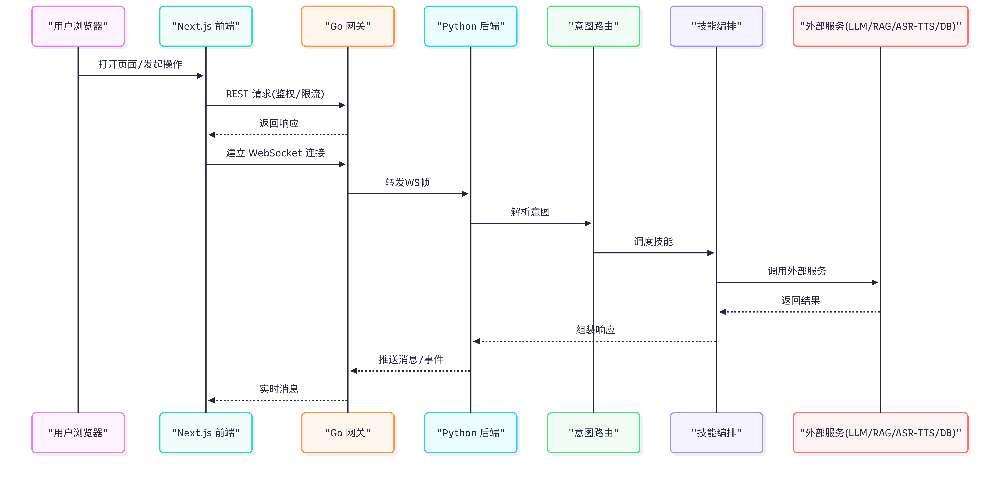 | 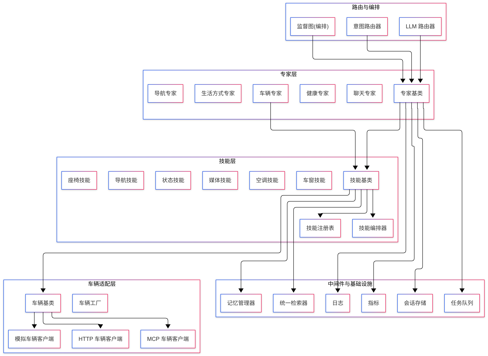 |

> 详见 [架构总览](docs/architecture/overview.md)

### Multi-Agent 工作流 (Supervisor + 5 Experts)

```
User Input → Supervisor (意图+分派)
               ├── Vehicle Expert  (车控专家)
               ├── Nav Expert      (导航专家)
               ├── Lifestyle Expert (生活专家)
               ├── Health Expert   (健康专家)
               └── Chat Expert     (闲聊专家)
                      ↓ (并行)
            Responder (汇总+LLM流式)
               → Reflection (事实性/无幻觉检查)
               → Reviewer (质量检查+记忆存储)
               → Response
```

### GraphRAG 三路融合检索

```
Query
  ├── Vector Path:  Milvus 语义搜索 → Top-K
  ├── Graph Path:   Neo4j 用户画像 + 关系遍历
  ├── BM25 Path:    全文关键词匹配召回
  └── RRF Fusion → Rerank (bge-reranker-v2-m3) → Top-5
```

| GraphRAG 检索增强 | 车辆控制系统 |
|:---:|:---:|
| 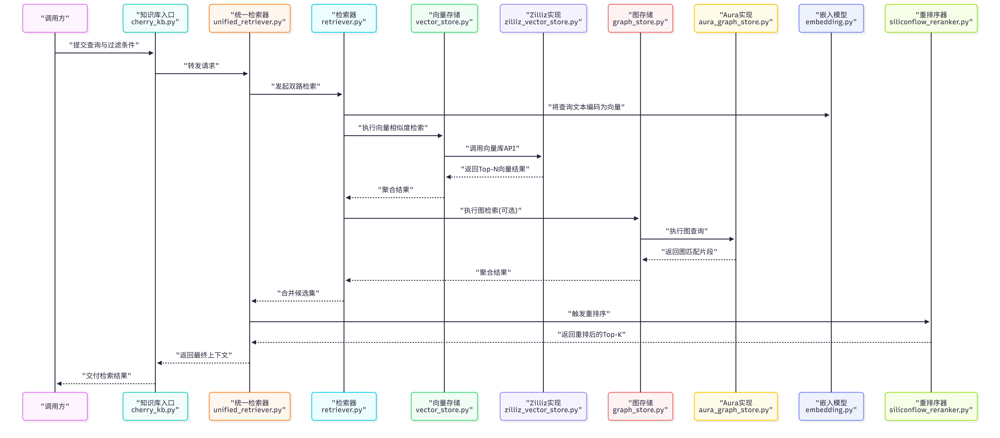 | 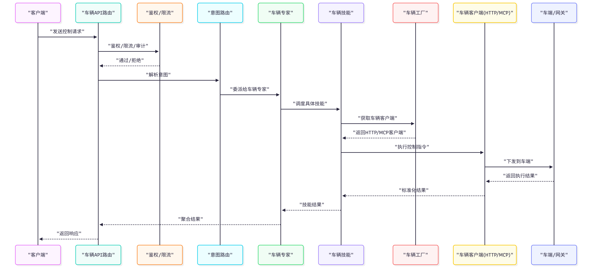 |

| 语音交互系统 |
|:---:|
| 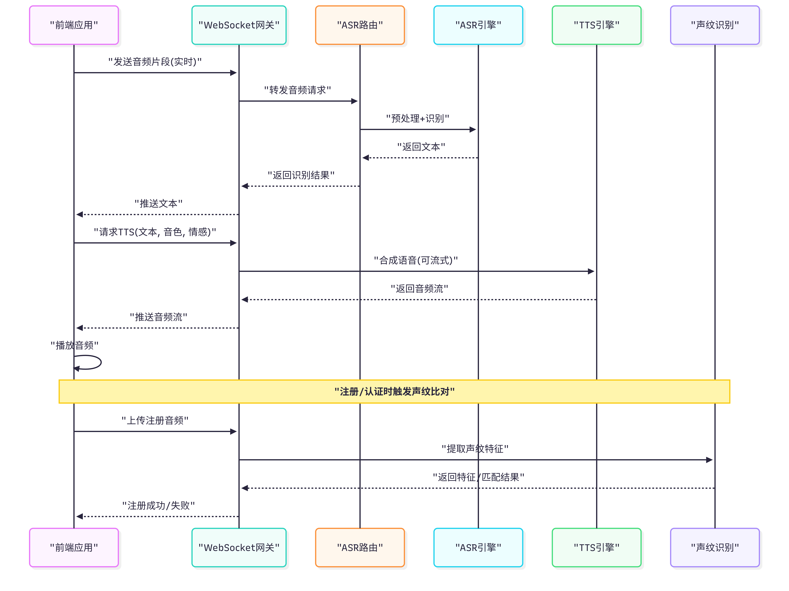 |

### 座舱控制 + 运营总览

```
座舱控制 ──┐
语音助手 ──┼── Go网关 ──→ Python AI服务
运营总览 ──┘                    Supervisor+5专家
```

---

## 技术选型

| 组件 | 选型 | 理由 |
|------|------|------|
| Web 框架 | FastAPI | 异步原生、自动文档 |
| Agent 编排 | LangGraph | 有状态图、条件路由 |
| 向量库 | Milvus 2.4 | 开源、HNSW 索引 (双模式: Zilliz Cloud) |
| 图数据库 | Neo4j 5.x | Cypher、ACID (双模式: AuraDB) |
| 缓存 | Redis 7 | 语义缓存、限流 (双模式: 云 Redis) |
| Reranker | bge-reranker-v2-m3 | 三路融合后重排 (双模式: 硅基流动 API) |
| 配置 | Pydantic Settings | 类型安全 |
| ASR | FunASR (SenseVoice) | 多语言、端侧 |
| TTS | CosyVoice | 高质量、可克隆 |
| 追踪 | Langfuse | LLM 专用 |
| 指标 | Prometheus + grafana | 云原生标准 |
| Go 网关 | Gin + gorilla/websocket | 高并发、低内存 |
| 前端框架 | Next.js 14 (App Router) | SSR/SSG、文件路由 |
| 状态管理 | Zustand | 轻量级、持久化 |
| 样式 | Tailwind CSS | 原子化 CSS |

---

## 文档导航

| 文档 | 说明 |
|------|------|
| [Agent.md](Agent.md) | 项目总导航 |
| **[学习路线图](docs/learning-roadmap.md)** | **新手 12-16 小时学习指南** |
| [环境搭建指南](docs/deployment/SETUP.md) | 虚拟环境、模型下载、部署 |
| [双模式部署方案](docs/deployment/dual_云端与本地部署.md) | 本地⇄云端 AK/SK 一键切换 |
| [架构总览](docs/architecture/overview.md) | 7 层架构设计 |
| [L0-L7 分层文档](docs/architecture/) | 各层详细说明 |
| [项目进展](docs/PROGRESS.md) | 开发进度与架构图 |
| [测试文档](docs/testing/TESTING.md) | 单元/集成/E2E 测试 |

---

## 开源声明

### License

本项目基于 [MIT License](LICENSE) 开源。

```
MIT License

Copyright (c) 2026 zhangmengdi (NexusCockpit)

Permission is hereby granted, free of charge, to any person obtaining a copy
of this software and associated documentation files (the "Software"), to deal
in the Software without restriction, including without limitation the rights
to use, copy, modify, merge, publish, distribute, sublicense, and/or sell
copies of the Software, and to permit persons to whom the Software is
furnished to do so, subject to the following conditions.

The above copyright notice and this permission notice shall be included in all
copies or substantial portions of the Software.
```

### 引用要求

- 使用本项目建设时，请在项目 README 或文档中注明来源：`Powered by [NexusCockpit](https://github.com/zmdhdu/NexusCockpit)`
- Fork 或二次开发时，请保留原始 LICENSE 文件和版权声明
- 每个源码文件头部均包含版权信息：`Copyright (c) 2026 zhangmengdi (NexusCockpit)`

### 免责声明

本软件按"原样"提供，不提供任何明示或暗示的担保。作者不对因使用本软件而产生的任何直接或间接损失负责。请在使用前充分测试并评估是否适合您的场景。

---

## 贡献指南

欢迎提交 Issue 和 Pull Request！

1. Fork 本仓库
2. 创建特性分支 (`git checkout -b feature/amazing-feature`)
3. 提交变更 (`git commit -m 'Add amazing feature'`)
4. 推送到分支 (`git push origin feature/amazing-feature`)
5. 创建 Pull Request

---

## 联系方式

- **GitHub**: [zmdhdu/NexusCockpit](https://github.com/zmdhdu/NexusCockpit)
- **Issues**: [提交 Issue](https://github.com/zmdhdu/NexusCockpit/issues)

---

## 致谢

本项目使用了以下开源技术，感谢它们的贡献：

- [FastAPI](https://fastapi.tiangolo.com/) — Python Web 框架
- [LangGraph](https://langchain-ai.github.io/langgraph/) — Agent 编排框架
- [Milvus](https://milvus.io/) — 向量数据库
- [Neo4j](https://neo4j.com/) — 图数据库
- [Redis](https://redis.io/) — 缓存与消息
- [Gin](https://gin-gonic.com/) — Go Web 框架
- [Next.js](https://nextjs.org/) — React 全栈框架
- [Tailwind CSS](https://tailwindcss.com/) — CSS 框架
- [FunASR](https://github.com/modelscope/FunASR) — 语音识别
- [CosyVoice](https://github.com/FunAudioLLM/CosyVoice) — 语音合成
