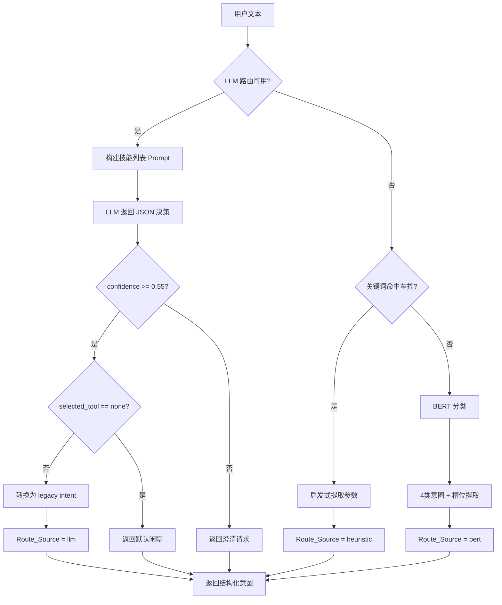
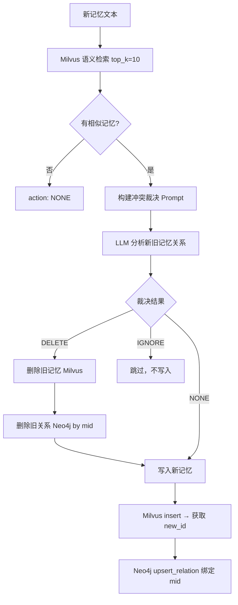
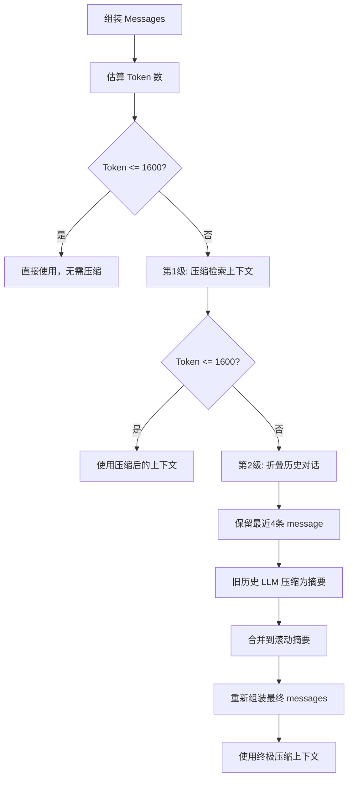

# M-RAG-Voice 项目架构全景文档

> **文档定位**：面向新人小白的快速上手指南 + 面试备战手册 + 改造方案蓝图
> **项目名称**：M-RAG-Voice: Identity-Aware Multimodal Voice Agent
> **当前版本**：v0.5.0-alpha
> **最后更新**：2026-07-06

---

## 目录

- [1. 项目设计初心](#1-项目设计初心)
- [2. 整体架构图](#2-整体架构图)
- [3. 技术栈全景](#3-技术栈全景)
- [4. 核心模块详解](#4-核心模块详解)
- [5. 新人快速上手路径](#5-新人快速上手路径)
- [6. 版本演进史](#6-版本演进史)
- [7. Flowchart 流程图集](#7-flowchart-流程图集)
- [8. 高频面试题](#8-高频面试题)
- [9. 代码改进点与优化方案](#9-代码改进点与优化方案)
- [10. 全栈技术改造方案](#10-全栈技术改造方案)
- [11. 需要掌握的程度](#11-需要掌握的程度)

---

## 1. 项目设计初心

### 1.1 一句话定位

> **一个能听懂"你说什么"、识别"你是谁"、记住"你喜欢什么"、还能控制"你的车"的智能语音助手。**

### 1.2 解决什么问题

传统车载语音助手存在三大痛点：

| 痛点 | 传统方案 | 本项目方案 |
|------|----------|------------|
| **千人一面** | 所有用户听到同样的回答 | 声纹识别 + 长期记忆，实现个性化交互 |
| **意图单一** | 只能执行预设指令 | 三级 fallback 意图路由 + 可插拔技能编排 |
| **记忆缺失** | 对话结束即遗忘 | Milvus 向量记忆 + Neo4j 知识图谱 + 冲突裁决 |

### 1.3 核心设计理念

1. **Audio-Text-Audio 闭环**：从语音输入到语音输出，端到端流式处理
2. **身份感知优先**：先识别"你是谁"，再决定"怎么回答你"
3. **双库记忆一致性**：Milvus 存语义记忆，Neo4j 存关系图谱，通过 mid 绑定联动删除
4. **三级降级路由**：LLM Function-Calling → 启发式关键词 → 微调 BERT，兼顾精度与延迟
5. **端云混合架构**：端侧跑 ASR/声纹/TTS，云端跑 LLM，灵活部署

---

## 2. 整体架构图

### 2.1 系统三层架构

```
┌─────────────────────────────────────────────────────────────────────────┐
│                        接口层 (Interface Layer)                          │
│                                                                         │
│  ┌──────────┐   ┌─────────┐   ┌──────────┐   ┌──────────┐            │
│  │ 音频采集  │──▶│  VAD    │──▶│ 唤醒词   │──▶│   ASR    │            │
│  │ PyAudio  │   │WebRTCVAD│   │ 拼音匹配 │   │SenseVoice│            │
│  └──────────┘   └─────────┘   └──────────┘   └────┬─────┘            │
│                                                    │                    │
│  ┌──────────┐                                     ▼                    │
│  │ 声纹识别  │◀──────────────────────────────────────────              │
│  │  CAM++   │                                          │              │
│  └──────────┘                                          │              │
└────────────────────────────────────────────────────────┼──────────────┘
                                                          │
┌─────────────────────────────────────────────────────────┼──────────────┐
│                        技能层 (Skill Layer)              │              │
│                                                         ▼              │
│  ┌──────────────────────────────────────────────────────────────┐      │
│  │              意图路由 (Intent Router)                         │      │
│  │                                                              │      │
│  │   ┌──────────┐    ┌──────────┐    ┌──────────┐            │      │
│  │   │  LLM FC  │──▶│ 启发式   │──▶│  BERT    │            │      │
│  │   │ ~800ms   │   │ <10ms    │   │ <50ms    │            │      │
│  │   └──────────┘    └──────────┘    └──────────┘            │      │
│  └──────────────────────────┬───────────────────────────────┘      │
│                              │                                      │
│  ┌───────────────────────────▼───────────────────────────────┐     │
│  │           技能编排 (Skill Orchestrator)                    │     │
│  │                                                           │     │
│  │  ┌────────┐┌────────┐┌────────┐┌────────┐┌────────┐    │     │
│  │  │web_search│order_food│register│vehicle_6│vehicle_6│   │     │
│  │  │(Tavily)│(KG查询) │(声纹)  │(车控)  │(状态)  │    │     │
│  │  └────────┘└────────┘└────────┘└────────┘└────────┘    │     │
│  └───────────────────────────┬───────────────────────────────┘     │
│                              │                                      │
│  ┌───────────────────────────▼───────────────────────────────┐     │
│  │           MCP 网关 (MCPGateway)                            │     │
│  │   白名单校验 → 限流控制 → 审计日志                          │     │
│  └───────────────────────────┬───────────────────────────────┘     │
│                              │                                      │
│  ┌───────────────────────────▼───────────────────────────────┐     │
│  │           车控总线 (VehicleBus)                             │     │
│  │   MockVehicleBus / HttpVehicleBusAdapter / MCPStdioAdapter│     │
│  └───────────────────────────────────────────────────────────┘     │
└─────────────────────────────────────────────────────────────────────┘
                              │
┌─────────────────────────────▼───────────────────────────────────────┐
│                        大脑层 (LLM Layer)                            │
│                                                                     │
│  ┌────────────┐   ┌──────────────┐   ┌──────────┐   ┌──────────┐  │
│  │ 记忆召回    │──▶│ 上下文压缩   │──▶│ LLM 流式 │──▶│ TTS 播报 │  │
│  │Milvus+Neo4j│   │ 三级预算管理 │   │DeepSeek/Qwen│ │pyttsx3/ │  │
│  └────────────┘   └──────────────┘   └──────────┘   └──────────┘  │
│         │                                              ▲           │
│         ▼                                              │           │
│  ┌────────────┐   ┌──────────────┐                     │           │
│  │ 记忆提取    │──▶│ 冲突裁决     │─────────────────────┘           │
│  │ LLM 分析   │   │ DELETE/IGNORE│  (后台异步写入)                  │
│  └────────────┘   └──────────────┘                                 │
│                                                                     │
│  ┌──────────────────────────────────────────┐                      │
│  │     Langfuse 可观测性 (trace/span/gen)    │                      │
│  └──────────────────────────────────────────┘                      │
└─────────────────────────────────────────────────────────────────────┘
```

### 2.2 Audio-Text-Audio 闭环

```
用户说话
    │
    ▼
┌─────────┐     ┌─────────┐     ┌──────────┐     ┌──────────┐
│ 麦克风   │────▶│ VAD 检测 │────▶│ 录音保存  │────▶│  ASR     │
│ PyAudio │     │ WebRTC  │     │ WAV 文件 │     │SenseVoice│
└─────────┘     └─────────┘     └──────────┘     └────┬─────┘
                                                      │
                    ┌─────────────────────────────────┘
                    ▼
              ┌──────────┐
              │ 唤醒词检测│───否──▶ 忽略（等待唤醒）
              └────┬─────┘
                   │ 是
                   ▼
              ┌──────────┐
              │ 声纹识别  │───Unknown──▶ "抱歉，没听出你是谁"
              └────┬─────┘
                   │ 识别成功
                   ▼
              ┌──────────┐     ┌──────────┐     ┌──────────┐
              │ 意图路由  │────▶│ 技能编排  │────▶│ LLM 生成 │
              └──────────┘     └──────────┘     └────┬─────┘
                                                      │
                    ┌─────────────────────────────────┘
                    ▼
              ┌──────────┐     ┌──────────┐     ┌──────────┐
              │ 句子切分  │────▶│ TTS 合成  │────▶│ 音频播放 │
              │ 标点断句  │     │pyttsx3   │     │ pygame  │
              └──────────┘     └──────────┘     └──────────┘
                                                      │
                    ┌─────────────────────────────────┘
                    ▼
              ┌──────────────┐
              │ 后台记忆提取  │ (守护线程异步执行)
              │ LLM → JSON   │
              │ 冲突裁决      │
              │ Milvus+Neo4j │
              └──────────────┘
```

### 2.3 项目文件结构图

```
Agent_ASR-master/
│
├── SenseVoice_Agent_Main.py       # ★ 主入口：音频 I/O、VAD、多线程调度
├── SenseVoice_Agent_Brain.py      # ★ 核心大脑：意图路由、RAG、记忆、冲突裁决
├── Local_Model.py                 # ★ 模型加载器：LLM/ASR/CAM++/CosyVoice 单例
├── SpeakerManager.py              # ★ 身份管理：声纹注册、1:N 匹配
├── Milvus.py                      # ★ 数据层：Milvus 向量库 CRUD + Embedding
├── Knowledge_Grpah.py             # ★ 知识图谱：Neo4j 关系写入/删除/检索
├── intent_router_service.py       # ★ 意图路由服务：LLM→启发式→BERT 三级
├── intent_router_bert.py          # ★ BERT 意图分类器（rbt3 微调，4 分类）
├── skills.py                      # ★ 技能注册中心：9 个技能定义与 Schema
├── orchestrator.py                # ★ 技能编排器：统一分发与元数据回传
├── three_layer_pipeline.py        # ★ 三层解耦流水线
├── mcp_gateway.py                 # ★ MCP 网关：白名单/限流/审计
├── vehicle_bus.py                 # ★ 车控总线适配器：Mock/HTTP/MCP-stdio
├── vehicle_mcp_server.py          # ★ 独立 MCP Server
├── langfuse_monitor.py            # ★ Langfuse 可观测性封装
├── webui.py                       # CosyVoice Gradio Web UI
│
├── BERT-Finetuing/                # BERT 意图分类器微调
│   ├── train.py                   # 训练脚本
│   ├── train_data.json            # 训练数据
│   └── downlaod.py                # 模型下载
│
├── Fine-Tuning/                   # Qwen3-4B LoRA 微调
│   ├── train_fine.py              # LoRA 微调脚本
│   ├── dataset.jsonl              # 微调数据集
│   └── formatted_finetune_data.jsonl
│
├── LLM deployment/                # LLM 部署指南
│   ├── llm_api.py                 # API 封装
│   ├── Xinference_load_test.py    # 性能测试
│   └── 大模型Transformer与VLLM部署.ipynb
│
├── iic/                           # 模型权重
│   ├── CAM++/                     # 声纹识别模型
│   └── CosyVoice-300M/            # TTS 模型
│
├── SpeakerVerification_DIR/       # 声纹注册音频
│   ├── enroll_wav/
│   └── users/                     # 已注册用户声纹
│
├── Agent_ASR_V1-V4(history)/      # 历史版本
│
├── .catpaw/skills/                # Agent Skills
├── project_knowledge/             # 项目知识文档
├── requirements.txt               # Python 依赖
├── .gitignore                     # Git 忽略规则
└── README.md                      # 项目说明
```

---

## 3. 技术栈全景

### 3.1 技术栈分层

```
┌─────────────────────────────────────────────────────────────────────┐
│                         前端 / 交互层                                │
│  Gradio (WebUI) | PyAudio (音频采集) | pygame (音频播放)            │
├─────────────────────────────────────────────────────────────────────┤
│                         ASR / 语音识别                               │
│  SenseVoice (FunASR) | WebRTCVAD (VAD) | pypinyin (唤醒词)         │
├─────────────────────────────────────────────────────────────────────┤
│                         声纹识别                                     │
│  CAM++ (3D-Speaker) | SpeakerManager (1:N 匹配)                    │
├─────────────────────────────────────────────────────────────────────┤
│                         TTS / 语音合成                               │
│  pyttsx3 (本地) | Edge-TTS (在线) | CosyVoice-300M (生成式)        │
├─────────────────────────────────────────────────────────────────────┤
│                         意图路由                                     │
│  LLM Function-Calling | 启发式关键词 | BERT (rbt3 微调)            │
├─────────────────────────────────────────────────────────────────────┤
│                         LLM / 大模型                                 │
│  DeepSeek-V3 (API) | Qwen (本地) | OpenAI SDK (客户端)             │
├─────────────────────────────────────────────────────────────────────┤
│                         记忆 / RAG                                   │
│  Milvus (向量库) | Neo4j (知识图谱) | Qwen3-Embedding-4B           │
├─────────────────────────────────────────────────────────────────────┤
│                         技能 / 工具                                  │
│  Tavily (联网搜索) | MCP Protocol (车控) | SkillRegistry           │
├─────────────────────────────────────────────────────────────────────┤
│                         车控 / MCP                                   │
│  MCPGateway | VehicleBus (Mock/HTTP/stdio) | MCP Server            │
├─────────────────────────────────────────────────────────────────────┤
│                         微调 / 训练                                  │
│  BERT LoRA (意图分类) | Qwen3-4B LoRA (座舱对话)                   │
├─────────────────────────────────────────────────────────────────────┤
│                         可观测性                                     │
│  Langfuse (trace/span/generation)                                  │
├─────────────────────────────────────────────────────────────────────┤
│                         基础设施                                     │
│  Python 3.10+ | PyTorch 2.8+CUDA | FastAPI | asyncio              │
└─────────────────────────────────────────────────────────────────────┘
```

### 3.2 依赖清单（关键包）

| 类别 | 包名 | 用途 |
|------|------|------|
| ASR | `funasr==1.1.12` | SenseVoice 语音识别 |
| VAD | `webrtcvad==2.0.10` | 语音活动检测 |
| 声纹 | `modelscope==1.15.0` | CAM++ 声纹识别 |
| TTS | `edge-tts==6.1.17` | Edge-TTS 在线合成 |
| TTS | `pyttsx3` (系统) | 本地 TTS 合成 |
| LLM | `openai==2.15.0` | LLM API 客户端 |
| 向量库 | `pymilvus==2.6.6` | Milvus 向量数据库 |
| 知识图谱 | `neo4j` (隐含) | Neo4j 图数据库 |
| 意图 | `transformers==4.45.2` | BERT 意图分类 |
| 意图 | `torch==2.8.0+cu128` | 深度学习框架 |
| 搜索 | `tavily==1.1.0` | 联网搜索 |
| 编排 | `langchain==1.2.3` | LLM 编排框架 |
| 编排 | `langgraph==1.0.6` | 状态图编排 |
| 监控 | `langfuse==4.5.0` | 可观测性 |
| Web | `fastapi==0.128.0` | API 服务 |
| Web | `gradio==3.43.2` | Web UI |
| 音频 | `pyaudio==0.2.14` | 音频采集 |
| 音频 | `pygame==2.6.1` | 音频播放 |

---

## 4. 核心模块详解

### 4.1 SenseVoice_Agent_Main.py — 主入口

**职责**：音频采集 → VAD → 录音管理 → 异步调度 → TTS 消费

**关键设计**：
- **三线程模型**：录音线程（独立 Thread）+ 推理调度（asyncio Task）+ TTS 消费（asyncio Task）
- **队列解耦**：`audio_task_queue`（线程安全 Queue）传递音频路径，`tts_text_queue`（asyncio Queue）传递 TTS 文本
- **三种流水线模式**：`orchestrator`（默认）/ `legacy`（灰度回退）/ `three-layer`（解耦版）
- **互斥机制**：`is_speaking` 和 `is_processing` 全局标志防止录入自身声音

```python
# 核心数据流
audio_recorder_thread()          # 独立线程：持续录音
    → audio_task_queue.put()     # 放入队列

PipelineOrchestrator.run()       # asyncio Task：推理调度
    → audio_task_queue.get()     # 取出音频
    → run_asr()                  # ASR 识别
    → extract_pinyin()           # 唤醒词检测
    → spk_manager.identify()     # 声纹识别
    → agent_brain.process_user_query()  # LLM 处理
    → tts_text_queue.put()       # 放入 TTS 队列

tts_consumer_worker()            # asyncio Task：TTS 消费
    → tts_text_queue.get()       # 取出文本
    → pyttsx3_synthesis_sync()   # 合成音频
    → async_play_audio()         # 播放音频
```

### 4.2 SenseVoice_Agent_Brain.py — 核心大脑

**职责**：意图路由 → 技能编排 → 记忆召回 → 上下文压缩 → LLM 流式生成 → 记忆提取与冲突裁决

**关键设计**：

1. **三级上下文压缩**（`_build_context_api`）：
   - 第 0 级：Token 未超标，直接使用
   - 第 1 级：压缩检索上下文（search_ctx）
   - 第 2 级：折叠历史对话，生成滚动摘要

2. **记忆冲突裁决**（`detect_conflict_with_llm`）：
   - LLM 分析新旧记忆的逻辑关系
   - 四种裁决结果：DELETE（删除旧记忆）/ IGNORE（冗余忽略）/ NONE（无冲突共存）/ NEED_DELETE（需删除指定ID）
   - 双库联动：Milvus 删除记忆时，通过 mid 同步删除 Neo4j 对应关系

3. **流式生成与断句**：
   - LLM 流式输出 → 按标点（。！？；...）断句 → 逐句送入 TTS 队列
   - 实现"边生成边播报"，降低首句延迟

### 4.3 意图路由三级 Fallback

```
用户输入 "把空调调到24度"
         │
         ▼
┌──────────────────┐
│ LLM FC 路由      │ 成功？──是──▶ 返回结构化意图
│ (~800ms)         │
│ 发送技能列表给LLM│
│ LLM返回JSON决策  │
└────────┬─────────┘
         │ 失败/超时
         ▼
┌──────────────────┐
│ 启发式关键词路由  │ 命中？──是──▶ 返回关键词意图
│ (<10ms)          │
│ 匹配"空调""温度" │
│ 正则提取参数     │
└────────┬─────────┘
         │ 未命中
         ▼
┌──────────────────┐
│ BERT 分类路由    │ 输出4类意图
│ (<50ms)          │ call_elm/need_search/
│ rbt3微调模型     │ register/chat
└──────────────────┘
```

### 4.4 记忆系统双库架构

```
用户说："我以后不吃辣了"
         │
         ▼
┌──────────────────┐
│ LLM 记忆提取     │
│ Prompt: 提取长期  │
│ 用户画像→JSON    │
└────────┬─────────┘
         │
         │ [{"relation":"DISLIKES","target":"辣","type":"Food"}]
         ▼
┌──────────────────┐
│ Milvus 语义检索  │
│ 搜索相似记忆     │
│ top_k=10         │
└────────┬─────────┘
         │
         │ 返回旧记忆: "用户 LIKES 辣" (id=123)
         ▼
┌──────────────────┐
│ LLM 冲突裁决     │
│ 新: DISLIKES 辣  │
│ 旧: LIKES 辣     │
│ → DELETE id=123  │
└────────┬─────────┘
         │
    ┌────┴────┐
    ▼         ▼
┌────────┐ ┌────────┐
│ Milvus │ │ Neo4j  │
│ 删除   │ │ 删除   │
│ id=123 │ │ mid=123│
└────────┘ └────────┘
         │
         ▼
┌──────────────────┐
│ 写入新记忆       │
│ Milvus: insert   │──▶ 返回 new_id=456
│ Neo4j: upsert    │──▶ 关系绑定 mid=456
└──────────────────┘
```

### 4.5 车控 MCP 协议链

```
用户: "把空调调到24度"
         │
         ▼
┌──────────────────┐
│ 意图路由          │
│ → Climate_Action │
│ {op:"set_temp",  │
│  target_temp:24} │
└────────┬─────────┘
         ▼
┌──────────────────┐
│ SkillOrchestrator│
│ dispatch()       │
│ → vehicle_climate│
└────────┬─────────┘
         ▼
┌──────────────────┐
│ ClimateControlSkill│
│ execute()        │
│ → gateway.invoke │
└────────┬─────────┘
         ▼
┌──────────────────┐
│ MCPGateway       │
│ ✓ 白名单校验     │
│ ✓ 限流控制       │
│ ✓ 审计日志       │
└────────┬─────────┘
         ▼
┌──────────────────┐
│ VehicleBus       │
│ (环境变量选择)   │
│ ├─ MockVehicleBus│ ← 开发调试
│ ├─ HttpAdapter   │ ← 对接真实车控
│ └─ MCPStdioAdapter│← MCP 协议
└────────┬─────────┘
         ▼
┌──────────────────┐
│ VehicleCommandResult
│ {success: True,  │
│  message: "已将  │
│  空调设置为24度"}│
└──────────────────┘
```

---

## 5. 新人快速上手路径

### 5.1 学习路线图（建议 2 周完成）

```
Week 1: 基础理解
─────────────────────────────────────────────────
Day 1-2  │ 阅读 README.md，理解项目定位和架构
         │ 安装依赖，配置 .env，跑通 Mock 模式
         │
Day 3-4  │ 精读 SenseVoice_Agent_Main.py
         │ 理解三线程模型和队列解耦
         │ 画出音频数据流图
         │
Day 5-7  │ 精读 SenseVoice_Agent_Brain.py
         │ 理解意图路由三级 fallback
         │ 理解记忆系统和冲突裁决
         │ 画出记忆数据流图

Week 2: 深入实践
─────────────────────────────────────────────────
Day 8-9  │ 阅读 skills.py + orchestrator.py
         │ 理解技能注册和编排机制
         │ 尝试添加一个新技能
         │
Day 10-11│ 阅读 vehicle_bus.py + mcp_gateway.py
         │ 理解 MCP 协议和车控适配
         │ 尝试用 Mock 模式测试车控
         │
Day 12-13│ 阅读 Milvus.py + Knowledge_Grpah.py
         │ 理解双库记忆一致性
         │ 尝试记忆冲突裁决测试
         │
Day 14   │ 阅读 intent_router_service.py
         │ 理解三级路由的决策逻辑
         │ 总结全文，输出学习笔记
```

### 5.2 环境搭建步骤

```bash
# 1. 克隆项目
git clone <repo_url>
cd Agent_ASR-master

# 2. 创建虚拟环境
python -m venv venv
source venv/bin/activate  # Linux/Mac
# venv\Scripts\activate   # Windows

# 3. 安装依赖
pip install -r requirements.txt

# 4. 配置环境变量
cp .env.example .env
# 编辑 .env，填入 API Key（不要提交真实密钥）

# 5. 修改模型路径
# 编辑 Local_Model.py 中的路径指向本地模型

# 6. 启动依赖服务
# Milvus: docker run -d --name milvus -p 19530:19530 milvusdb/milvus
# Neo4j:  docker run -d --name neo4j -p 7687:7687 -e NEO4J_PASSWORD=xxx neo4j

# 7. 运行（Mock 模式，无需 GPU 和真实车控）
VEHICLE_ADAPTER=mock python SenseVoice_Agent_Main.py
```

### 5.3 快速熟悉代码的阅读顺序

| 顺序 | 文件 | 重点理解 | 预计时间 |
|------|------|----------|----------|
| 1 | `README.md` | 项目定位、架构概览、功能列表 | 30min |
| 2 | `requirements.txt` | 技术栈全景 | 15min |
| 3 | `SenseVoice_Agent_Main.py` | 主入口、三线程模型、数据流 | 2h |
| 4 | `SenseVoice_Agent_Brain.py` | 大脑核心、意图路由、记忆系统 | 3h |
| 5 | `intent_router_service.py` | 三级 fallback 路由 | 1.5h |
| 6 | `skills.py` + `orchestrator.py` | 技能注册与编排 | 1h |
| 7 | `Milvus.py` | 向量库 CRUD | 1h |
| 8 | `Knowledge_Grpah.py` | 知识图谱 | 30min |
| 9 | `mcp_gateway.py` + `vehicle_bus.py` | MCP 网关与车控 | 2h |
| 10 | `three_layer_pipeline.py` | 三层解耦架构 | 1h |
| 11 | `Local_Model.py` | 模型加载与本地推理 | 1h |
| 12 | `langfuse_monitor.py` | 可观测性 | 30min |

### 5.4 转化为自己的成果

1. **画一张自己的架构图**：用 Draw.io 或 Excalidraw 重新画一遍系统架构
2. **写一篇技术博客**：总结"声纹识别 + 记忆系统"的设计思路
3. **做一个 Demo 视频**：录制完整对话流程，展示个性化记忆和车控
4. **添加一个新技能**：如"日历提醒"或"智能家居控制"
5. **优化一个模块**：如改进冲突裁决的 prompt，或优化 BERT 分类准确率

---

## 6. 版本演进史

```
V1 ──────────────▶ V2 ──────────────▶ V3 ──────────────▶ V4 ──────────────▶ 当前
基础版            知识图谱版         路由优化版         重构版             v0.5.0
```

| 版本 | 核心变化 | 新增文件 | 解决的问题 |
|------|----------|----------|------------|
| **V1** | ASR + LLM + Milvus 记忆 | 基础 5 文件 | 语音识别 + 个性化回答 |
| **V2** | + Neo4j 知识图谱 | `Knowledge_Grpah.py` | 结构化记忆，关系查询 |
| **V3** | + 关键词 + BERT 路由 | `intent_router_bert.py` | 降低 LLM 调用成本和延迟 |
| **V4** | + 技能编排雏形 | `skills.py` `orchestrator.py` | 可插拔技能扩展 |
| **当前** | + MCP 车控 + 三层解耦 + Langfuse | `mcp_gateway.py` `vehicle_bus.py` `three_layer_pipeline.py` `langfuse_monitor.py` | 车控落地 + 工程化 + 可观测 |

### 各版本关键差异

**V1 → V2**：
- 新增 Neo4j 知识图谱，记忆从"纯向量"变为"向量+图谱"双库
- 引入 `upsert_relation` 和 `delete_relation_by_mid` 实现双库联动

**V2 → V3**：
- 新增 BERT 意图分类器（rbt3 微调，4 分类：call_elm/need_search/register/chat）
- 关键词先验 + BERT 兜底，大幅降低 LLM 调用频率
- 新增 `BERT-Finetuing/` 训练目录

**V3 → V4**：
- 新增 `SkillRegistry` 和 `SkillOrchestrator`，技能可插拔
- 技能从硬编码变为注册式，新增技能只需继承 `BaseSkill`
- 9 个技能注册（搜索/点餐/注册 + 6 项车控）

**V4 → 当前**：
- 新增完整 MCP 协议链（Gateway + VehicleBus + MCP Server）
- 新增三层解耦流水线（Interface/Skill/LLM）
- 新增 Langfuse 可观测性
- 新增 Qwen3-4B LoRA 微调
- 新增上下文动态压缩（三级预算管理）
- 新增记忆冲突裁决机制

---

## 7. Flowchart 流程图集

### 7.1 完整对话流程

```mermaid
flowchart TD
    A[用户说话] --> B[PyAudio 采集]
    B --> C[WebRTCVAD 检测]
    C -->|有语音| D[录音保存 WAV]
    C -->|无语音| C
    D --> E[放入 audio_task_queue]
    E --> F[ASR: SenseVoice 识别]
    F --> G{唤醒词检测}
    G -->|未唤醒| C
    G -->|已唤醒| H[播放唤醒回复]
    H --> I{声纹识别 CAM++}
    I -->|Unknown| J[播报"没听出你是谁"]
    I -->|识别成功| K[召回用户记忆]
    K --> L[意图路由]
    L --> M{技能命中?}
    M -->|车控| N[MCPGateway → VehicleBus]
    M -->|搜索| O[Tavily 搜索]
    M -->|点餐| P[知识图谱查询]
    M -->|注册| Q[声纹注册流程]
    M -->|闲聊| R[LLM 直接回答]
    N --> S[LLM 生成回复]
    O --> S
    P --> S
    R --> S
    S --> T[流式断句]
    T --> U[TTS 合成 pyttsx3]
    U --> V[pygame 播放]
    V --> W[后台记忆提取]
    W --> X[冲突裁决]
    X --> Y[Milvus + Neo4j 写入]
    Y --> C
```

### 7.2 意图路由决策流程



### 7.3 记忆冲突裁决流程



### 7.4 上下文压缩三级策略



---

## 8. 高频面试题

### 8.1 架构设计类

**Q1: 为什么选择三级 Fallback 的意图路由而不是单一模型？**

> **答**：三级 Fallback 兼顾了精度和延迟。LLM Function-Calling 精度最高（能处理复杂意图和槽位提取），但延迟约 800ms 且依赖网络；启发式关键词路由延迟 <10ms，适合车控等高频固定模式；BERT 分类延迟 <50ms，作为兜底覆盖 4 类基础意图。当 LLM 超时或网络异常时，系统自动降级到关键词和 BERT，保证可用性。

**Q2: Milvus 和 Neo4j 为什么要双库存储？只用一个不行吗？**

> **答**：Milvus 擅长语义相似度检索（"我喜欢吃辣" ≈ "我爱吃麻辣"），但不擅长关系查询（"用户的所有过敏原"）。Neo4j 擅长关系遍历（User-[:ALLERGY]->Food），但不擅长模糊语义匹配。双库互补：Milvus 做语义召回，Neo4j 做关系检索，通过 `mid`（Milvus ID）绑定实现联动删除。这比 Mem0 等方案更强调数据一致性。

**Q3: 记忆冲突裁决为什么用 LLM 而不是规则？**

> **答**：冲突类型多样且涉及语义理解。例如"我对海鲜过敏" vs "今晚小龙虾真好吃"，规则难以识别"小龙虾属于海鲜"这一隐含关系。LLM 能理解上下文语境（如"医生不让跑步了，改游泳"明确表示终止旧习惯），做出更准确的 DELETE/IGNORE/NONE 判定。规则方案的维护成本随冲突类型增长而爆炸。

**Q4: 三层解耦流水线和 Orchestrator 模式有什么区别？**

> **答**：Orchestrator 模式是单类编排，所有逻辑集中在一个类中，适合快速迭代。三层解耦将系统拆分为 InterfaceLayer（设备交互）、SkillLayer（意图+技能）、LLMLayer（对话生成），通过 StateBridge 传递状态。三层模式更易于测试（每层可独立 mock）和替换（如替换 InterfaceLayer 为文本输入），但增加了间接调用开销。项目保留两种模式用于灰度切换。

### 8.2 技术实现类

**Q5: 流式 TTS 是如何实现"边生成边播报"的？**

> **答**：LLM 以流式方式输出 token，系统在接收过程中维护一个 `sentence_buffer`，当遇到中文标点（。！？；）或英文标点（.!?）时，将 buffer 中的完整句子送入 `tts_text_queue`。TTS 消费者协程从队列取出句子，通过 `run_in_executor` 在线程池中调用 pyttsx3 合成，然后用 pygame 播放。这样首句延迟 = ASR 延迟 + LLM 首句生成延迟 + TTS 合成延迟，而非等待完整回复生成。

**Q6: VAD 和人声检测的互斥机制是怎么实现的？**

> **答**：使用两个全局标志 `is_speaking`（正在播放 TTS）和 `is_processing`（正在推理）。录音线程在采集到语音段后，检查这两个标志：如果任一为 True，则丢弃该段音频（防止录入自身 TTS 输出）。在 TTS 播放前还会调用 `segments_to_save.clear()` 清空缓冲区。这是一个简单但有效的半双工机制。

**Q7: MCP 网关的白名单和限流是如何工作的？**

> **答**：白名单是一个 set（`allowed_tools`），包含 6 个车控工具名，invoke 时先检查工具名是否在白名单内。限流使用滑动窗口算法：每个 `actor:tool_name` 组合维护一个 deque，记录最近 2 秒内的调用时间戳，超过 5 次则拒绝。审计日志以 JSON Lines 格式写入 `runtime/mcp_audit.log`，记录每次调用的 actor、tool、payload 和 result。

**Q8: BERT 意图分类器是如何微调的？**

> **答**：使用 HuggingFace 的 `rbt3`（RoBERTa-wwm-ext-small）作为基础模型，在 `train_data.json`（4 分类：call_elm/need_search/register/chat）上微调。训练脚本在 `BERT-Finetuing/train.py` 中，使用 `AutoModelForSequenceClassification` 加载模型，输出 logits 维度为 4。推理时先经过关键词先验（register/food/search 关键词），未命中才调用 BERT 模型，进一步降低延迟。

### 8.3 性能优化类

**Q9: 系统的主要延迟瓶颈在哪里？如何优化？**

> **答**：主要瓶颈在串行网络链路：意图路由 LLM API（~800ms）→ 联网搜索 Tavily（~1-2s）→ 最终生成 LLM API（~2-3s）。优化方向：
> 1. 意图路由本地化（BERT + 关键词），省去 LLM API 调用
> 2. 搜索结果截断（只取 top 2，每条 160 字）
> 3. 流式 TTS（首句延迟 = 首句生成延迟，而非全文生成延迟）
> 4. 上下文压缩（避免超长 prompt 增加 LLM 延迟）
> 5. 记忆提取异步化（守护线程，不阻塞主链路）

**Q10: 上下文压缩的三级策略是如何设计的？**

> **答**：按"信息价值密度"从低到高压缩：
> - 第 0 级：Token 未超标（≤1600），不压缩
> - 第 1 级：压缩检索上下文（search_ctx），因为搜索结果通常最冗长且信息密度低
> - 第 2 级：折叠旧历史对话，保留最近 2 轮原文，更早的用 LLM 压缩为摘要
> Token 估算使用 `len(text)/1.8` 粗估（中文场景），避免频繁调用 tokenizer。

### 8.4 安全与工程化类

**Q11: 项目存在哪些安全风险？**

> **答**：
> 1. **Cypher 注入**：Neo4j 查询中 `f"...:{target_type}..."` 使用 f-string 拼接节点标签，存在注入风险
> 2. **Milvus 过滤注入**：`filter_expr = f'user_id == "{user_id}"'` 中 user_id 未转义
> 3. **密钥管理**：.env 文件需确保不被提交（已在 .gitignore 中）
> 4. **HTTP 超时**：部分 HTTP 调用未设置超时
> 5. **审计日志膨胀**：MCP 审计日志无轮转机制

**Q12: 如何保证记忆系统双库的数据一致性？**

> **答**：通过 `mid`（Milvus 主键 ID）绑定。写入时：先 Milvus insert 获取 ID，再 Neo4j upsert_relation 时将 mid 写入关系属性。删除时：先 Milvus delete_memory_by_ids，再 Neo4j delete_relation_by_mid。如果中间失败，可能出现"孤儿关系"（Neo4j 有关系但 Milvus 无记忆），目前通过 flush 和重试机制缓解，未实现分布式事务。

---

## 9. 代码改进点与优化方案

### 9.1 安全修复（P0）

```python
# ❌ 当前: Cypher 注入风险
cypher = f"""
MERGE (t:{target_type} {{name: $target}})
"""

# ✅ 改进: 参数化查询 + 白名单
ALLOWED_ENTITY_TYPES = {"Food", "Ingredient", "Job", "Person", "Place", "Entity"}
if target_type not in ALLOWED_ENTITY_TYPES:
    target_type = "Entity"
cypher = """
MERGE (u:User {id: $user_id})
MERGE (t:Entity {name: $target, type: $target_type})
MERGE (u)-[r:RELATION]->(t)
SET r.mid = $milvus_id
"""
```

```python
# ❌ 当前: Milvus 过滤注入
filter_expr = f'user_id == "{user_id}"'

# ✅ 改进: 转义特殊字符
safe_user_id = user_id.replace('"', '\\"').replace('\\', '\\\\')
filter_expr = f'user_id == "{safe_user_id}"'
```

### 9.2 配置治理（P1）

```python
# ❌ 当前: 硬编码路径
self.llm_model_path = r"D:\Qwen"
self.funasr_model_path = r"D:\ASR-LLM-TTS-master\ASR-LLM-TTS-master\ASR"

# ✅ 改进: 环境变量 + 配置文件
self.llm_model_path = os.environ.get("LLM_MODEL_PATH", r"D:\Qwen")
self.funasr_model_path = os.environ.get("ASR_MODEL_PATH", "")
```

### 9.3 异步一致性（P1）

```python
# ❌ 当前: Milvus 连接硬编码
connections.connect(alias="link", uri="http://47.113.202.238:19530/")

# ✅ 改进: 使用环境变量
connections.connect(
    alias="link",
    uri=os.environ.get("URL", "http://127.0.0.1:19530"),
    token=os.environ.get("Token", ""),
)
```

### 9.4 错误处理增强（P2）

```python
# ❌ 当前: 裸 except
try:
    os.remove(filename)
except:
    pass

# ✅ 改进: 明确异常类型 + 日志
try:
    os.remove(filename)
except OSError as e:
    logger.warning(f"删除临时文件失败: {filename}, {e}")
```

### 9.5 测试覆盖（P2）

```python
# 新增 tests/ 目录
# tests/test_intent_router.py
import pytest
from intent_router_service import IntentRouterService

class TestIntentRouter:
    @pytest.mark.asyncio
    async def test_climate_heuristic(self):
        router = IntentRouterService(MockRouter(), llm_enabled=False)
        result = await router.route_async("把空调调到24度")
        assert result["Climate_Action"]["target_temp"] == 24
        assert result["Route_Source"] == "heuristic"

    @pytest.mark.asyncio
    async def test_chinese_fallback(self):
        router = IntentRouterService(MockRouter(), llm_enabled=False)
        result = await router.route_async("今天天气怎么样")
        assert result["Need_Search"] != ""
```

---

## 10. 全栈技术改造方案

### 10.1 改造总览

```
当前架构                          改造后架构
┌──────────┐                    ┌──────────────────────┐
│ 单体Python │                    │ 微服务 + 容器化       │
│ 脚本运行   │         ───▶       │ Docker + K8s          │
│ 本地模型   │                    │ 端云混合 + 边缘计算   │
│ 无测试     │                    │ CI/CD + 全链路测试    │
│ 无前端     │                    │ React + WebSocket    │
└──────────┘                    └──────────────────────┘
```

### 10.2 技术栈升级路线图

#### 阶段一：RAG 增强（Milvus + LangChain + LangGraph）

```
┌─────────────────────────────────────────────────────────┐
│                    RAG 增强架构                          │
│                                                         │
│  ┌──────────┐   ┌──────────┐   ┌──────────┐          │
│  │ 文档加载  │──▶│ 分块切分  │──▶│ Embedding│          │
│  │ LangChain│   │Recursive │   │ Qwen3-Emb│          │
│  │ Loader   │   │ splitter │   │          │          │
│  └──────────┘   └──────────┘   └────┬─────┘          │
│                                      │                  │
│                               ┌──────▼──────┐          │
│                               │   Milvus    │          │
│                               │ 向量检索     │          │
│                               └──────┬──────┘          │
│                                      │                  │
│  ┌──────────┐   ┌──────────┐   ┌────▼─────┐           │
│  │ LangGraph│◀──│ Reranker │◀──│ 召回 top-k│           │
│  │ StateGraph│  │ BGE-rerank│   │          │           │
│  └────┬─────┘   └──────────┘   └──────────┘           │
│       │                                                 │
│  ┌────▼─────┐   ┌──────────┐   ┌──────────┐          │
│  │ LLM 生成  │──▶│ 引用标注  │──▶│ 答案输出  │          │
│  │ DeepSeek │   │ Source   │   │          │          │
│  └──────────┘   └──────────┘   └──────────┘          │
└─────────────────────────────────────────────────────────┘
```

**改造代码示例**：

```python
# rag_engine.py — 新增 RAG 引擎
from langchain_core.documents import Document
from langchain_text_splitters import RecursiveCharacterTextSplitter
from langchain_core.prompts import ChatPromptTemplate
from langchain_core.output_parsers import StrOutputParser
from langchain_core.runnables import RunnablePassthrough
from langgraph.graph import StateGraph, END
from typing import TypedDict, List
import pymilvus

class RAGEngine:
    """基于 LangChain + Milvus 的 RAG 引擎"""

    def __init__(self, milvus_uri: str, embedding_model, llm):
        self.llm = llm
        self.embedding_model = embedding_model
        self.text_splitter = RecursiveCharacterTextSplitter(
            chunk_size=500,
            chunk_overlap=50,
            separators=["\n\n", "\n", "。", "！", "？", " "]
        )
        self.milvus_client = pymilvus.MilvusClient(uri=milvus_uri)

    def ingest_documents(self, documents: List[Document], collection_name: str):
        """文档入库：分块 → Embedding → Milvus"""
        chunks = self.text_splitter.split_documents(documents)
        vectors = [self.embedding_model.embed_query(c.page_content) for c in chunks]
        data = [
            {"id": i, "vector": v, "text": c.page_content, "source": c.metadata.get("source", "")}
            for i, (c, v) in enumerate(zip(chunks, vectors))
        ]
        self.milvus_client.insert(collection_name, data)

    def retrieve(self, query: str, collection_name: str, top_k: int = 5) -> List[Document]:
        """向量检索"""
        query_vec = self.embedding_model.embed_query(query)
        results = self.milvus_client.search(
            collection_name=collection_name,
            data=[query_vec],
            limit=top_k,
            output_fields=["text", "source"]
        )
        return [
            Document(page_content=r["entity"]["text"], metadata={"source": r["entity"]["source"]})
            for r in results[0]
        ]

    def build_rag_chain(self, collection_name: str):
        """构建 RAG 链"""
        prompt = ChatPromptTemplate.from_messages([
            ("system", "你是一个车载语音助手。基于以下检索上下文回答用户问题。"
                       "如果上下文不足以回答，请诚实说明。回答简洁口语化。\n\n上下文：{context}"),
            ("human", "{question}")
        ])

        def retrieve_context(inputs):
            docs = self.retrieve(inputs["question"], collection_name)
            return "\n\n".join(d.page_content for d in docs)

        chain = (
            {"context": retrieve_context, "question": RunnablePassthrough()}
            | prompt
            | self.llm
            | StrOutputParser()
        )
        return chain


# LangGraph 状态机：多步推理
class AgentState(TypedDict):
    query: str
    retrieved_docs: List[Document]
    need_search: bool
    answer: str

def build_agent_graph(rag_engine: RAGEngine):
    """使用 LangGraph 构建多步推理 Agent"""

    def retrieve_node(state: AgentState):
        docs = rag_engine.retrieve(state["query"], "knowledge_base")
        return {"retrieved_docs": docs}

    def evaluate_node(state: AgentState):
        need_search = len(state["retrieved_docs"]) == 0
        return {"need_search": need_search}

    def rag_answer_node(state: AgentState):
        chain = rag_engine.build_rag_chain("knowledge_base")
        answer = chain.invoke(state["query"])
        return {"answer": answer}

    def search_answer_node(state: AgentState):
        # 调用 Tavily 搜索
        return {"answer": "搜索结果..."}

    graph = StateGraph(AgentState)
    graph.add_node("retrieve", retrieve_node)
    graph.add_node("evaluate", evaluate_node)
    graph.add_node("rag_answer", rag_answer_node)
    graph.add_node("search_answer", search_answer_node)

    graph.set_entry_point("retrieve")
    graph.add_edge("retrieve", "evaluate")
    graph.add_conditional_edges(
        "evaluate",
        lambda state: "search_answer" if state["need_search"] else "rag_answer"
    )
    graph.add_edge("rag_answer", END)
    graph.add_edge("search_answer", END)

    return graph.compile()
```

#### 阶段二：BERT + LoRA 微调增强

```python
# BERT 意图分类增强：从 4 分类扩展到 10+ 分类
# 新增意图：vehicle_control, schedule, weather, music, navigation

# train_enhanced.py
from transformers import AutoModelForSequenceClassification, AutoTokenizer, Trainer, TrainingArguments
from datasets import Dataset
import json

LABELS = [
    "call_elm", "need_search", "register", "chat",
    "vehicle_climate", "vehicle_window", "vehicle_seat",
    "vehicle_navigation", "vehicle_media", "vehicle_status"
]

def train_enhanced_bert():
    model_name = "hfl/chinese-roberta-wwm-ext"  # 更大的基础模型
    tokenizer = AutoTokenizer.from_pretrained(model_name)
    model = AutoModelForSequenceClassification.from_pretrained(
        model_name, num_labels=len(LABELS)
    )

    # 加载增强训练数据
    with open("train_data_enhanced.json", "r") as f:
        data = json.load(f)

    dataset = Dataset.from_list(data)

    def tokenize_fn(examples):
        return tokenizer(examples["text"], truncation=True, max_length=64)

    dataset = dataset.map(tokenize_fn, batched=True)

    training_args = TrainingArguments(
        output_dir="./BERT-Finetuing/enhanced_model",
        num_train_epochs=5,
        per_device_train_batch_size=32,
        learning_rate=2e-5,
        weight_decay=0.01,
        evaluation_strategy="epoch",
        save_strategy="epoch",
        load_best_model_at_end=True,
    )

    trainer = Trainer(
        model=model,
        args=training_args,
        train_dataset=dataset,
    )
    trainer.train()


# Qwen LoRA 微调增强：车载场景对话
# fine_tune_vehicle.py
from peft import LoraConfig, get_peft_model, TaskType
from transformers import AutoModelForCausalLM, AutoTokenizer, TrainingArguments
from trl import SFTTrainer

def setup_lora_finetune():
    model_path = "Qwen/Qwen3-4B-Instruct"
    model = AutoModelForCausalLM.from_pretrained(model_path, torch_dtype="auto", device_map="auto")
    tokenizer = AutoTokenizer.from_pretrained(model_path, trust_remote_code=True)

    lora_config = LoraConfig(
        task_type=TaskType.CAUSAL_LM,
        r=8,              # LoRA 秩
        lora_alpha=32,    # 缩放因子
        lora_dropout=0.1,
        target_modules=["q_proj", "k_proj", "v_proj", "o_proj"],
    )
    model = get_peft_model(model, lora_config)

    training_args = TrainingArguments(
        output_dir="./Fine-Tuning/qwen3-4b-vehicle-lora",
        num_train_epochs=3,
        per_device_train_batch_size=4,
        gradient_accumulation_steps=4,
        learning_rate=1e-4,
        warmup_steps=100,
        logging_steps=10,
        save_strategy="epoch",
        fp16=True,
    )

    # 使用 CARMEM 车载对话数据集
    trainer = SFTTrainer(
        model=model,
        args=training_args,
        train_dataset=load_vehicle_dataset(),
        tokenizer=tokenizer,
    )
    trainer.train()
```

#### 阶段三：FastAPI + Flask 服务化

```python
# api_server.py — FastAPI 服务化
from fastapi import FastAPI, WebSocket, UploadFile, HTTPException
from fastapi.middleware.cors import CORSMiddleware
from pydantic import BaseModel
import asyncio
import uvicorn

app = FastAPI(title="M-RAG-Voice API", version="1.0.0")
app.add_middleware(CORSMiddleware, allow_origins=["*"], allow_methods=["*"], allow_headers=["*"])

class ChatRequest(BaseModel):
    text: str
    user_id: str = "Guest"
    session_id: str = ""

class ChatResponse(BaseModel):
    reply: str
    intent: str
    latency_ms: float

@app.post("/api/chat", response_model=ChatResponse)
async def chat(req: ChatRequest):
    """文本对话接口"""
    import time
    t0 = time.time()
    brain = get_brain()  # 单例
    full_response = ""
    async for sentence in brain.process_user_query(req.text, req.user_id):
        full_response += sentence
    return ChatResponse(
        reply=full_response,
        intent="chat",
        latency_ms=round((time.time() - t0) * 1000, 2)
    )

@app.post("/api/asr")
async def asr(audio: UploadFile):
    """语音识别接口"""
    audio_bytes = await audio.read()
    # 保存临时文件 → ASR 识别
    text = run_asr_from_bytes(audio_bytes)
    return {"text": text}

@app.websocket("/ws/voice")
async def voice_ws(ws: WebSocket):
    """WebSocket 流式语音接口"""
    await ws.accept()
    brain = get_brain()
    while True:
        audio_data = await ws.receive_bytes()
        # ASR → 意图 → LLM → TTS 全链路流式
        text = run_asr_from_bytes(audio_data)
        async for sentence in brain.process_user_query(text, "ws_user"):
            await ws.send_text(sentence)

@app.get("/api/vehicle/status")
async def vehicle_status():
    """车控状态查询"""
    from mcp_gateway import MCPGateway
    gw = MCPGateway()
    result = gw.invoke("vehicle_status", {})
    return {"success": result.success, "message": result.message, "data": result.data}

if __name__ == "__main__":
    uvicorn.run(app, host="0.0.0.0", port=8000)


# Flask 备用方案（轻量部署）
# flask_app.py
from flask import Flask, request, jsonify
app = Flask(__name__)

@app.route("/api/health")
def health():
    return jsonify({"status": "ok"})

@app.route("/api/intent", methods=["POST"])
def predict_intent():
    text = request.json.get("text", "")
    from intent_router_service import IntentRouterService
    router = get_router()
    import asyncio
    result = asyncio.run(router.route_async(text))
    return jsonify(result)
```

#### 阶段四：Docker 容器化部署

```dockerfile
# Dockerfile
FROM python:3.10-slim

WORKDIR /app

# 系统依赖
RUN apt-get update && apt-get install -y \
    portaudio19-dev ffmpeg libsndfile1 \
    && rm -rf /var/lib/apt/lists/*

# Python 依赖
COPY requirements.txt .
RUN pip install --no-cache-dir -r requirements.txt

# 项目代码
COPY . .

# 模型权重（按需挂载 volume）
# VOLUME ["/models"]

ENV PYTHONUNBUFFERED=1
ENV PIPELINE_MODE=orchestrator
ENV VEHICLE_ADAPTER=mock

EXPOSE 8000

CMD ["python", "api_server.py"]
```

```yaml
# docker-compose.yml
version: "3.8"

services:
  agent:
    build: .
    ports:
      - "8000:8000"
    environment:
      - PIPELINE_MODE=orchestrator
      - VEHICLE_ADAPTER=mock
      - URL=http://milvus:19530
      - NEO4J_URI=bolt://neo4j:7687
    depends_on:
      - milvus
      - neo4j
    volumes:
      - ./iic:/app/iic:ro
      - ./SpeakerVerification_DIR:/app/SpeakerVerification_DIR

  milvus:
    image: milvusdb/milvus:latest
    ports:
      - "19530:19530"
    volumes:
      - milvus_data:/var/lib/milvus

  neo4j:
    image: neo4j:5-community
    ports:
      - "7687:7687"
      - "7474:7474"
    environment:
      - NEO4J_PASSWORD=your_password
    volumes:
      - neo4j_data:/data

volumes:
  milvus_data:
  neo4j_data:
```

### 10.3 改造后的完整技术栈

```
┌─────────────────────────────────────────────────────────────────────┐
│                         前端 / 交互层                                │
│  React + TypeScript | WebSocket | Web Audio API | PWA              │
├─────────────────────────────────────────────────────────────────────┤
│                         API 网关层                                   │
│  FastAPI | WebSocket | JWT Auth | Rate Limiting | CORS            │
├─────────────────────────────────────────────────────────────────────┤
│                         Agent 编排层                                 │
│  LangGraph (StateGraph) | LangChain (Chain) | Skill Registry      │
├─────────────────────────────────────────────────────────────────────┤
│                         RAG / 知识层                                 │
│  Milvus (向量) | Neo4j (图谱) | BGE-Reranker | Document Loader    │
├─────────────────────────────────────────────────────────────────────┤
│                         模型层                                       │
│  DeepSeek-V3 (LLM) | Qwen3-4B (本地LLM) | SenseVoice (ASR)        │
│  CAM++ (声纹) | CosyVoice (TTS) | BERT (意图) | LoRA (微调)       │
├─────────────────────────────────────────────────────────────────────┤
│                         车控 / MCP 层                                │
│  MCPGateway | VehicleBus | MCP Server | CAN Bus Adapter           │
├─────────────────────────────────────────────────────────────────────┤
│                         可观测性                                     │
│  Langfuse (Trace) | Prometheus (Metrics) | Grafana (Dashboard)    │
├─────────────────────────────────────────────────────────────────────┤
│                         基础设施                                     │
│  Docker | Kubernetes | CI/CD | Nginx | Redis (缓存)               │
└─────────────────────────────────────────────────────────────────────┘
```

---

## 11. 需要掌握的程度

### 11.1 知识掌握矩阵

| 模块 | 初级（能运行） | 中级（能调试） | 高级（能改造） | 专家（能创新） |
|------|---------------|---------------|---------------|---------------|
| ASR (SenseVoice) | □ 调用 generate() | □ 调整参数 | □ 模型替换 | □ 自训练 ASR |
| 声纹 (CAM++) | □ 调用 pipeline() | □ 调阈值 | □ 多模型融合 | □ 自训练声纹 |
| LLM (DeepSeek/Qwen) | □ 调用 API | □ Prompt 工程 | □ LoRA 微调 | □ 模型量化部署 |
| 意图路由 | □ 理解三级 fallback | □ 添加新规则 | □ 训练新 BERT | □ 设计自适应路由 |
| Milvus | □ CRUD 操作 | □ 索引优化 | □ 分片策略 | □ 集群运维 |
| Neo4j | □ Cypher 查询 | □ 图谱设计 | □ 性能优化 | □ 图算法应用 |
| 记忆系统 | □ 理解双库一致性 | □ 调试冲突裁决 | □ 设计新裁决策略 | □ 分布式记忆 |
| 车控 MCP | □ Mock 模式测试 | □ HTTP 适配器 | □ MCP Server | □ CAN 总线对接 |
| Langfuse | □ 查看 Trace | □ 添加埋点 | □ 自定义面板 | □ 告警规则 |
| LangChain/Graph | □ 调用 Chain | □ 自定义 Chain | □ StateGraph | □ Multi-Agent |
| FastAPI | □ 定义路由 | □ 中间件 | □ WebSocket | □ 性能优化 |
| Docker | □ 构建镜像 | □ Compose 编排 | □ K8s 部署 | □ Helm Chart |

### 11.2 建议学习资源

1. **Milvus 官方文档**：https://milvus.io/docs
2. **LangChain 文档**：https://python.langchain.com/docs
3. **LangGraph 文档**：https://langchain-ai.github.io/langgraph/
4. **HuggingFace Transformers**：https://huggingface.co/docs/transformers
5. **Neo4j Cypher 手册**：https://neo4j.com/docs/cypher-manual/
6. **FastAPI 官方教程**：https://fastapi.tiangolo.com/tutorial/
7. **MCP 协议规范**：https://modelcontextprotocol.io/
8. **FunASR 文档**：https://github.com/modelscope/FunASR

---

> **文档结束** | 持续更新中 | 问题反馈：提交 Issue
