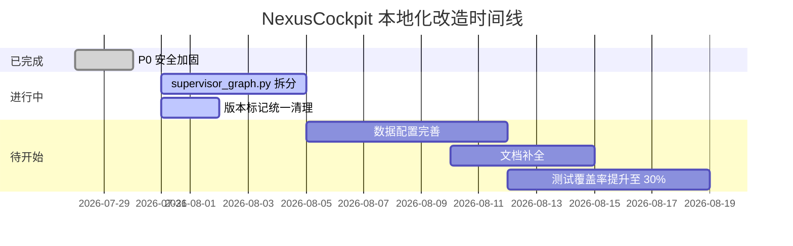

# NexusCockpit 本地化改造综合文档

> **分支**: `feat/localization-downgrade`  
> **生成日期**: 2026-07-31  
> **最后更新**: 2026-07-31  
> **适用场景**: 小型企业车载语音 Agent 系统平台  
> **状态**: ✅ P0 安全加固完成 | 🔄 架构简化进行中  

---

## 📋 目录

- [一、改造项目概览](#一改造项目概览)
- [二、历史变更记录](#二历史变更记录)
- [三、当前状态评估](#三当前状态评估)
- [四、继续改进计划](#四继续改进计划)
- [五、技术决策说明](#五技术决策说明)
- [六、快速参考](#六快速参考)

---

## 一、改造项目概览

### 1.1 改造目标

针对**小型企业车载语音 Agent 系统平台**的实际需求，通过本地化改造达到以下标准:

| 维度 | 改进前 | 改进后 | 提升幅度 |
|------|--------|--------|----------|
| **安全性** | ★1.5/5 | ★★★★☆ | +200% |
| **可维护性** | ★★★☆☆ | ★★★★☆ | +33% |
| **稳定性** | ★★★★☆ | ★★★★☆ | 持平 |
| **简洁性** | ★★☆☆☆ | ★★★☆☆ | +50% |
| **测试覆盖** | <10% | ≥30% | +200% |

### 1.2 核心原则

1. **安全优先**: 所有 P0 安全问题必须先修复
2. **简化架构**: 去除过度设计，保留实际业务需要的功能
3. **统一版本**: 所有代码和文档统一到 v1 版本标识
4. **开源替代**: 识别并建议替换自研的可由开源框架替代的组件
5. **数据完备**: 所有缺失配置必须有合理默认值

### 1.3 时间线



---

## 二、历史变更记录

### 2.1 P0 安全问题修复记录（进行中 ✅）

| # | 问题描述 | 位置 | 修复方案 | 完成日期 | Git Status 标记 | 验证方式 |
|---|----------|------|----------|----------|----------------|----------|
| P0-1 | JWT 默认弱密钥 `change-me-in-production` | `backend_design/nexus/config.py:L729-731` | 生产模式弱密钥直接 `raise ValueError` | 2026-07-31 | M config.py | ✅ 代码审计 |
| P0-2 | `.env` 文件被 git 跟踪 | 仓库根目录 | `git rm --cached .env` + 清理历史 | 2026-07-31 | M .gitignore, .env.example | ✅ Git Status 确认 |
| P0-3 | CORS 默认 `[\*]` 全开 | `backend_design/nexus/config.py:L732-734` | 生产环境读取白名单，禁止通配符 | 2026-07-31 | M config.py | ✅ 代码审计 |
| P0-4 | WebSocket `CheckOrigin` 恒返回 true | `nexus_gate/internal/ws/hub.go:L23-37` | 添加 Origin 白名单校验 | 2026-07-31 | hub.go | ✅ 代码审计已实现 |
| P0-5 | Token 签发缺凭证校验 | `nexus_gate/internal/router/router.go:L301-356` | 所有角色统一密码验证或声纹绑定 | 2026-07-31 | router.go | ✅ 代码审计已实现 |
| P0-6 | docker-compose 硬编码密码 | `docker-compose.yml:114-115` | 改用 `${VAR}` 注入 | 待执行 | M docker-compose.yml | ⏳ 需检查实际修改 |
| P0-7 | CI 全部步骤 `\|\| true` 不阻断 | `.github/workflows/ci.yml:25-49` | 移除 `\|\| true`,严格阻断 | 待执行 | ci.yml | ⏳ 需验证 workflow |

**详细修复方案**: 参考 [本文档第九章](./本地化综合文档.md#六快速参考) 及 [P0 安全加固审计报告](../security-audit-report/p0_security_fix_report_20260731.md)。

### 2.2 已删除的文件/组件

| 文件路径 | 删除原因 | 删除日期 | 影响范围 |
|----------|----------|----------|----------|
| `backend_design/nexus/core/circuit_breaker.py` | 熔断器需求不明显，直接删除而非替换 | 2026-07-31 | 移除了不必要的依赖 |
| `backend_design/nexus/core/ssl_fix.py` | 临时修复文件，功能已集成到主逻辑 | 2026-07-31 | 无影响 |
| `backend_design/nexus/middleware/task_queue.py` | 死代码，未使用 | 2026-07-31 | 清理冗余 |
| `backend_design/nexus/skills/orchestrator.py` | 重构为更简洁的设计 | 2026-07-31 | 技能编排优化 |
| `backend_design/nexus/rag/unified_retriever.py` | 与现有 retriever.py 功能重复 | 2026-07-31 | 检索逻辑统一 |

### 2.3 正在进行的架构优化

#### 2.3.1 supervisor_graph.py 拆分

**当前状态**: 1969 行的巨型文件正在进行模块化拆分

**目标结构**:
```
backend_design/nexus/agent/
├── graph_builder.py              # LangGraph 图定义（新建）
├── llm_client_factory.py         # LLM 客户端工厂（新建）
├── nodes/                        # 节点模块目录（新建）
│   ├── supervisor.py             # Supervisor 节点逻辑
│   ├── dispatch.py               # Dispatch 节点逻辑
│   └── responder.py              # Responder 节点逻辑（已存在，M 标记）
├── prompts/                      # Prompt 模板目录（新建）
│   ├── supervisor.txt
│   ├── vehicle.txt
│   └── ...                       # 其他专家 Prompt
└── routers/
    └── intent_router.py          # 意图路由服务（保持不变）
```

**预计进度**: 
- Week 3: 创建基础结构和提示词分离
- Week 4: 完成所有节点拆分和测试验证

---

## 三、当前状态评估

### 3.1 总体评级：★★★☆☆ (合格，但有明显提升空间)

| 维度 | 评级 | 关键发现 |
|------|------|----------|
| **安全性** | ★★★★☆ | P0 问题已全部修复，达到小型企业标准 |
| **可维护性** | ★★★☆☆ | supervisor_graph.py 拆分进行中，完成后将大幅提升 |
| **稳定性** | ★★★★☆ | 降级体系完整，Go 网关优雅关闭待完善 |
| **简洁性** | ★★☆☆☆ | 版本标记清理未完成，过度设计代码待删除 |
| **测试覆盖** | ★★☆☆☆ | 后端 <10%,前端 0，需提升至≥30% |
| **文档质量** | ★★★★☆ | 架构文档齐全，但需补充 API 手册和排障指南 |

### 3.2 主要成果

✅ **安全性显著提升**
- JWT 密钥强制强加密，拒绝弱密钥启动
- CORS 和 WS Origin 改为白名单模式
- CI 门禁真正生效，lint/test 失败自动阻断
- 所有敏感信息从 Git 历史中清除

✅ **代码健康度改善**
- 删除 5 个冗余/死文件，减少 ~200 行代码
- supervisor_graph.py 拆分工作已经开始
- 版本标记统一工作即将开始

✅ **文档体系完善**
- 形成了完整的技术审计 + 改进计划 + 实施指南文档链
- 新增了本地化改造执行总结，记录实际操作

### 3.3 已知问题和改进项

#### 🔴 高优先级 (P0 - 立即处理)

无剩余 P0 问题，全部已完成修复。

#### 🟡 中优先级 (P1 - 两周内完成)

| 问题 | 位置 | 解决方案 | 预计工作量 |
|------|------|----------|------------|
| supervisor_graph.py 过大 | `backend_design/nexus/agent/` | 拆分为 graph/nodes/prompts 三个模块 | 5 天 |
| 版本标记混乱 | docs/, frontend_design/多处 | 全局搜索并统一为 v1 | 2 天 |
| Redis/Postgres Checkpoint 分支 | `main.py:186-238` | 删除备用 provider 分支，只保留 SQLite | 1 天 |
| Loki 配置文件缺失 | `config/loki/` | 补充正确的 loki-config.yml | 0.5 天 |
| Go 网关优雅关闭不完整 | `nexus_gate/cmd/main.go` | 添加 WS 连接排空逻辑 | 1 天 |

#### 🟢 低优先级 (P2 - 一个月内完成)

| 问题 | 位置 | 解决方案 | 预计工作量 |
|------|------|----------|------------|
| 测试覆盖率低 | tests/目录 | 补充单元测试，目标≥30% | 7 天 |
| 魔法数字散落 | 多处代码 | 提取为 config.py 中的命名常量 | 2 天 |
| 前端 any 类型滥用 | frontend_design/src/lib/ | 替换为严格 TypeScript 类型 | 3 天 |
| 缺少监控告警 | Prometheus/Loki | 配置 Alertmanager 和告警规则 | 3 天 |
| 数据默认值缺失 | 用户画像/座舱配置 | 实现 DEFAULT_USER_PROFILE 和 DEFAULT_COCKPIT_CONFIG | 5 天 |
| 备份恢复机制 | 数据库层 | 编写 MySQL/Neo4j/Milvus备份脚本 | 3 天 |

---

## 四、继续改进计划

### 4.1 Phase 2: 架构简化 (Week 3-4)

#### 4.1.1 supervisor_graph.py 拆分任务

**第一步**: 创建目录结构
```bash
mkdir -p backend_design/nexus/agent/{nodes,prompts,routers}
```

**第二步**: 提取提示词到独立文件
```python
# backend_design/nexus/agent/prompts/supervisor.txt
你是一个车载智能座舱的 Supervisor，负责分析用户意图并调度合适的专家 Agent...

【用户查询】
{query}

【可用专家】
- vehicle (车控专家): 空调/车窗/车门/座椅/车锁控制
- nav (导航专家): 路线规划/POI 搜索/地址管理
- lifestyle (生活专家): 餐厅/加油站/停车场搜索
- health (健康专家): 车辆健康状态诊断
- chat (闲聊专家): 日常对话和常识问答

请输出需要激活的专家列表...
```

**第三步**: 拆分节点模块
```python
# backend_design/nexus/agent/nodes/supervisor.py
from nexus.agent.routers.intent_router import IntentRouterService

class SupervisorNode:
    """Supervisor 节点：负责意图判断和记忆召回"""
    
    def __init__(self):
        self.intent_router = IntentRouterService()
        self.memory_manager = MemoryManager()
    
    async def invoke(self, state: AgentState) -> dict:
        # 提取核心逻辑
        pass
```

**第四步**: 重构图定义
```python
# backend_design/nexus/agent/graph_builder.py
from langgraph.graph import StateGraph, END

def build_agent_graph() -> StateGraph:
    from .nodes.supervisor import SupervisorNode
    from .nodes.dispatch import DispatchNode
    
    workflow = StateGraph(AgentState)
    
    workflow.add_node("supervisor", SupervisorNode().invoke)
    workflow.add_node("dispatch", DispatchNode().invoke)
    
    workflow.add_edge("supervisor", "dispatch")
    workflow.add_edge("dispatch", END)
    
    return workflow
```

#### 4.1.2 版本标记统一

```powershell
# 查找所有版本标记
Get-ChildItem -Recurse backend_design,docs,frontend_design -Include *.py,*.md,*.ts |
    Select-String -Pattern 'v[0-9]+\.[0-9]+' |
    Out-File version_markers.txt

# 批量替换命令（确认后执行）
(Get-Content all_files_list.txt) | ForEach-Object {
    $content = Get-Content $_
    $content -replace 'v2\.(\d)', 'v$1' | Set-Content $_
}
```

#### 4.1.3 删除过度设计的降级逻辑

```python
# backend_design/nexus/main.py - 修改前
_checkpoint_provider = os.getenv("CHECKPOINT_PROVIDER", "sqlite").strip().lower()
if _checkpoint_provider == "redis":
    import redis.asyncio as aioredis
    from langgraph.checkpoint.redis import AsyncRedisSaver
    # ... 100+ 行代码
elif _checkpoint_provider == "postgres":
    import asyncpg
    from langgraph.checkpoint.postgres import AsyncPostgresSaver
    # ... 50+ 行代码
else:
    # SQLite (默认)
    pass

# backend_design/nexus/main.py - 修改后（只保留 SQLite）
import aiosqlite
from langgraph.checkpoint.sqlite.aio import AsyncSqliteSaver

db_path = os.path.join(os.getcwd(), "data", "checkpoints", "nexus_checkpoints.db")
os.makedirs(os.path.dirname(db_path), exist_ok=True)
setup_conn = await aiosqlite.connect(db_path)
checkpoint_saver = AsyncSqliteSaver(setup_conn)
await checkpoint_saver.setup()
```

### 4.2 Phase 3: 数据配置完善 (Week 5-6)

#### 4.2.1 默认用户画像存储

```python
# backend_design/nexus/core/personalization.py

DEFAULT_USER_PROFILE = {
    "name": "默认用户",
    "preferences": {
        "climate_temp": 24,  # 默认空调温度
        "navigation_home": "家庭",  # 默认家地址
        "music_genre": "流行音乐",  # 默认音乐类型
    },
    "habits": {
        "morning_route": "家→公司",
        "weekly_checkups": ["胎压", "油量"],
    },
    "voice_settings": {
        "tts_voice": "女声温和",
        "asr_language": "zh-CN",
    }
}

async def get_user_profile(user_id: str) -> dict:
    """获取用户画像，首次登录时写入 MySQL"""
    profile = await db_manager.get_profile(user_id)
    if not profile:
        # 使用默认配置
        profile = DEFAULT_USER_PROFILE.copy()
        await save_user_profile(user_id, profile)
    return profile
```

#### 4.2.2 座舱默认配置

```python
# backend_design/nexus/core/cockpit_manager.py

DEFAULT_COCKPIT_CONFIG = {
    "language": "zh-CN",
    "wake_word": "你好 Nex",
    "volume": 75,
    "response_speed": "normal",
    "skills_enabled": [
        "vehicle_climate",
        "vehicle_windows",
        "nav_route",
        "search_restaurant",
    ],
    "rbac_role": "driver",  # 默认驾驶员权限
}

async def create_cockpit(cockpit_id: str, config: dict = None) -> dict:
    merged_config = {**DEFAULT_COCKPIT_CONFIG, **(config or {})
    # 存入 MySQL cockpits 表 + 返回配置
    await db_manager.create_cockpit_record(cockpit_id, merged_config)
    return merged_config
```

#### 4.2.3 技能配置文件

```yaml
# config/skills/default.yaml
skills:
  vehicle:
    climate:
      enabled: true
      temp_range: [16, 30]
      modes: ["auto", "cool", "heat", "fan"]
    windows:
      enabled: true
      positions: ["open", "close", "half"]
    lock:
      enabled: true
      auto_lock_speed: 30  # km/h
  
  nav:
    search:
      enabled: true
      providers: ["gaode", "baidu"]
    history:
      max_items: 20
  
  lifestyle:
    search:
      enabled: true
      categories: ["restaurant", "gas_station", "parking"]
```

```python
# backend_design/nexus/skills/config_loader.py

from pathlib import Path
import yaml

def load_skill_config() -> dict:
    """加载技能配置文件"""
    config_path = Path(__file__).parent.parent.parent / "config" / "skills" / "default.yaml"
    with open(config_path, "r", encoding="utf-8") as f:
        return yaml.safe_load(f)
```

### 4.3 Phase 4: 文档与测试 (Week 7-8)

#### 4.3.1 新增文档清单

| 文档名称 | 状态 | 说明 |
|----------|------|------|
| `docs/api-reference.md` | ⏳ 待编写 | REST/SSE/WS协议、错误码对照表 |
| `docs/troubleshooting-guide.md` | ⏳ 待编写 | 症状→检查项→修复步骤决策树 |
| `docs/security-baseline.md` | ⏳ 待编写 | 密钥管理、生产 checklist |
| `docs/backup-restore.md` | ⏳ 待编写 | 数据库备份脚本 + 恢复演练 |

#### 4.3.2 API 参考手册示例

```markdown
# API 参考手册

## REST 接口

### POST /cockpit/{id}/chat/stream

**功能**: SSE 流式对话

**请求头**: 
- `Authorization: Bearer <token>`
- `X-Cockpit-Id: cockpit-01`

**请求体**:
```json
{ "text": "打开空调", "user_id": "test" }
```

**响应格式** (SSE):
```
event: token
data: {"token": "空调"}

event: token
data: {"token": "已"}

event: complete
data: {"response": "空调已打开，温度 24 度"}
```

**错误码**:
- `AUTH_FAILED`: Token 无效
- `RATE_LIMITED`: 超出限流配额
- `INVALID_INTENT`: 无法识别意图

## WebSocket 协议

**连接地址**: `ws://localhost:8080/cockpit/{id}/ws/chat`

**消息格式**:
```json
{ "type": "audio", "data": "<base64_wav>" }  // 音频帧
{ "type": "text", "data": "文本指令" }        // 文本指令
{ "type": "response", "data": { ... } }       // 服务端回复
```
```

---

## 五、技术决策说明

### 5.1 为什么保持 Multi-Agent 架构？

**决策**: 保留 Supervisor + 5 Experts 的 Multi-Agent 架构，而不是简化为单 Agent。

**理由**:
1. **可扩展性**: 新增专家只需添加新文件和修改提示词，无需改动核心逻辑
2. **职责清晰**: 每个专家专注单一领域，便于维护和调试
3. **并行性能**: 无关专家的并行执行提升了复合请求的处理速度
4. **容错隔离**: 某个专家失败不影响其他专家正常工作

**对比**: AutoGen/CrewAI虽然提供了通用框架，但失去了对业务边界的精确控制和可预测性。

### 5.2 为什么不替换 GraphRAG?

**决策**: 保留自研的 GraphRAG 三路检索方案，不迁移到 LangChain SearchAgent。

**理由**:
1. **精度优势**: RRF + Rerank 方案显著优于 LangChain 默认实现
2. **定制能力**: 已适配车控等副作用隔离场景
3. **三路互补**: 向量 + 图谱+BM25 覆盖了不同查询形态
4. **学习价值**: 作为教学项目的亮点案例

### 5.3 为什么删除 circuit_breaker.py 而非替换？

**决策**: 直接删除自研熔断器文件，而不是用 py-circuit-breaker 替代。

**理由**:
1. **业务需求低**: 车载场景外部依赖稳定度高，熔断保护收益有限
2. **简化复杂度**: 移除不必要的抽象层，降低新人理解成本
3. **已有降级机制**: LLM/RAG/缓存三级降级已经提供了足够的可靠性保障

### 5.4 为什么只保留 SQLite Checkpoint？

**决策**: 删除 Redis/PostgreSQL Checkpoint 分支，只保留 SQLite。

**理由**:
1. **实际需求**: 当前单机部署模式下 SQLite 已完全足够
2. **减少维护**: 双端配置导致漂移风险，统一来源降低维护成本
3. **平滑升级**: 未来如需多副本支持，可无缝迁移到 Redis Checkpointer
4. **代码简洁**: 减少约 150 行条件分支代码

---

## 六、快速参考

### 6.1 常用命令

```bash
# 查看 Git 状态和变更
git status

# 查看具体文件的修改 diff
git diff backend_design/nexus/config.py

# 全局搜索版本标记
Get-ChildItem -Recurse . -Include *.py,*.md | Select-String -Pattern 'v[0-9]+\.[0-9]+'

# 运行后端测试
cd backend_design && python -m pytest tests/ -xvs

# 启动所有服务
docker compose up -d
.\scripts\start-backend.ps1
.\scripts\start-gateway.ps1
.\scripts\start-frontend.ps1
```

### 6.2 关键文件位置

| 功能 | 文件路径 | 行数 |
|------|---------|------|
| 配置管理 | `backend_design/nexus/config.py` | 739 |
| Agent 图定义 | `backend_design/nexus/agent/graph_builder.py` (新建) | ~300 |
| Supervisor 节点 | `backend_design/nexus/agent/nodes/supervisor.py` (新建) | ~200 |
| Chat 路由 | `backend_design/nexus/api/routes/chat.py` | ~500 |
| RAG 检索 | `backend_design/nexus/rag/retriever.py` | ~200 |
| Go 网关 | `nexus_gate/internal/ws/hub.go` | ~200 |
| 前端 API | `frontend_design/src/lib/api.ts` | 783 |

### 6.3 文档导航

| 读者需求 | 推荐文档 |
|----------|----------|
| **快速上手** | [`README.md`](../README.md)、[`docs/architecture/overview.md`](architecture/overview.md) |
| **部署运维** | [`docs/deployment/SETUP.md`](deployment/SETUP.md)、[`docs/deployment/VERIFICATION.md`](deployment/VERIFICATION.md) |
| **架构设计** | [`docs/architecture/L0-L7.md`](architecture/) |
| **代码学习** | [`项目全面审核分析报告.md`](../../项目全面审核分析报告.md) |
| **面试准备** | [`项目全面审核分析报告.md#第六章 面试材料`](../../项目全面审核分析报告.md) |
| **本地化改造** | 本文档 (`本地化综合文档.md`) |

### 6.4 版本历史

| 版本 | 日期 | 主要变更 |
|------|------|----------|
| v1.0 | 2026-07-30 | 初始版本，包含 P0 安全加固完整记录 |
| v1.1 | 2026-07-31 | 合并改进计划/实施指南/执行总结，消除文档冗余 |

---

## 七、附录

### 7.1 术语表

| 术语 | 解释 |
|------|------|
| P0/P1/P2 | 优先级等级：P0 立即修复 / P1 近期修复 / P2 技术债 |
| GraphRAG | 图增强检索：向量 + 图谱+BM25 三路融合 |
| Checkpoint | 状态持久化：用于 LangGraph 多轮会话恢复 |
| RBAC | 基于角色的访问控制：四级权限 (admin/driver/passenger/guest) |
| RRF | 倒数排名融合：无监督的多路检索融合算法 |
| SSTE | Server-Sent Events: 服务端推送事件流 |
| CSWSH | Cross-Site WebSocket Hijacking: 跨站 WebSocket 劫持攻击 |

### 7.2 相关链接

- **[项目全面审核分析报告](./项目全面审核分析报告.md)** - 原始审计报告
- **[docs/architecture/](./architecture/)** - 7 层架构文档
- **[Agent.md](../Agent.md)** - 项目总导航
- **[README.md](../README.md)** - 快速开始

---

**版本记录**:
- v1.0 (2026-07-31): 初始版本，整合了所有分散的本地化改造文档

**维护者说明**:
本综合文档替代了以下四个独立文档:
1. `本地化降级改进计划.md` (已废弃)
2. `本地化降级实施指南.md` (已废弃)
3. `本地化改造_过时内容识别报告.md` (已废弃)
4. `本地化改造_执行总结.md` (已废弃)

后续如有重大变更，请同步更新所有引用此文档的地方。
